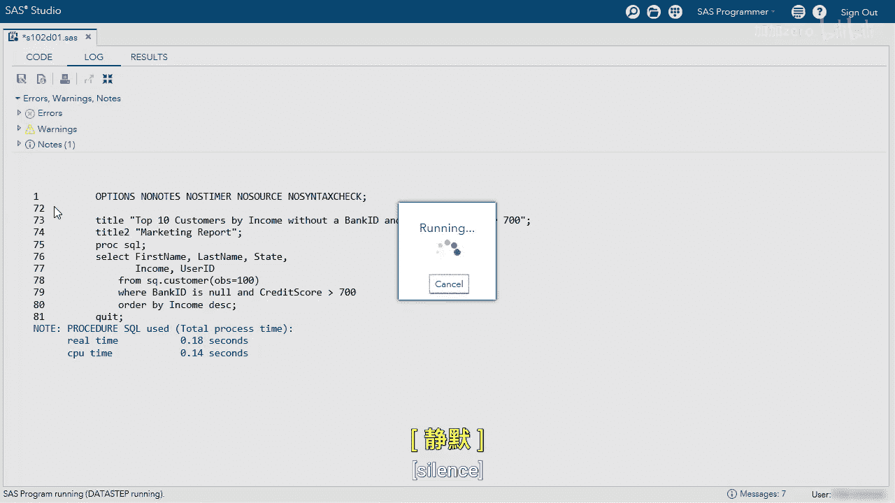
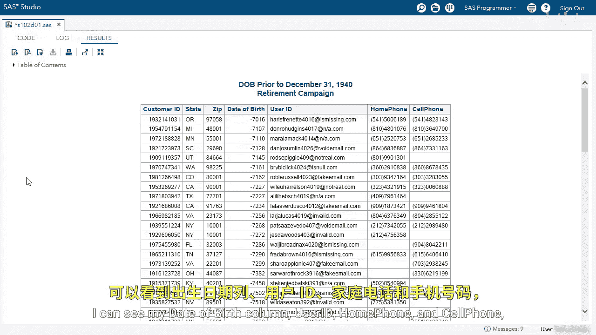
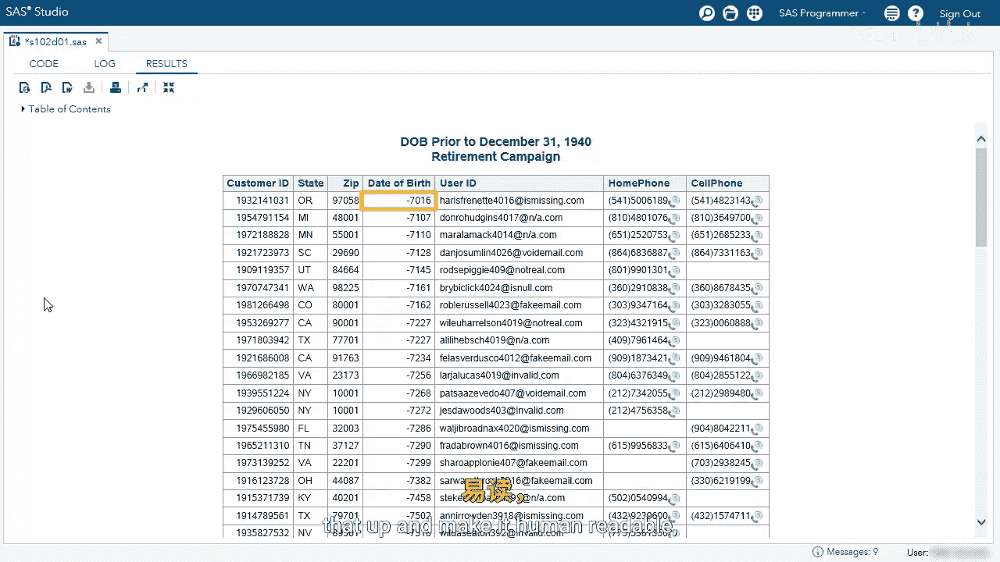

# SAS【中英⚡SAS高级程序员 专项课程｜SAS Advanced Programmer Professional Certificate】 p17 P17 08_演示：创建简单报告 -BV1Cfe3z3EoA_p17-

Let's use ProC SQL to create some simple reports。Our first report。

 we want to find all customers with no bank ID， a credit score greater than 700。

 and the top 10 customers by income。Some of our code is already written。

 we already have a title and a title two。We are selecting five columns。

 the first name last name state， income and user ID from the customer table。

 we're limiting it to the first100 roads as we develop our code。

And now let's complete the War clauses and the order by clauses。

The first thing is I want to find where bank ID is no。And credit score greater than 700。

This will subset my table accordingly。Next I want to order by my column。

 I want to order by the income column descending。

I'm going to run my code and take a look at my results。

Here I can see my title， I have my five columns， and I'm just going to scroll and look at the income column and make sure it's in descending order。

So everything's looking good， but now I got to finalize my report and find the top 10 customers and then clean up my report and have dollars for income and then change some of the column headers。

Let's go back to our editor。The first thing I'm going to do is use the out Obs equals 10 option。

 this will limit the output to 10 rows。Next， I'm going to use the format equals column modifier to add a format to the income column。

I'm going to use the dollar format， the $116 dot。I don't need any decimals in my income column。

And then next， I'm going to change the label to the user ID column to email。

Now that column name will be called email because it is the customer's email I'm going to remove the Opbs equals 100 option because I know my code is ready to go。

This query will run on every observation in the customer table。Let's run the query。

Here we can see our five columns， we can see the income column is in descending order。

 and I only have the top 10 customers， we can see the format。😊。

And we can also see that email column instead of user ID， it's now called email。

Let's go back to our editor。In the next report， we want to find all customers born prior to December 31st。

 1940 who are employed。Again， we have some of our code written， we can see our title。

 we have our select statement with a couple columns， we have our customer ID， state， zip， DOB。

 user ID， home phone and cell phone again from the customer table。

 limiting to the first100 rows as I develop my query。And now let's begin to subset。

I would use thewareclos to find all customers born before December 31st， 1940。

Make sure to put the D after the quotes。Next I want to find all customers who are employed。

 we're going to use the and operator。And employed equals yes or why。

I want to clean up my report and order it accordingly， so I'm going to order by DOB descending。

I'm going to run my query and make sure my logic is correct。I can see my data birth column， user ID。

 home phone and cell phone， and I can see it is descending。

However， what date is negative 7016？Let's apply a format to the date of birth column to clean that up and make it human readable。

And I'm also going to apply a format to my zip code column， and I'm going to scroll down。😊。

And let's look at one of the rows where the customer ID is 193-76-22797。

This customer has a zip code of 7097。United States zip codes are five digits。

 so we need a leading zero here， we're going to apply a format to provide a leading zero。

Let's go back to our editor。

And let's enhance our report。For the DOB column， I'm going to use the date9 dot format。

SS has a variety of date formats that you can use， we are just going to use the date9 format here。

In the zip column， we're going to use the Z5 dot format thatll add leading zeros to any number with four digits。

Now I can remove my Opbs equals 100 option and get the results。We can see our title。

 we can see the columns we've selected， we can see date of birth is now human readable and we can see that it is descending。

I want to scroll down。And find that customer again now we can see the zip code is 07097 the format we applied added that leading zero for us。

