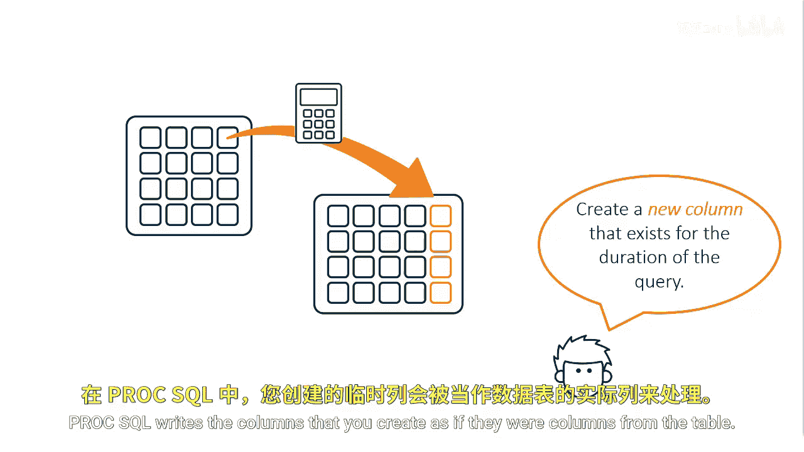
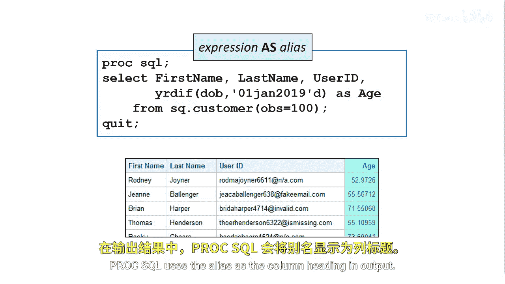

# SAS【中英⚡SAS高级程序员 专项课程｜SAS Advanced Programmer Professional Certificate】 p18 P18 09_创建新列 -BV1Cfe3z3EoA_p18-

In addition to selecting columns that are stored in a table。

 you can create new columns that exist for the duration of the query these columns can contain text or calculations。

Pro EsQl writes the columns that you create as if they were columns from the table。

In the select statement， you define the expression。

 text or string that creates a column and include the keyword as and the column name。In this example。

 we need to find all customers who are 70 years old or older。To do this。

 we first created a new column named Age by using A SA function。

The year to function returns the difference in years between two dates， in this case。

 it returns a person's age as of January 1st， 2019。If you want to make the report more dynamic。

 you can use the Today function to use today's date。We'll use a date constant for consistency。

After the function， we specify the column alias age。

You can assign a new name to any column within a ProC SQL query。

The new name must follow the rules for SAS names。The name persists only for that query。

When you use an alias to name a column， you can use the alias to reference a column later in the query。

Prooc SQL uses the alias as a column heading and output。

