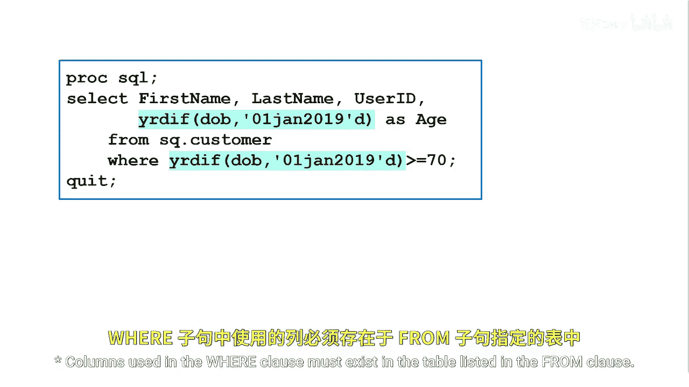
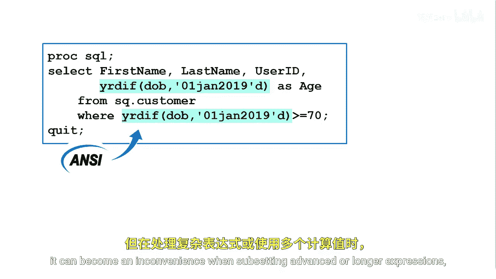

# SAS【中英⚡SAS高级程序员 专项课程｜SAS Advanced Programmer Professional Certificate】 p19 P19 10_筛选计算值 -BV1Cfe3z3EoA_p19-

Columns used in the wear clauses must exist in the table listed in the from clauses。

One way to ensure this is to repeat the calculation in the where clause。

This method is the anNsI standard method to subset using a calculated value。

Although this method works， it can become an inconvenience when subsetting advanced or longer expressions or when using multiple calculated values。

Alternatively， you can use the calculated keyword， which refers to computed columns in the select clause。

 the calculated keyword is A enhancement。It enables you to use the results of an expression in the same select clause or a where clause。

It's valid only when used to refer to columns that are calculated in the immediate query expression。

