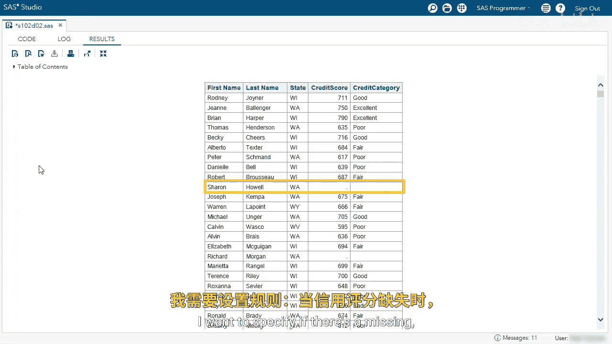
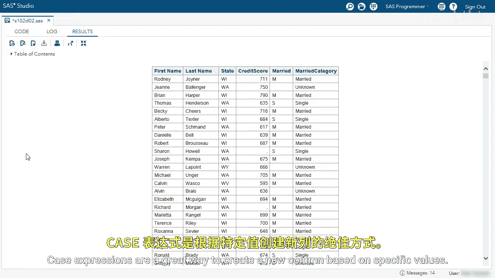

# SAS【中英⚡SAS高级程序员 专项课程｜SAS Advanced Programmer Professional Certificate】 p21 P21 12_演示：按条件赋值 -BV1Cfe3z3EoA_p21-

We're going to use a case expression to create columns conditionally。Let's look at our first query。

In this query， we want to use a simple case expression。

 We want to find the credit score and assign it a value。 If you have a credit score greater than 750。

 you're excellent， 70749， you're good and so on。 I'm going to run the query。

This looks great， we have the first name last name state credit score and category column。

 we can see the categories are assigned， but I want to look at one of the values。

 let's look at the credit score column where there's a missing value what is the credit category column。

It is a missing value or a blank I don't want that I want to specify if there's a missing。

 then I specify the value in the credit category column so go back to my editor。

And now I'm going to use else。And then if it's anything else other than the values I specified above。

 make it unknown。Now let's go back， run the query。And take a look at the value we can see now if the credit score column is missing。

 then the category is unknown。I want to do one more thing。

 what if I want a subset for credit category where it's excellent？Let's go back to our editor。

And below the from clause， let's use a where clause。And I'm going to specify where calculated。

Credit category。Equals excellent。I'm going to remove my Obs equals option。😊。

And I'm going to run the query。I have now subset a calculated column by using the where clause。

 the calculated keyword and then the value I've specified。 Let's go back to our editor。

Nextus's use the casese opera form。Here again， the queries started。

 we're selecting the first name last name state， credit score married column。

 and then we're using our case expression， selecting the married column。

 we're going to complete this expression。Now I can use the values above。When D， then divorced。

When S then single。And then W equals widowed。And now I want to use else， if I don't find anything。

 I want to say it's unknown。 So again， else。Unknown。Let's run our query。Again。

 now we can see the new column married category from the values of married case expressions are a great way to create a new column based on specific values。

