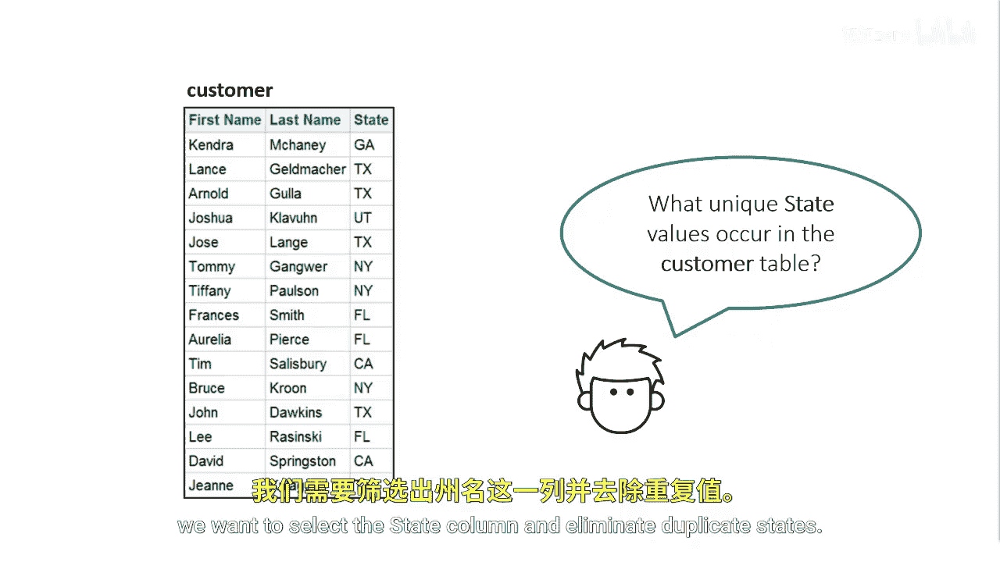
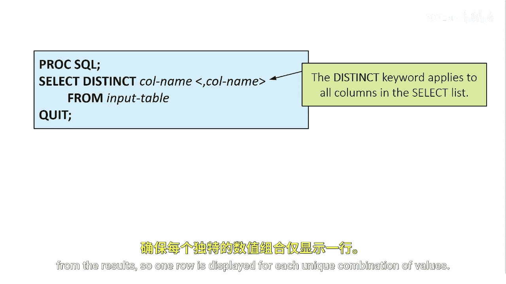

# SAS【中英⚡SAS高级程序员 专项课程｜SAS Advanced Programmer Professional Certificate】 p22 P22 01_使用 DISTINCT 关键字消除重复行 -BV1Cfe3z3EoA_p22-

In some cases， you might want to find only the unique values in a column。 For example。

 we have over 100，000 customers in the customer table。

 and we want to determine in what specific states our customers reside。

We're not looking for account just a list of states， do our customers come from all states。

 or only a select few， 30 states， 40 states？To answer this question。

 we want to select the state column and eliminate duplicate states。

To eliminate the duplicate rows from the results， you can use the distinct keyword in the select clause the distinct keyword applies to all columns listed。

Proc SQL eliminates duplicate rows， a rows in which the values in all the columns match from the results。

 so one row is displayed for each unique combination of values。

When we use a distinct keyword on the state column。

 the query eliminates duplicate states and gives a summary of the states in which our customers reside。

