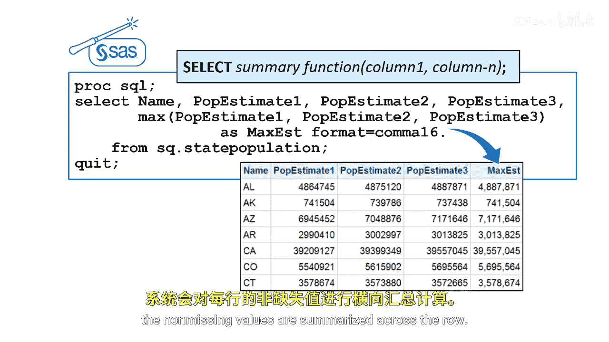

# SAS【中英⚡SAS高级程序员 专项课程｜SAS Advanced Programmer Professional Certificate】 p23 P23 02_数据汇总 -BV1Cfe3z3EoA_p23-

You've already learned to create columns by adding SAS functions to expressions in the select clause to calculate summary columns in your query output。

 you add summary functions。Summary functions are also called aggregate functions。

 and they reduce all the values in a row based on the columns we want to summarize。

Suppose we want to summarize down a column of values for example。

 the state population table contains population estimates for the next three years for each state。

We want to calculate the maximum， minimum， and average of the P estimateimate1 column。

 which is next year's estimate。

To do this， we use a summary function with a single argument。With a single argument。

 non missing values are totaled down a column。This is the ANsI standard。

For next year's population estimate， the max state population estimate is a bit over 39。2 million。

 the minimum state population estimate is about 585，000。

 and the general average state population is about 6。2 million。

What if we want to summarize across a row and create a new column with a summarize value？

In SQL， the way a summary function works depends on the number of columns specified in the argument list。

If the summary function specifies more than one column。

 the statistic is calculated for the row using values from the listed columns。In this example。

 we want to determine the maximum estimated population of the next three years for each state。

To do this， we use the Mac summary function and specify each column， P Eimate 1， P Eimate2。

 and P Estimate 3。

When using a summary function with multiple arguments。

 the non missing values are summarized across the row。

If a missing value exists， the function ignores it。

