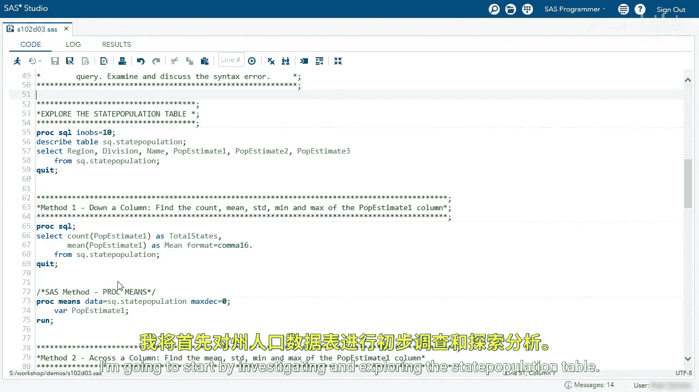
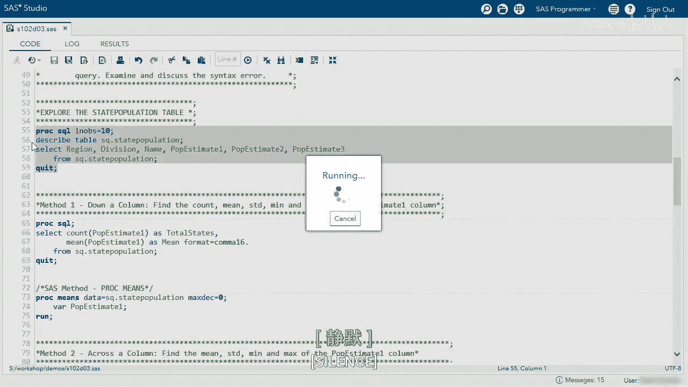
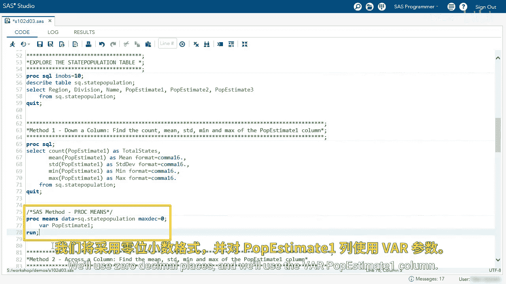
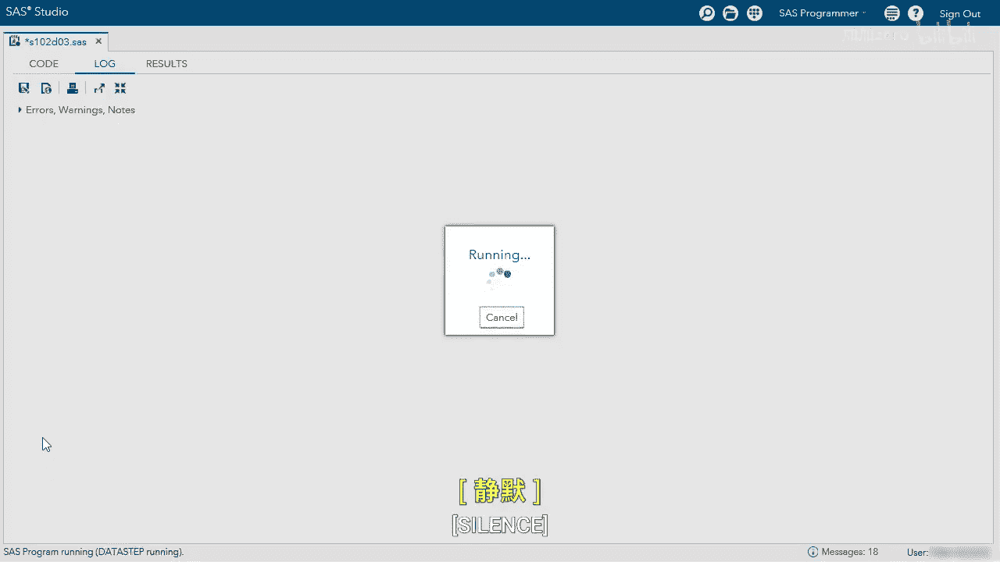
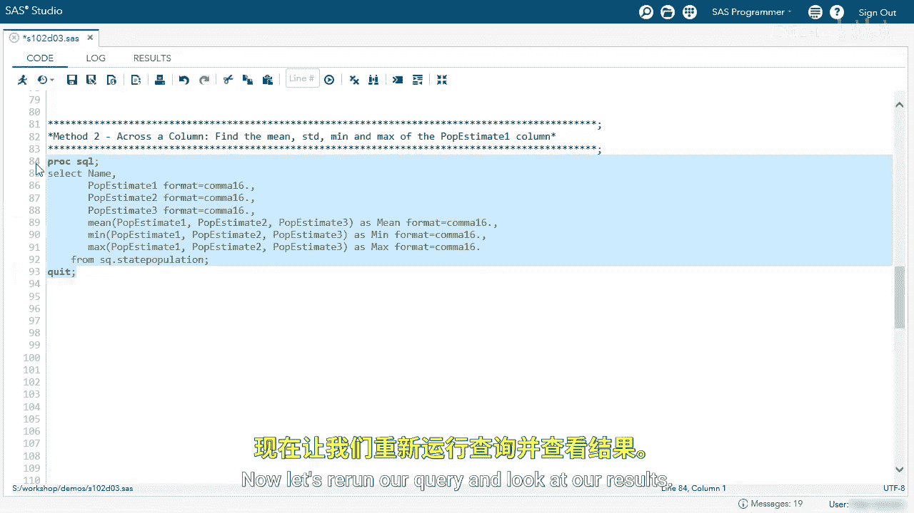

# SAS【中英⚡SAS高级程序员 专项课程｜SAS Advanced Programmer Professional Certificate】 p24 P24 04_演示：使用汇总函数分析表格 -BV1Cfe3z3EoA_p24-

We're going to use summary functions to analyze a table。

I'm going to start by investigating and exploring the state population table。

In this table we can see we have a couple columns， a region in the division， we have the state name。

 and then we have the population estimates of that state。Using this information。

 we want to summarize down a column and we want to find the count， the mean， the standard deviation。

 the min and the max of the P estimate1 column。In the query here we are using the count function to count the P estimateimate 1。

 and we're going to call that total states， and we're going to use the mean function to get the mean value of P estimate 1 and call that mean and we'll format using the comma 16 format。

We can see when specifying one argument in a summary function， we get one row as output。

 We can see total states is 52。 This includes DC and Puerto Rico。

 and then we have the mean of about 6。2 million。I want to find some other statistics。

 so I'm going to use the standard deviation， the min and the Mac。

The easiest way is just to copy and paste。Then add your commas。

And now let's just change our summary functions。We use standard deviation？

And then we'll change the column name。And then here we're going to use the min and the max。

And let's just change the column names。And now let's look at our results。

Now we can see all these descriptive statistics。I want to go back and just show you one more thing。😊。

In SAS， there's another method to get the same results， and that is PRC means， we'll use the SQ。

 state population table， we'll use zero decimal places， and we'll use the Vr P estimate1 column。

And we can see the same results， so just another method for you。

Let's scroll down to Me two across a column。Here most of our queries written for us。

 we're selecting the name， the P estimate1 through three columns， we're formatting those accordingly。

And then we're using the average min and max functions。

I'm going to run this query if I want you to see something。Let's look at our error。

 the function AVG could not be located， so I want you to think， why is that not working？Well。

 let's go back。We talked about the average function only takes one argument because it's anNsI standard。

So if we want to summarize the average across a rows， we have to use the SAS mean function。

Now let's rerun our query。😊。

And look at our results， when we specify multiple arguments in the summary function。

 SAS summarizes across， we can see we have the min， mean， max of each state's population estimate。

Let's go back and I just want to show you one more thing。For our SAS programmers。

 if you want to specify P E 1 through P E 3 as a shortcut， what you can do。

Is use our shortcut method of of。Pop Eimate 1， dash pop E 3。So in SAS the data step， this will work。

 let's run our query。That shortcut does not work in ProC SQL。

 so just be aware of that you will have to type each column name。

