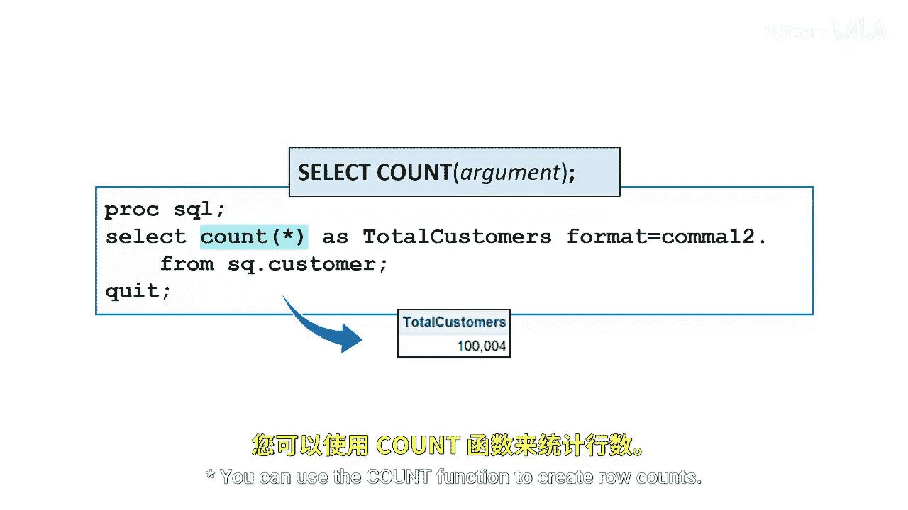
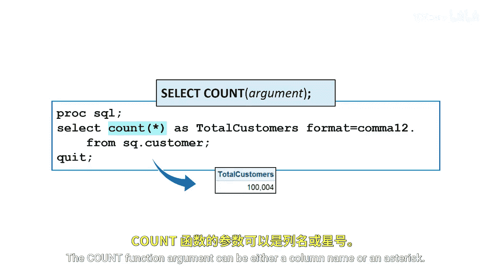
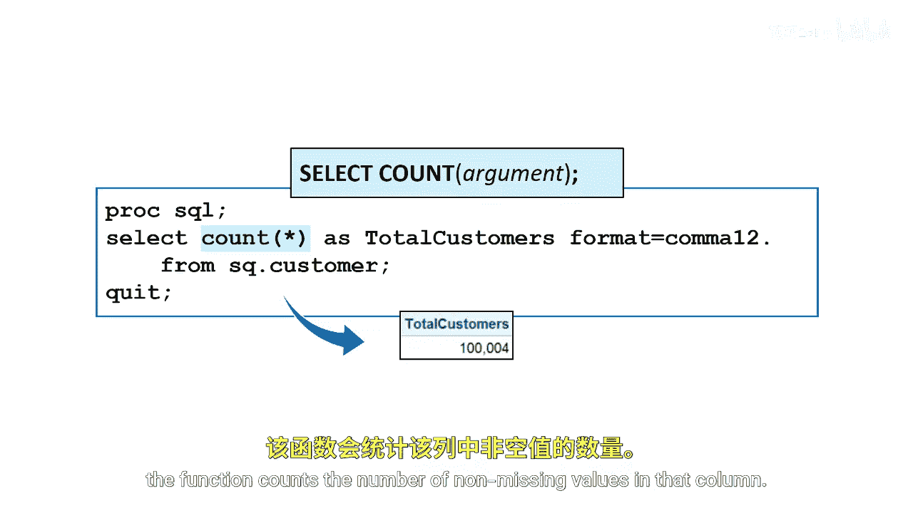
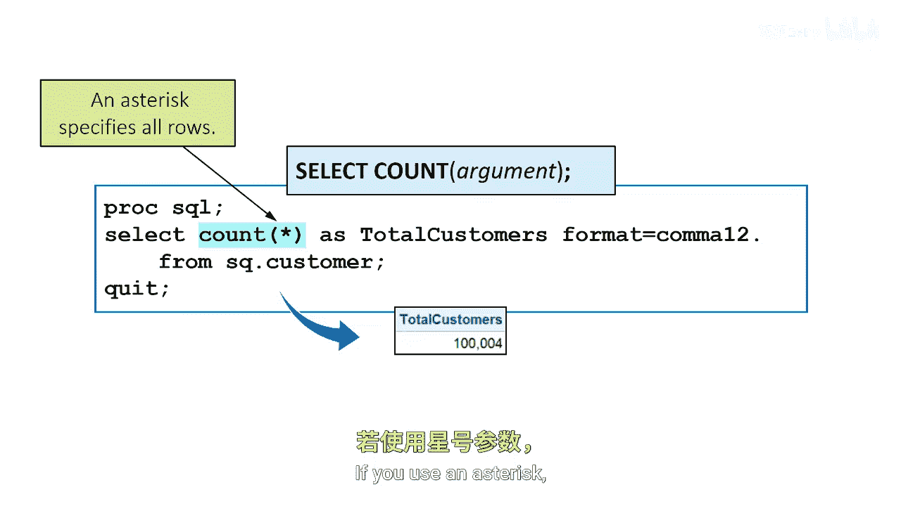
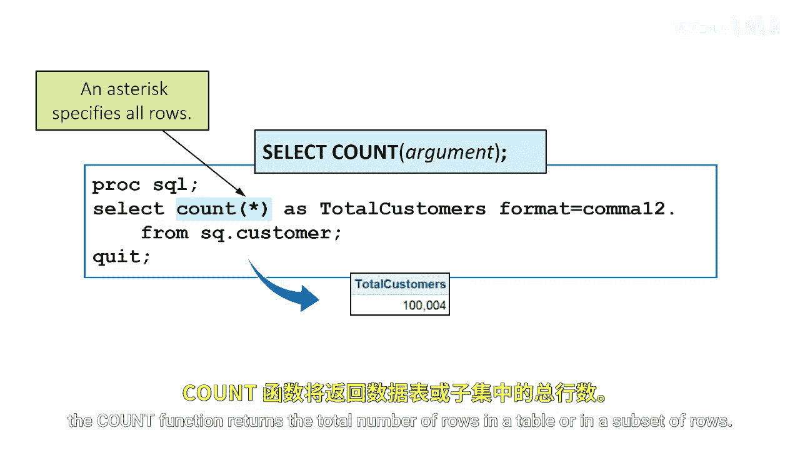

# SAS【中英⚡SAS高级程序员 专项课程｜SAS Advanced Programmer Professional Certificate】 p25 P25 05_使用 COUNT 函数汇总数据 -BV1Cfe3z3EoA_p25-

You can use the count function to create row counts the count function argument can be either a column name or an asterisk。

If you specify a column name， the function counts the number of non missing values in that column；

 if you use an asterisk， the count function returns a total number of rows in a table or in a subset of rows。

