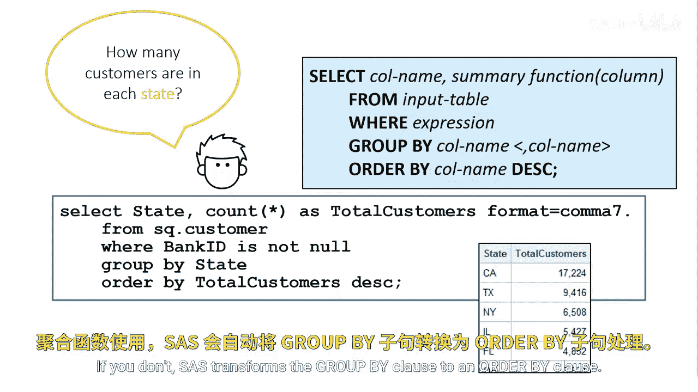
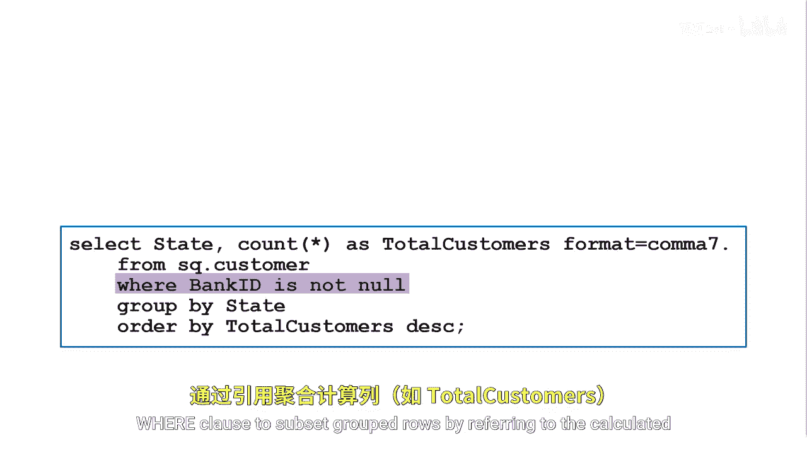

# SAS【中英⚡SAS高级程序员 专项课程｜SAS Advanced Programmer Professional Certificate】 p26 P26 06_数据分组 -BV1Cfe3z3EoA_p26-

We've been asked to investigate the customer table and summarize information based on groups。

How many customers are in each state， what is the average credit score of customers in each state？

To answer these questions in SQL， we include the group by clauseuse。

The group by clause classifies the data into groups based on the values of one or more columns and the summary function in the select clause calculates statistics for each unique value of the grouping columns。

You can use a summary function with any of the columns that you select。

To find the number of customers in each state， we can use a query with the count function that counts the total number of customers or rows in each state。

The group by clause groups the states， and the order by clauseuse puts the total customer's count in descending order。

When we run the code， our results show how many customers are in each state。

Because our query is sorting by descending total customers。

 we can tell that most customers are in California， followed by Texas and New York。

You must use a summary or aggregate function with the groupI clause。If you don't。

 SAS transforms a group by clause to an order by clause。

SS evaluates the wear clause before a row is available for processing and determines which individual rows are available for grouping。

Therefore， you can't use aware clause to subset group rows by referring to the calculated summary column totaltCustom。

You must use the having clauses with a group I clause to filter summarize rows。

The having clause affects groups in a way that is similar to how where clause affects individual rows。

When you use the having clause， ProC SQL displays only the groups that satisfy the having expression。

ProSQL applies the having condition after grouping the data and applying aggregate functions。

Think of the having clause as post summarization filtering。For example。

 having total customers greater than 6，000 restricts the groups who include only the states in the US that contain over 6。

000 customers。The result shows three states， CA， TX， and NY。

The having expression contains the value of the new column total customers。

 which counts the number of rows within each group。

