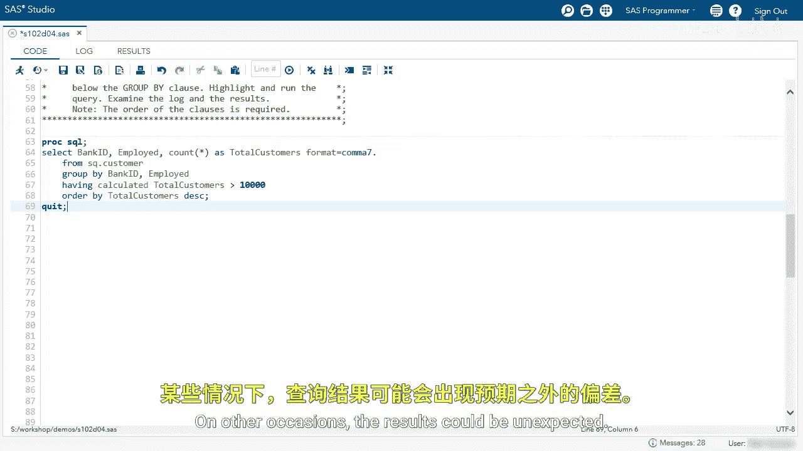
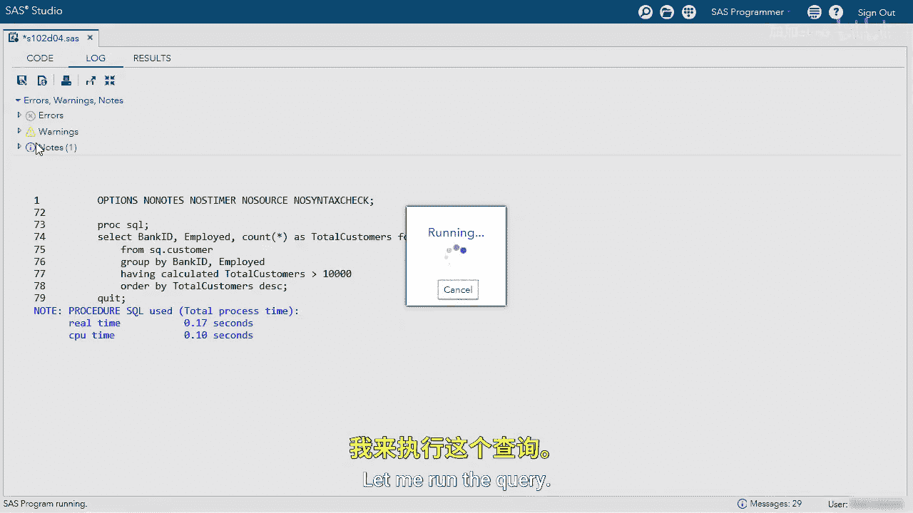

# SAS【中英⚡SAS高级程序员 专项课程｜SAS Advanced Programmer Professional Certificate】 p27 P27 07_演示：分析数据分组 -BV1Cfe3z3EoA_p27-

We're going to use the group by clause to group data and produce summary statistics for each group。

Let's start with our query here we're selecting the state column from the customer table， again。

 limiting to  a0 rows as we develop our code， and we're grouping by state。

I want to see that we do not have a summary column here， so let's run our query and see what happens。

So it looks like everything's in order， nothing's grouped。

 let me go to my log since we have a warning。We do have a warning that specifies a group by clause has transformed into an order by clause because we didn't use a summary function。

 So let's go back。And our goal is to count how many customers are in each state。To do that。

 we'll use the count function。And then we're going to name this column totalCustom and format it with a comma 7 format。

Now let's run the query and see if we have account of how many customers are in each state。

So this is looking better。 We have a count。 Now remember， we're limiting to the first thousand rows。

 so as our code developed， we feel confident in it， let's remove our Obs equals option。

Let me run the query。And we can see we have each state with a total amount of customers。

Now I want to order this by total customers descending。So let's go back。

And I'm going to add my order by clause。And I'm going to reference the total customers column。

We can see our column is ordered。 Now I do want to order this in descending order。

 so let me go back and add the DESC option。So we've been counting the number of customers in each state。

But now what if I want to count the number of customers by bank ID？To do that。

 all I have to do is change the state column in the select clause and the group I clause。

This should give us the total number of customers for each bank。Looking at our results。

 we can see the bank 101010 has the most customers。

We can also see a group by clause does include missing values。

 so we actually have about 4900 customers that don't have a bank ID。Well。

 let's dive a little bit deeper。I wanted to count the number of customers by bank ID and if they're employed。

To do that， we just have to add theEmploy column in the select clause and the group by clause。

If I run this query， I'll see a little bit more information。In our results。

 we can now see we have distinct values for bank I D and employed and the total customers for each value。

 Again， I want to subset this data。 I don't want to see all of this。

 So I want to subset and find only where total customers is greater than 10000。

I'm going to use my warehouseclos。And I'm going to specify calculated total customers。

Greater than 10，000。Before I run this， I want you to stop and think what's going to happen when I use this query。

Let's take a look。So we get an error and we have summary functions are restricted to the select and having clauses only。

 so our summary function must be filtered using the having clauses， not the where clauses。

The easiest way to fix this is to cut the wear clauses。Paste it below the group I clause。

And change the where to a having。Although it's not always necessary to have the calculated keyword in the group by or having clause。

 it's good practice to use it to guarantee the results of the query。In this example。

 we'd use the calculated keyword and the results are as expected。 On other occasions。

 the results could be unexpected。

I now see all the distinct values of Bank ID Un employed， where total customers is greater than 10。

000。

