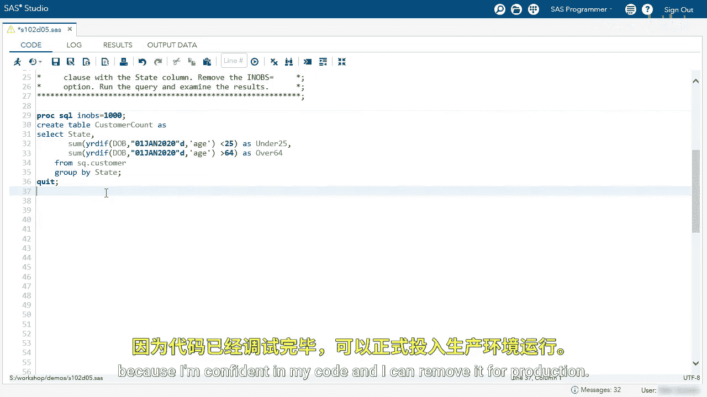
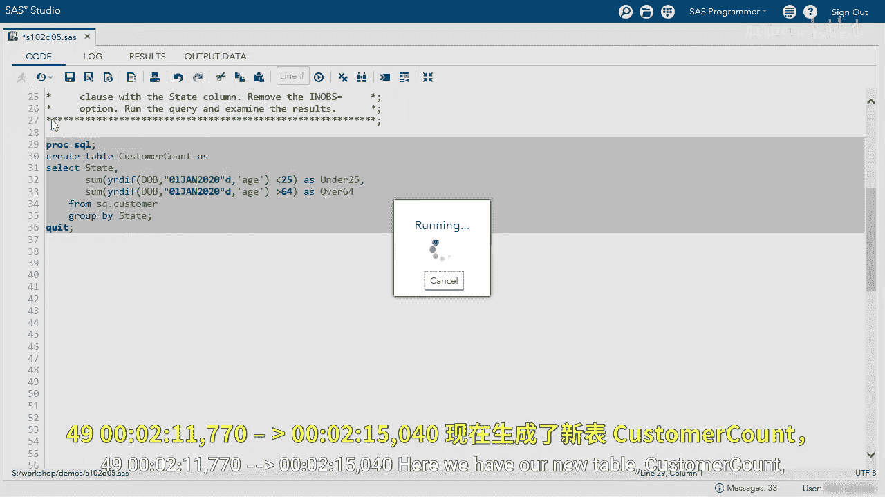

# SAS【中英⚡SAS高级程序员 专项课程｜SAS Advanced Programmer Professional Certificate】 p30 P30 10_演示：使用布尔表达式汇总数据 -BV1Cfe3z3EoA_p30-

We're going to summarize data using Boolean in a summary function。

This query is going to create a table calledCustom account from a query。

The queries started and we're selecting the state column。

 and then we're creating a new column called age using the year diff function。

I'm going to run the query and view the results。Here we have our new table。

 and we can see we have the state value and the age value。

I want to summarize my data by any customers under 25 and over 64。So let's go back to the editor。

And using that age value， I'm going to specify less than 25 as under 25。

Here we're using our Boolean expression and this will give us a1 if it's less than 25 or a0。

 if it's greater than 25。We can see that new column under 25 with a list of zeros and ones again zero is false。

 one is true。 so for example， row 6 is true that customer is under 25。Well。

 let's continue and find all customers greater than 64。I'm going to copy my function。

We'll add a comma， and then we'll paste the value。And instead of less than 25。

 we're going to specify greater than 64。And we're going to name this column over 64。

I'm going to run the query and just make sure everything's working accordingly。

Now I have the third column over 64 with zeros and ones。I want to summarize this by state。

 so I want to see how many customers are less than 25 and greater than 64 for each state。

So let's bring the sum function and we're going to sum the value of the ones。

This will sum each of these， and then we're going to add the group by clause and we're going to say group by state。

😊，I'm going to remove the NOs equals option because I'm confident in my code and I can remove it for production。

Here we have our new tableCustom count with the state， in this example， Arkansas。

 60 customers are under 25， 57 are over 64， and we can see that throughout for each state and DC and Puerto Rico。

