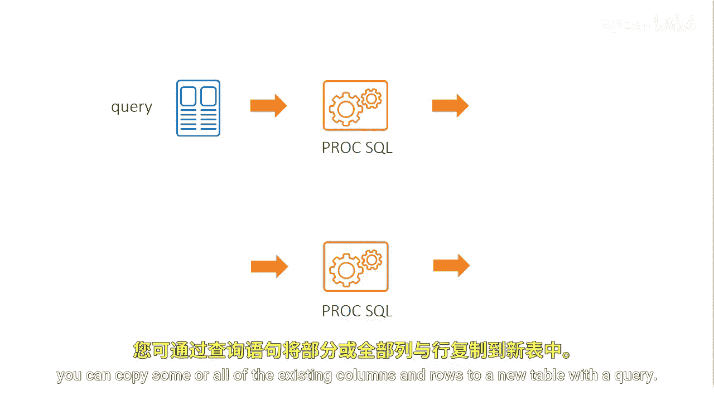
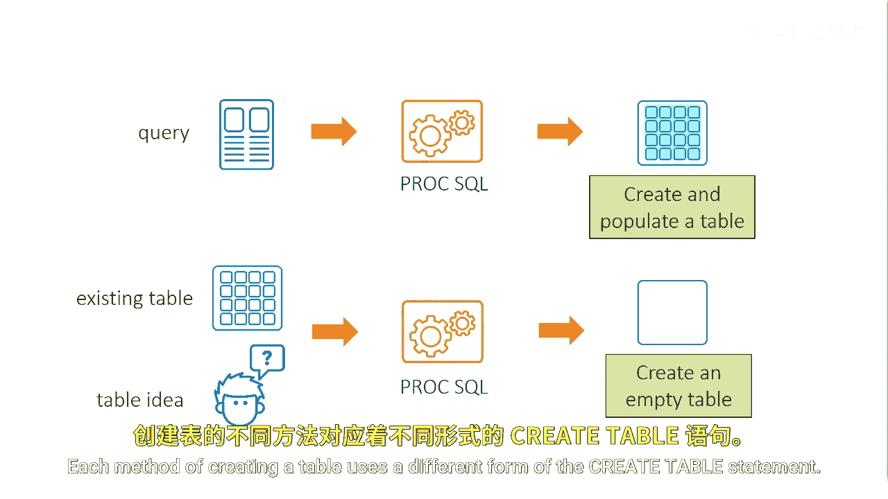
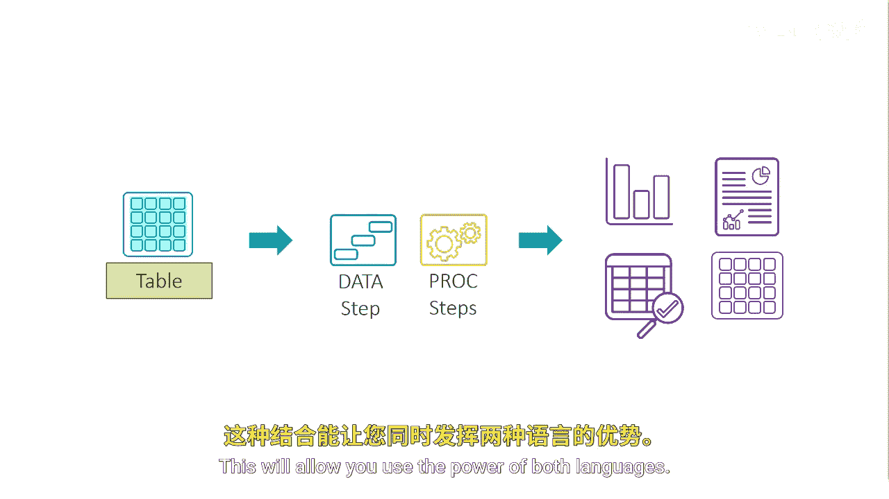

# SAS【中英⚡SAS高级程序员 专项课程｜SAS Advanced Programmer Professional Certificate】 p31 P31 01_创建表 -BV1Cfe3z3EoA_p31-

ProocSQL provides three methods of creating new tables。

You select a method depending on what you start with。

If one or more existing tables have the data that you need。

 you can copy some or all of the existing columns and rows to a new table with a query。

This method creates a table that is already populated with data If you start with an existing table。

 you can also copy only the column structure to create a new table that has no rows that is an empty table you'll need to add the data in a separate step。

If no existing table has a column structure that you want。

 you can define new columns in your code to create an empty table。

Each method of creating a table uses a different form of the Create table statement because tables created with ProC SQL or SAS tables。

 you can use them as input to a data step or to other SAS statistical or visualization procedures you might create tables with SQL for a variety of reasons。

 like to obtain a smaller table of data for different reports and analysis or to share with a coworker。

Another reason to summarize or filter data with SQL and use in SAS is for the data step。

If you need more control over data manipulation， the data step is a perfect tool for the task。

Combining SAS and SQL can make you a more productive and dynamic programmer。

 this will allow you to use the power of both languages。

