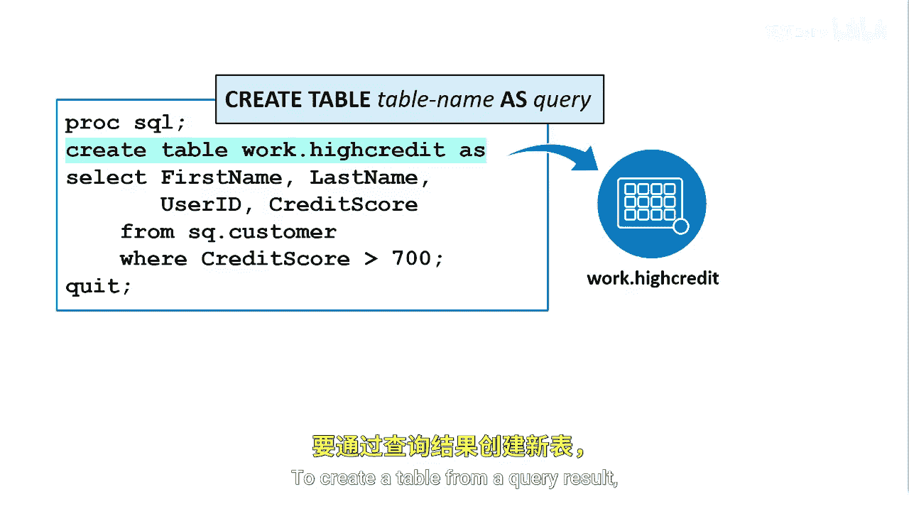
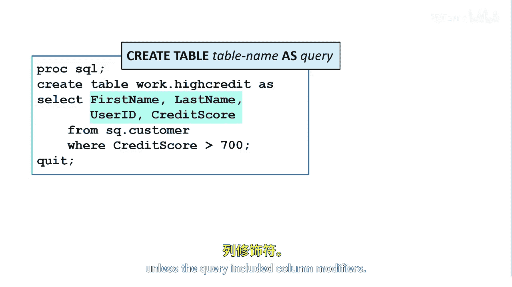
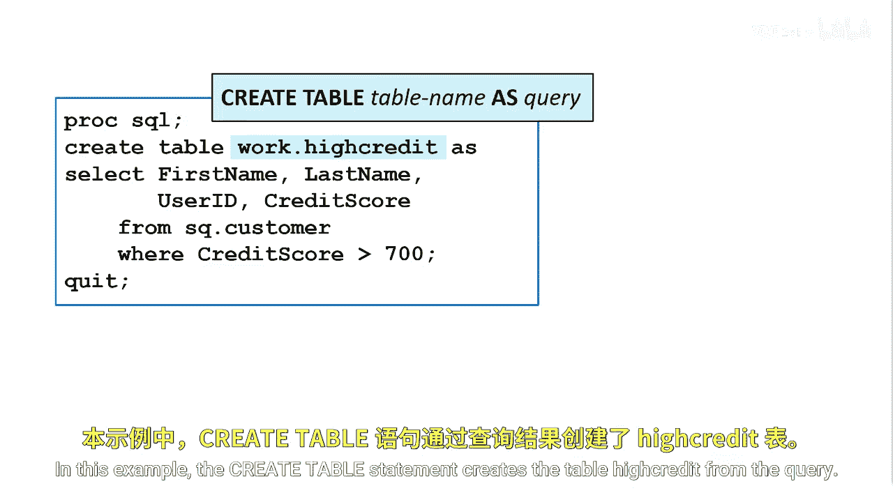
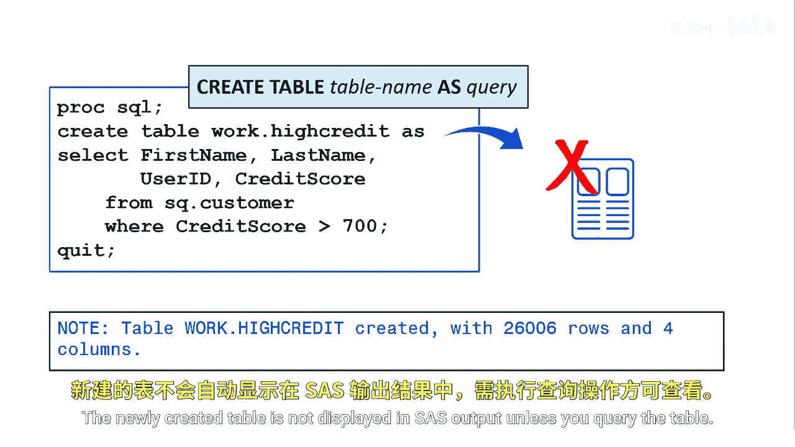
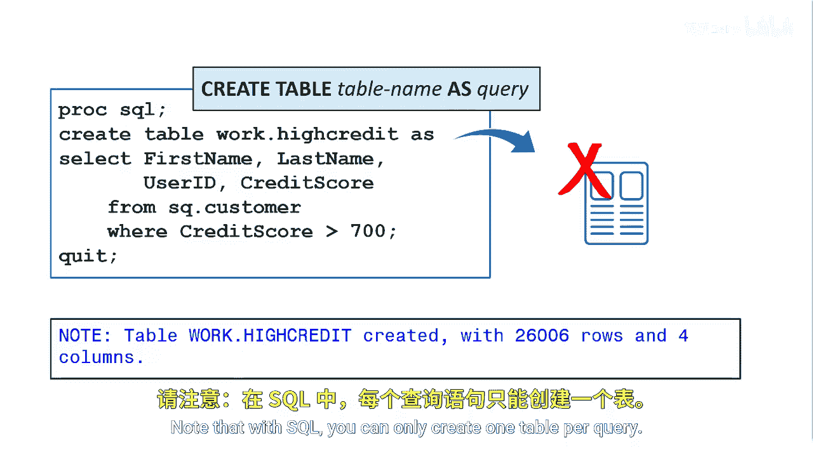

# SAS【中英⚡SAS高级程序员 专项课程｜SAS Advanced Programmer Professional Certificate】 p32 P32 02_从查询创建表 -BV1Cfe3z3EoA_p32-

To create a table by copying columns and rows from one or more existing tables。

 you use a query in the Create table statement。

This method is most often used to create subsets or supers of existing tables。

This is the only method that creates and populates a table in one statement。

To create a table from a query result， you can use a create table statement with a new table name and the as keyword followed by the query。

Adding Create table at the beginning of the query creates a table instead of results。

It's important to note that when a table is created this way。

 its data is derived from the table that is referenced in the queries from Cla。

The new table's column names are as specified in the Queery Select Clause list。The column attributes。

 the type， length， in format format， and extended attributes are the same as the selected source columns unless the query included column modifiers。

In this example， the createate table statement creates a table high credit from the query。

Only the rows where the value of credit score is over 700 are inserted into the new table。

The newly created table is not displayed in SAS output unless you query the table。

Note that with SQL， you can only create one table per query。

You can use a data step to create multiple tables。