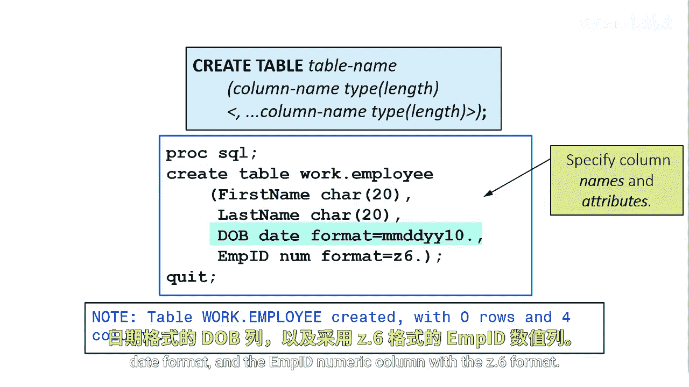

# SAS【中英⚡SAS高级程序员 专项课程｜SAS Advanced Programmer Professional Certificate】 p33 P33 03_创建表结构 -BV1Cfe3z3EoA_p33-

You can also create table structures with Pro SQL。 There are two methods。

 The first method to create a table structure that has similar column attributes as an existing table is to use the light clause in the Cate table statement。

This method will copy the table structure and columns that you reference after the light clause。

In this example， we want to create a table named high credit that contains only the first name。

 last name， user ID， and credit score columns from the SQ。cuser table。

The easiest way to do that is to use the Cate tableable like method with SAS data set options in the Create table statement。

Specify the four columns you want to keep using the Keep equals data set option。

You could also use the Drop Equ data set option and drop columns you don't want and implicitly keep remaining columns。

To create a new empty table， you define the columns in the Create table statement。

Then you specify a set of column definitions that together make up the table definition。

This create table statement creates the employee table with four columns。

 the first name and last name character columns with a withIA 20， the DOB column in the MMDDYY10。

 date format and the MID numeric column with the Z。6 format。

