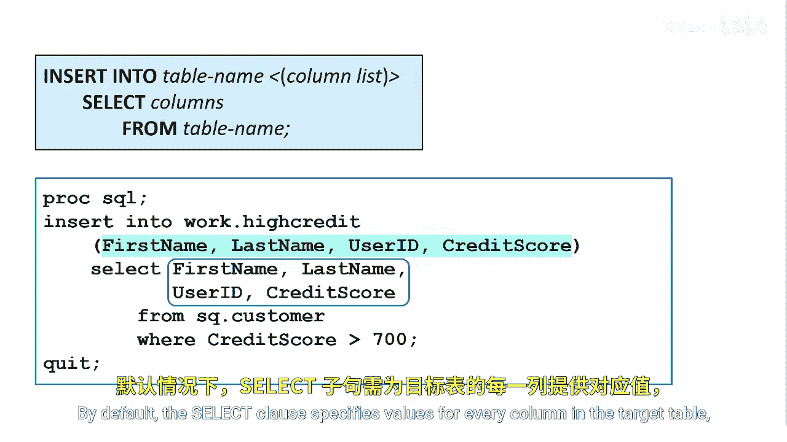
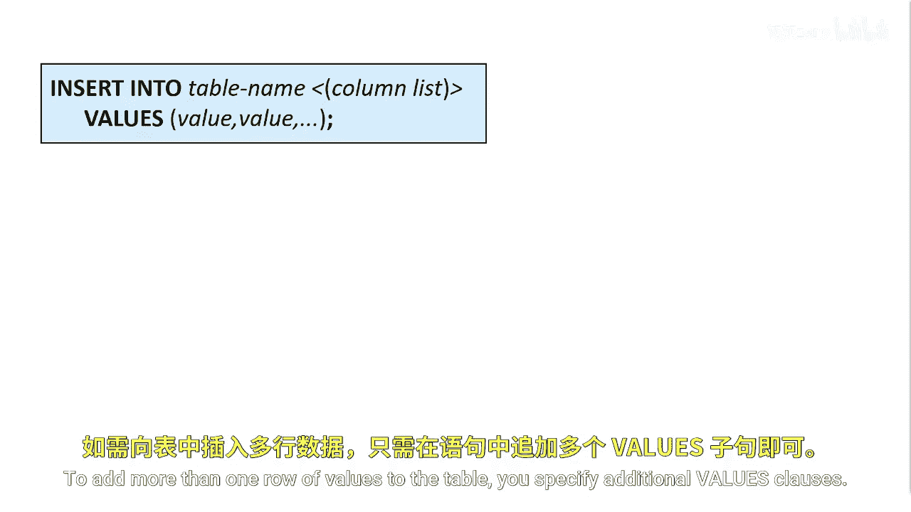
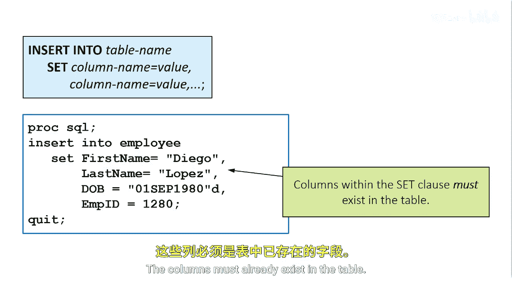

# SAS【中英⚡SAS高级程序员 专项课程｜SAS Advanced Programmer Professional Certificate】 p34 P34 04_向表中插入行 -BV1Cfe3z3EoA_p34-

Once tables are created， you can use the insert statement to insert data values into tables。

 either in an empty table or a table that is already populated。

 The insert statement first adds a new row to an existing table and then inserts the values that you specify into the row。

You specify values by using a set clause or values clause。

You can also insert the rows resulting from a query。To add data from one existing table to another。

 you can specify a query in the insert statement For example。

 this insert statement uses a query to add rows of data to the high credit table rows returned by the query are inserted into the table If the table has existing rows。

 the new rows are appended。By default， the select clause specifies values for every column in the target table and the order of the values must match the order of the columns in the target table。

In this example， the select clause specifies values for the four columns in the high credit table。

 first name， last name， user ID and credit score。Not all columns are required。

 and if there are more columns in the table than listed， the columns not listed are set to missing。

You can use the insert statement with the values clause to add values to a column in a single row。

To add more than one row of values to the table， you specify additional values clauses。

In this example， we want to insert two rows of data into the employee table because we gain new employees。

We first specify the insertt In statement followed by the table name and the columns we want to insert。

 first name， last name， DOB， and MPID。When specifying the columns after the table name。

 the position matters。Also， not all columns are required。

 and if there are more columns in the table than listed， the columns not listed are set to missing。

The values clauses specify the values we want to insert。When specifying the values。

 the order must match the position of the column specified After the keyword in parentheses。

 we specify the new employee's first name Diego， last name Lopez， his birthday。

 and his employee ID number。We do the same with the second employee。

You can also use the set clause to specify or alter the values of one or more columns in a row The set clause contains one or more pairs of column names and values。

In each pair， the column name and the value are joined by an equal sign。

The columns can appear in any order in the set clause， unlike in the previous examples。

 in this insert statement， the set clause inserts values into four columns in the employee table。

The columns must already exist in the table。

