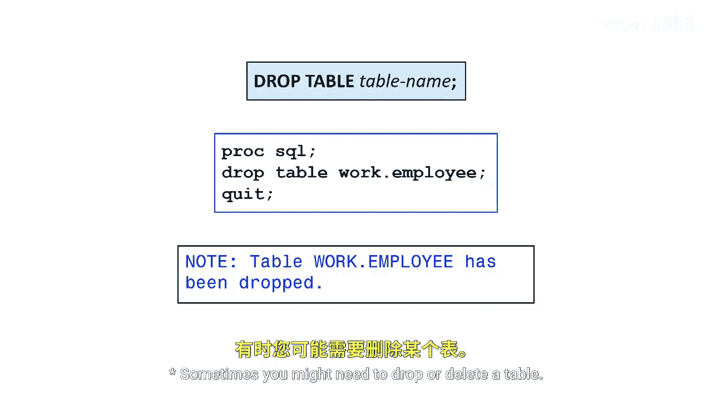

# SAS【中英⚡SAS高级程序员 专项课程｜SAS Advanced Programmer Professional Certificate】 p35 P35 05_在 PROC SQL 中删除表 -BV1Cfe3z3EoA_p35-

Sometimes you might need to drop or delete a table if you have the appropriate permissions to make such changes within SAS or a database。

 you can use the Drop table statement。

