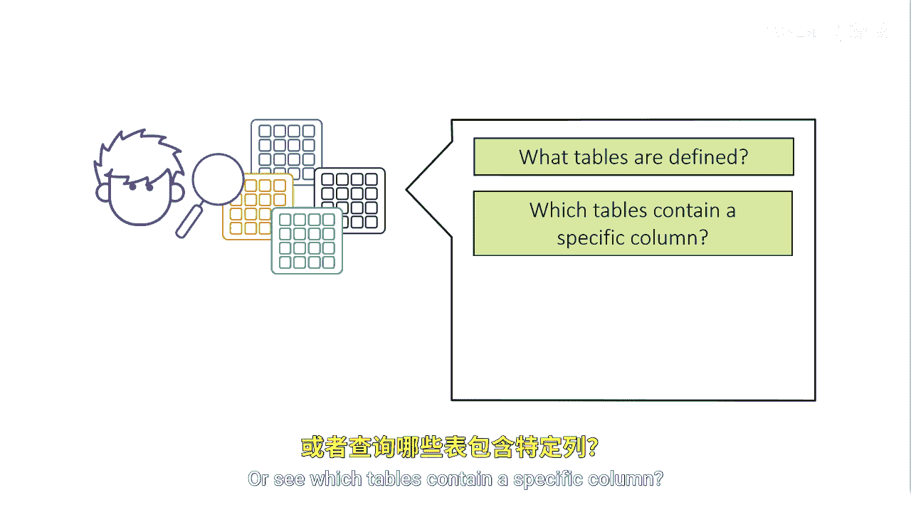

# SAS【中英⚡SAS高级程序员 专项课程｜SAS Advanced Programmer Professional Certificate】 p36 P36 01_场景 -BV1Cfe3z3EoA_p36-

Suppose weve inherit in many different data tables and want to become familiar with our content。

 How can we efficiently begin to explore our tables and libraries。

 What if we want to see all tables defined in a specific library or see which tables contain a specific column。

What about checking if related columns are the same data type and length in all tables？

Or what if we want to see all libraries that are assigned to us？

We can use dictionary tables to find this information easily and efficiently。

