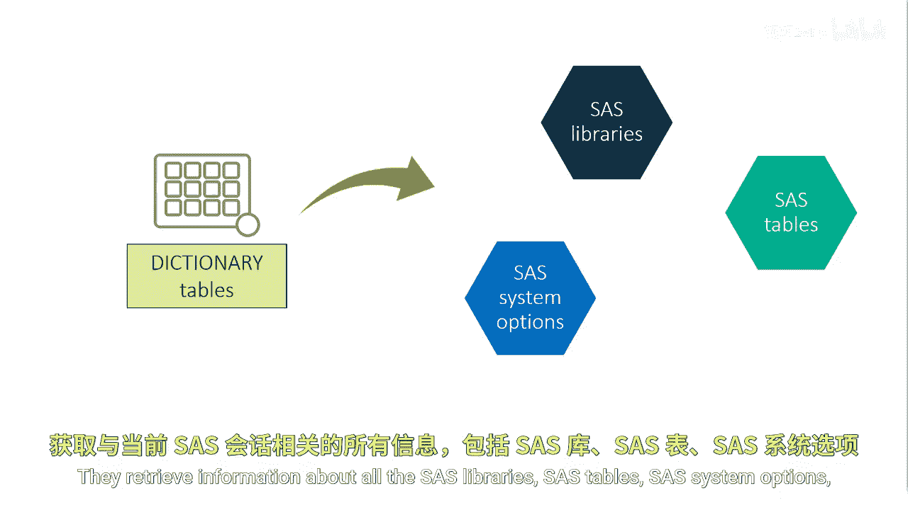
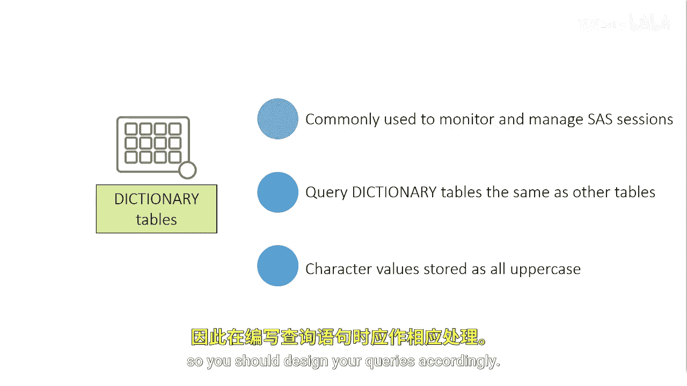
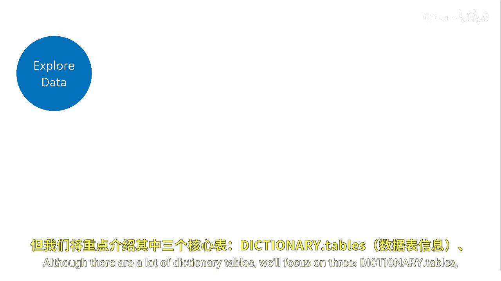

# SAS【中英⚡SAS高级程序员 专项课程｜SAS Advanced Programmer Professional Certificate】 p37 P37 02_字典表 -BV1Cfe3z3EoA_p37-

Dictionary tables contain information about each SAS session or batch job。

These special tables are available immediately after the SAS session initializes and are updated automatically by SAS throughout the entire session。

Dictionary tables are read only and contain data or metadata about the SAS session。

They retrieve information about all the SAS libraries， SAS tables， SAS system options。

 and external files that are associated with the current SAS session。

SS automatically assigns a special reserveser Libre dictionary accessible only from within ProC SQL to the dictionary tables。

However， SAS provides PRC SQL views based on the dictionary tables that can be used in other SAS procedures and in the data step。

These views are stored in the SAS Helpp Library and are commonly called SASHep View。

Dictionary tables are commonly used to monitor and manage SAS sessions because the data is more easily manipulated than the output from other sources such as PRC data sets。

You can query dictionary tables the same way you query any other table。

 including subsetseing with a wear clause， ordering the results， and creating PRC SQL views。

Note that many character values and dictionary tables are stored as all uppercase。

 so you should design your queries accordingly。

Although there are a lot of dictionary tables， we'll focus on three dictionary dot tables。

 dictionary。 columns， and dictionary。 Live names。

These are important tables to understand。