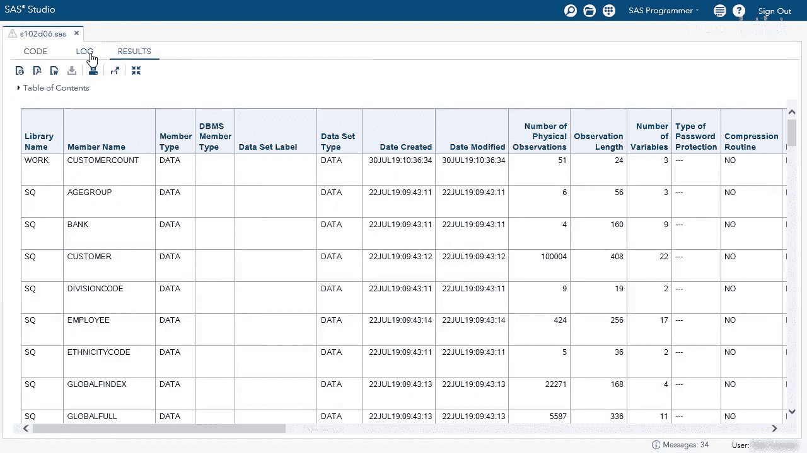
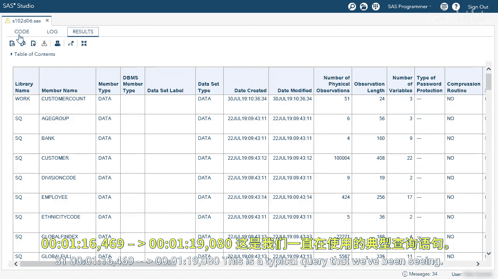
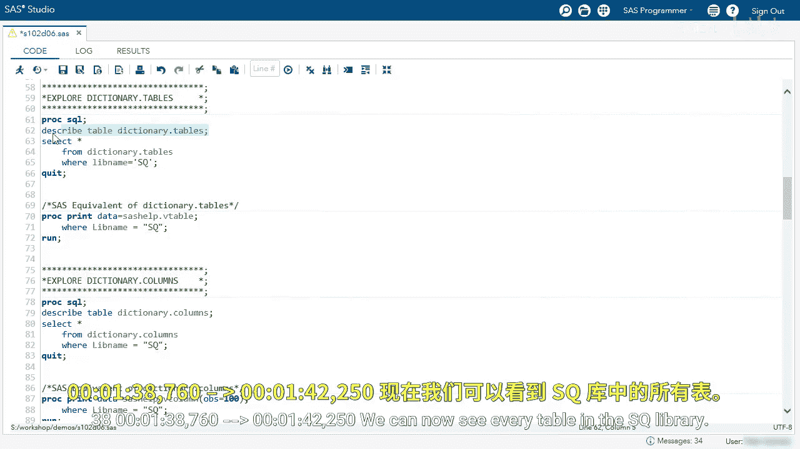
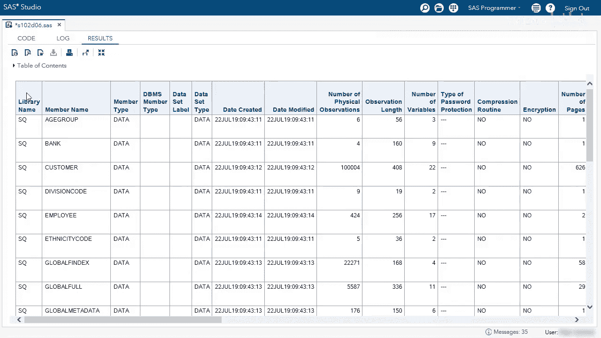
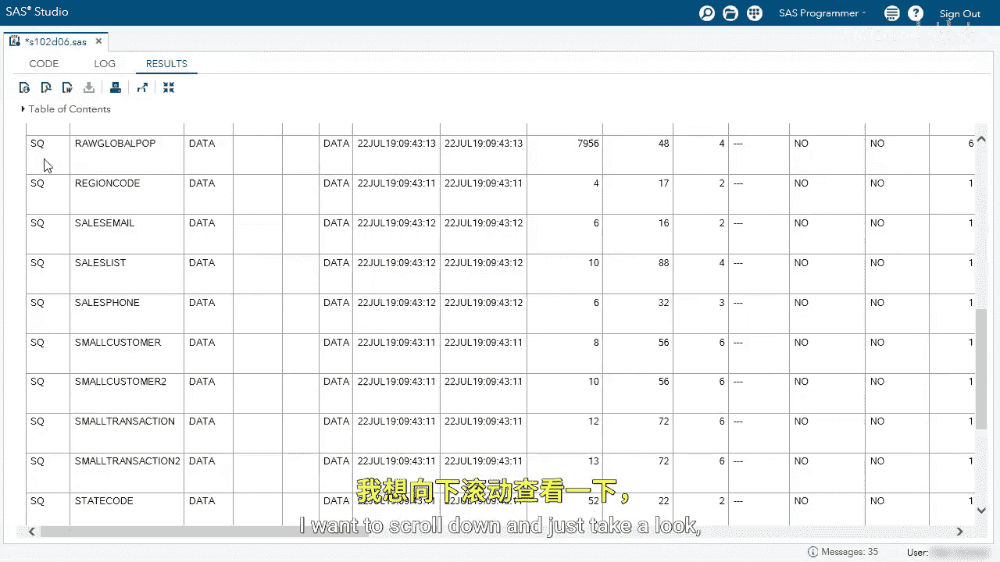
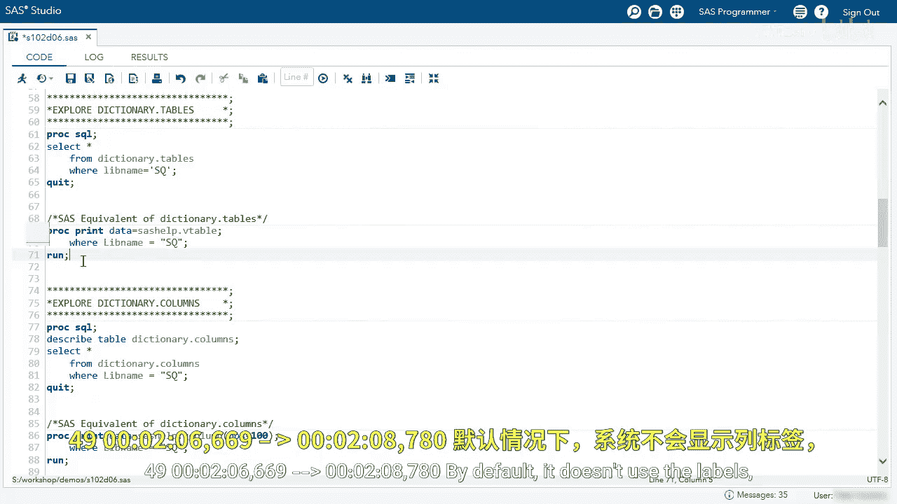
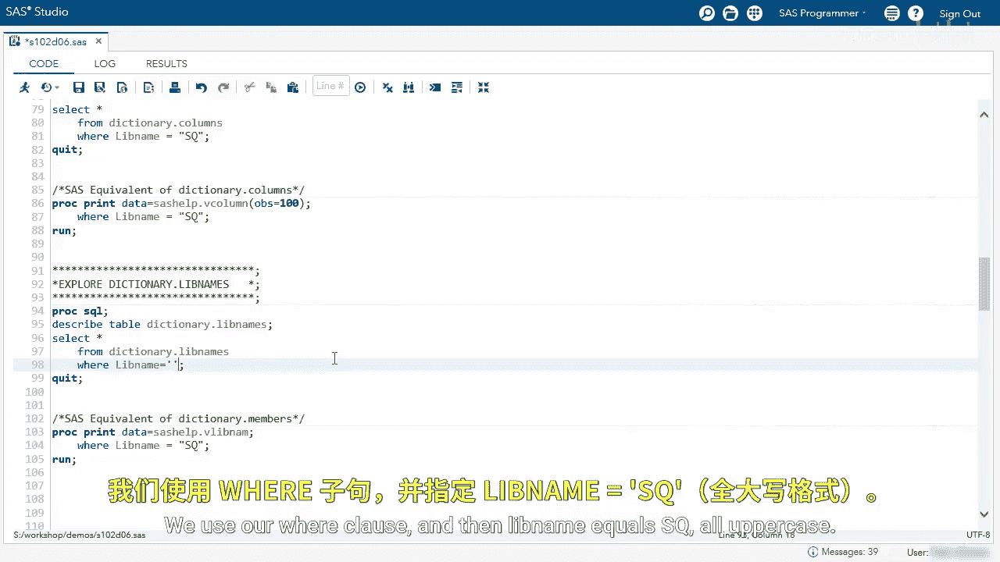

# SAS【中英⚡SAS高级程序员 专项课程｜SAS Advanced Programmer Professional Certificate】 p38 P38 03_使用字典表示例 -BV1Cfe3z3EoA_p38-

We're going to be using dictionary tables to query dictionary information。

We're going to start by first exploring dictionary dot tables。

 it's in our dictionary library and our tableables table。

I'm going to use the nOs equals 100 option to limit our rows。

We're going to use a De table statement on the dictionary dot tables。

 and then we're going to select all from dictionary dot tables。

The first thing I like to do is view the log。

The described table statement gives us the same information that we saw earlier；

 it shows us the column names， the column types， and if a label is associated。

Every column here has a label， so it's good to know what the actual column name is。

Let's go our results and see the information this query gives us。

We can see the library name， work， SQ， etc， these are all in uppercase， we can see the member name。

 which is the table name， again all uppercase， the member type。

 and then a variety of other information， the date it was created or modified。

 the number of physical observations， the length， the number of variables or columns， etc。Well。

 what if I want to focus just on the SQ library？

This is a typical query that we've been seeing， we're selecting all from dictionary dot tables where live name equals SQ。

Here we have to use the uppercase SQ。I'm going to remove the nOs equals option。

And I'm going to remove the De table statement。

We can now see every table in the SQ library。

I'm going to scroll down and just take a look。

And we should have about 27 tables and all the information about them。

The SAS equivalent of dictionary dot tables is using SAShelp。v table。

 we're going to use the aware statement where live name equals SQ。

 and if we run this we'll get the same information as above。

By default， it doesn't use the label so we have the actual column names。

It's good to know both dictionaryt tables and health help views depending on where you're using them。

Here we're going to explore the dictionary。 columns。

 I want to use the describe table statement on dictionary。 columns。

 and then I'm going to select everything from dictionary。 columns where live name equals SQ。

Let's take a look。Again， I'm going to quickly go to the log。

And view some of the column names， they're very similar。

 but there are different columns in each of these tables。

 I'm going to focus on the live name and the mem name。

We can see the library name is only the SQ library， and the member name is the table name。Now。

 if we look over at the column name， we can see every column in each table in the SQ library。

We can see the column type， the length， the position。

 and a variety of other information about each column in these tables。

This is a great way to compare columns in different tables if they're supposed to be the same column type。

 length and format。

Let's look at the SAS equivalent of dictionary。 columns and that is SAShelp。v column。

 we're limiting it to the first100 rows just to show you that this is an equivalent we'll run the procedure。

Again， we can see the same information， the column names here do not have labels by default when using the print procedure。

Lastly， I want to explore dictionary。 Live names。Here， describe tableable dictionary。L names。

 select everything from this table。

Again， quickly check the log。

We can see a little less columns， but we can see the live name， the engine， the path of the library。

 and a variety of other information。

And the results we can see we have the library name， the engine used， where that library is located。

 and again different information for each library， What if I want to see only the SQ library while we write a simple query？

We use our warehouse clauses。And then live name equals SQ all uppercase。

We can run the query。And now see the SQ library only。

Another nice feature is what if you want to see each distinct library you're connected to？

We can remove the wear clauses。And then in the select clause， write distinct Live name。

I'm going to run the query and see the distinct libraries I'm connected to。

Here we have some libraries I'm connected to， yours may differ slightly。

 but this is a nice way to check every library again， if we go back to our editor。

 we can see you can also use another version the SASHep。

 V live name in SAS programming so in the PRC step or the data step。If we're run this procedure。

 we can see all the libraries in the same information。Again。

 here we have our SQ library and the same information we saw earlier。

