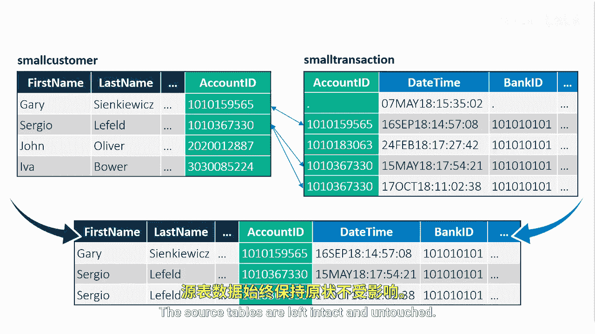
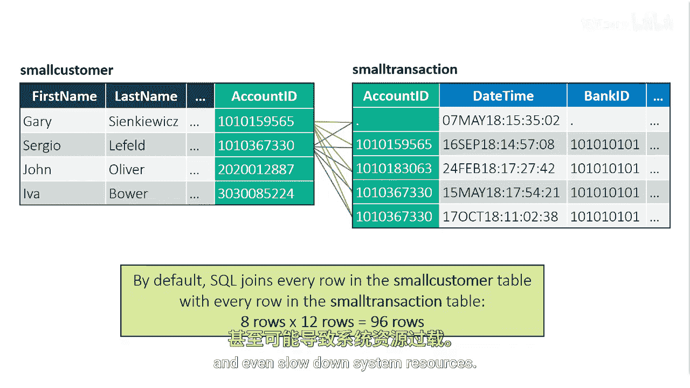

# SAS【中英⚡SAS高级程序员 专项课程｜SAS Advanced Programmer Professional Certificate】 p40 P40 01_连接表 -BV1Cfe3z3EoA_p40-

Suppose you want to create a report that includes customer demographics from the small customer table。

 combined with customer transactions from the small transaction table。

You want an entire row to contain all information about the same customer。

SQL uses joints to combine tables horizontally。Requesting a join involves matching data from one row in a table with a corresponding row in a second table。

Matching is typically performed on one or more columns in the two tables。

 the account ID column exists in both tables。In the small customer table。

 account ID is a unique value that represents a specific customer。

This is typically known as a primary key。A foreign key is a column in one table that refers to the primary key in another table in the small transaction table。

 account ID is a foreign key。You can combine or join the tables in Pro SQL by using the primary key account ID Joins combine data horizontally from multiple source tables to produce either a report or an output table。

The source tables are left intact and untouched。

The most basic type of join is performed by simply listing multiple tables in the front clauses of a select statement separated with a comma。

In this example， the query joins the two tables， small customer with eight rows。

 and small transaction with 12 rows。But to understand how SQL processes a join。

 it's helpful to understand the concept of the Cartesian product or a cross join。

A query that lists multiple tables in the front clauses without additional clauses that specify the conditions for matching rows generates a Cartesian product The number of rows in a Cartesian product is a product of the number of rows in the contributing tables。

Each row from the first table is combined with every row from the second table。

When you run this query， the Cartesian product creates a report with a total of 96 rows。

Our Cartesian product is rarely the result that you want when you join tables when working with large tables。

 a Cartesian product can create an unnecessarily large rapport or table and even slow down system resources。

