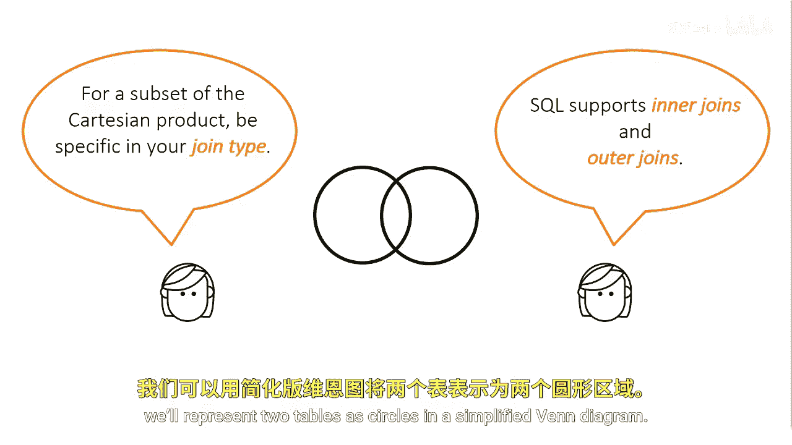

# SAS【中英⚡SAS高级程序员 专项课程｜SAS Advanced Programmer Professional Certificate】 p41 P41 02_连接类型 -BV1Cfe3z3EoA_p41-

Typically， you want a subset of their Cartesian product。

 so you need to be more specific and declare the join type and the pieces of information you want to associate between the tables。

SQL supports two types of joins， inner joins， and outer joins。

To explain the result of each type will represent two tables as circles in a simplified Venn diagram。

Inner joins represent the overlapping area of a Venn diagram。

They return a results set for all the rows in a table that have one or more matching rows in the other table or tables that are listed in the from clause。

All outer joins return results meeting the conditions described in the on or where clause。

 plus those rows not meeting the condition。There are three types of outer joints。

Full outer joins represent everything in the Venn diagram。So they return all the matching rows。

 plus the non matching rows from both tables。Left outer joins represent the left circle and the overlapping area of the Venn diagram。

They return all the matching rows plus the non matching rows from the first or left table。

And right outer joins represent the right circle and the overlapping area of the diagram。

 they return all the matching rows plus the non matching rows from the second or right table。

