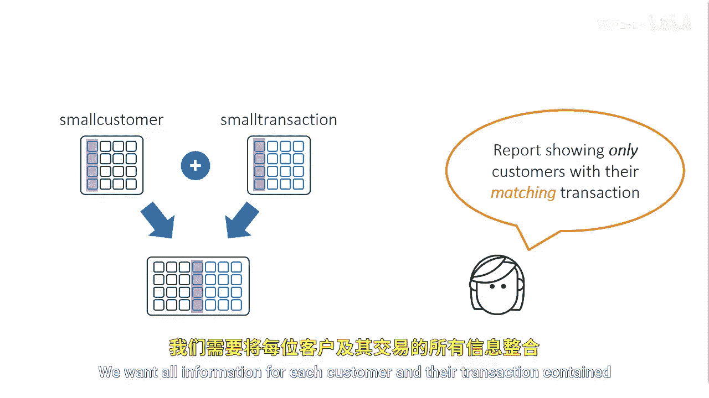
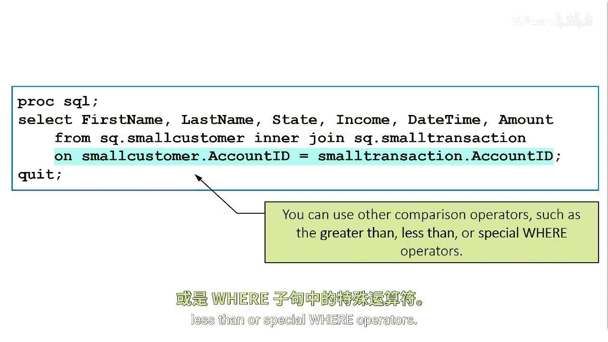
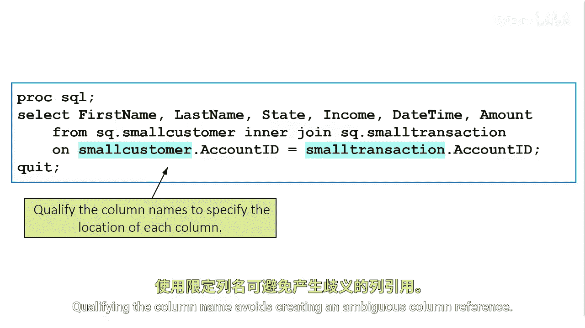

# SAS【中英⚡SAS高级程序员 专项课程｜SAS Advanced Programmer Professional Certificate】 p42 P42 01_使用内连接合并两个表 -BV1Cfe3z3EoA_p42-

Let's combine the small customer and small transaction tables by account ID and return a result containing only matching account ID values。

We want all information for each customer and their transaction contained in a single result set。

An inner join returns rows that meets certain join conditions that you specify。In the from clause。

 you specify the first table， the keywords inner join， followed by the second table。

Following the table names and join type， the syntax requires an on clause to describe the join criteria for matching rows in the tables。

Omitting the encluse produces a syntax error。

This example of an inner join is also called an Ejoin because of the equality in the en clauses where only rows with identical values in the account ID column produce a match。

The on conditiond could also use other comparison operators such as greaterer than less than or special wear operators。

A table name appears before each reference to the account ID column。

When you refer to tables that have the same name column。

 you must qualify the column names to specify the location of each column qualifiedified column names consist of the table name。

 a period， and then the column name。Qualifying the column name avoids creating an ambiguous column reference。

