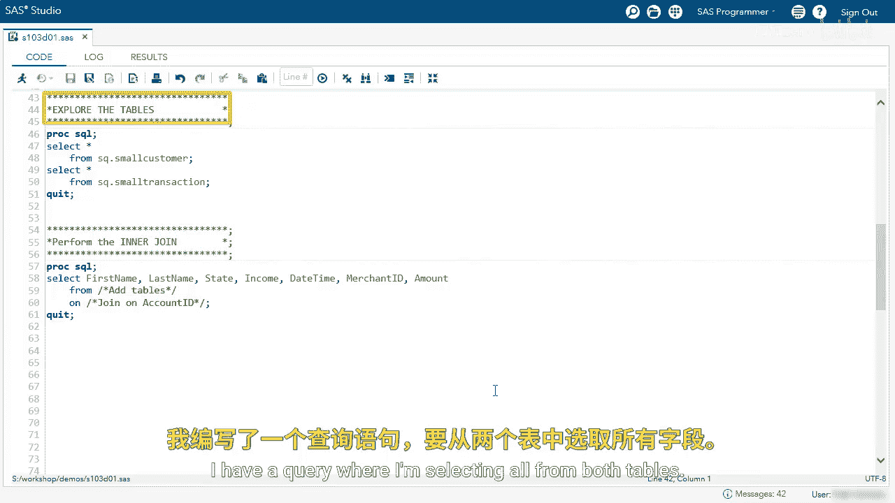
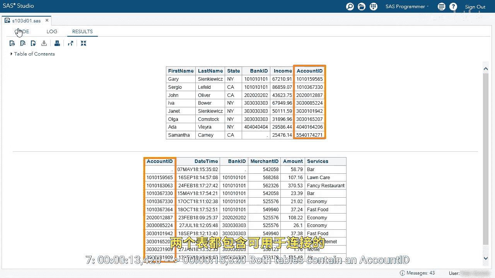
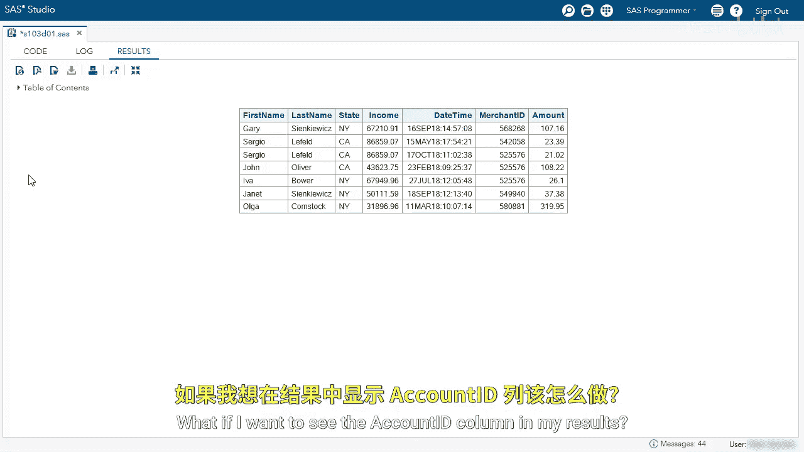
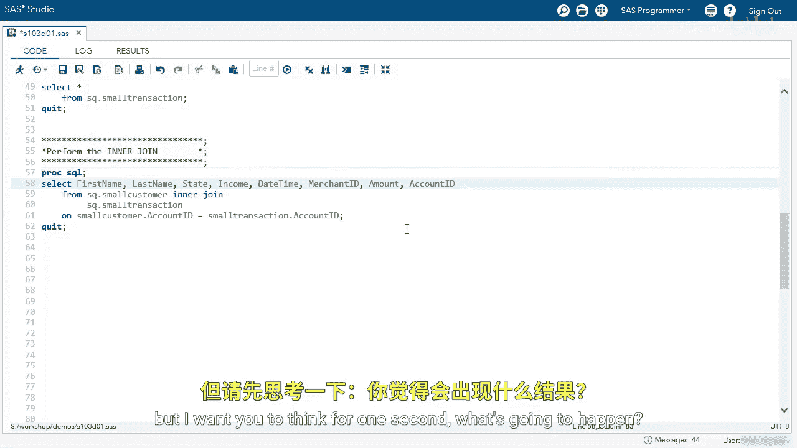
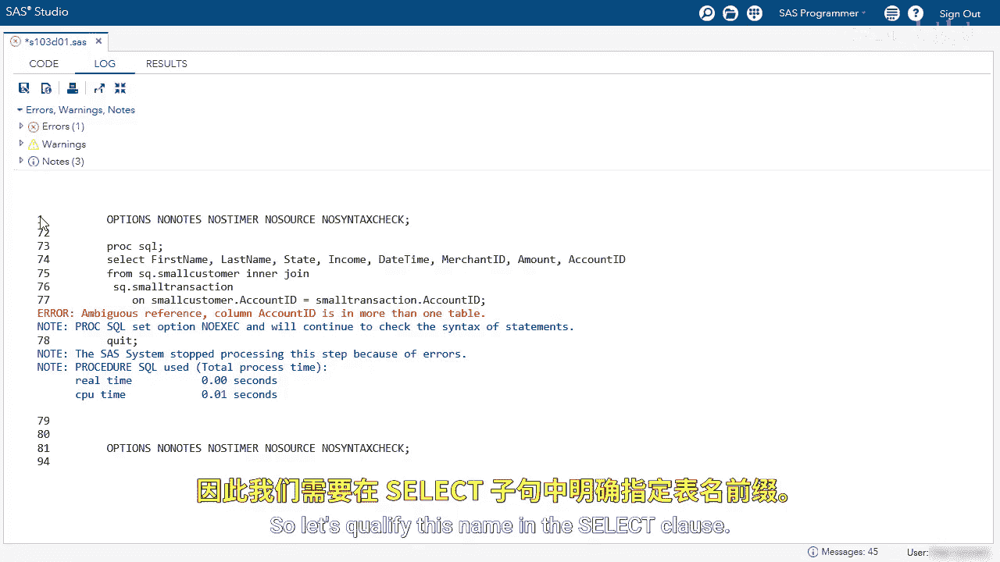
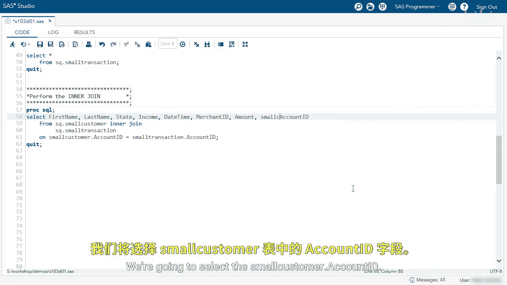
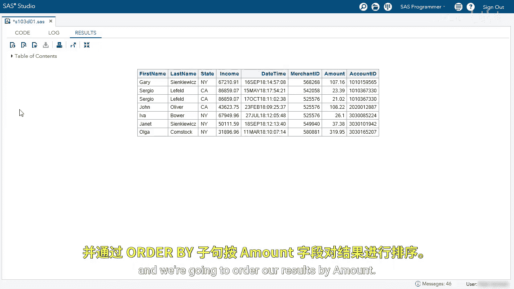
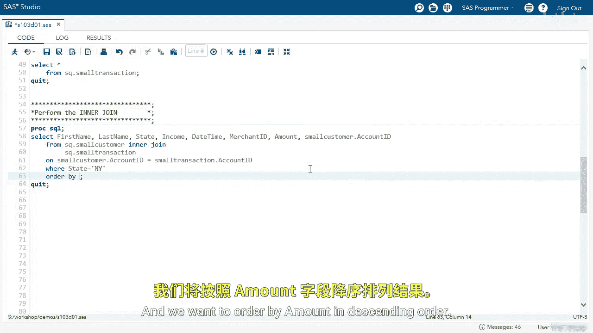

# SAS【中英⚡SAS高级程序员 专项课程｜SAS Advanced Programmer Professional Certificate】 p43 P43 02_使用PROC SQL执行内连接的演示 -BV1Cfe3z3EoA_p43-

We're going to use ProC SQL to perform an inner join between two tables。

I'm going to start by exploring the tables， I have a query where I'm selecting all from both tables。

Both tables contain an account ID that we can use to join the tables。

Let's perform the inner joint。The queries have started。

 so we are selecting a couple columns and we want to select these from both of these tables。

So I'll start with the SQ small customer。And then I need my join type， inner join。

Followed by the other table， and I'm going to use the SQ。t small transaction table。

Now we need to specify what is the join criteria， so in the oncluse we want to join by accountcount ID。

Since both tables contain a column called account ID， we need to qualify the column。

So the small customer dot account ID equals。The small transaction account ID。

We have performed an inner join， so rows in both tables in this query。

We can see that Gary has one transaction， the income of Gary， the date time of the transaction。

 the merchant from and the amount， we can see Sergio has two transactions and so on。

What if I want to see the account ID column in my results， let's add it in our query。

I'm going to run this query， but I want you to think for one second what's going to happen。

We get an error， ambiguous reference column account ID is in more than one table。

 so the account ID is in both tables， SQL doesn't know which account ID you would like。

So let's qualify this name in the select clause。

When using an inner join， you can select either account ID because you are only using matches we're going to select the small customer account ID。

I'm going to run the query。😊，And now we can see we have account ID as the last column。

And now we can use other clauses that we've learned in this course。

 we're going to use the where clause to subset where state equals NYY。

 and we're going to order our results by amount。

After the on clauses， we can specify the where clauses。The column。And then equals N。

Next we're going to use the order by clause to order by amount。

And we want to order by amount in descending order。

In this report， we can see we only have rows where state is N。

 and we can see the amount is in descending order。

So you can use an inner join with the other clauses we've learned。

