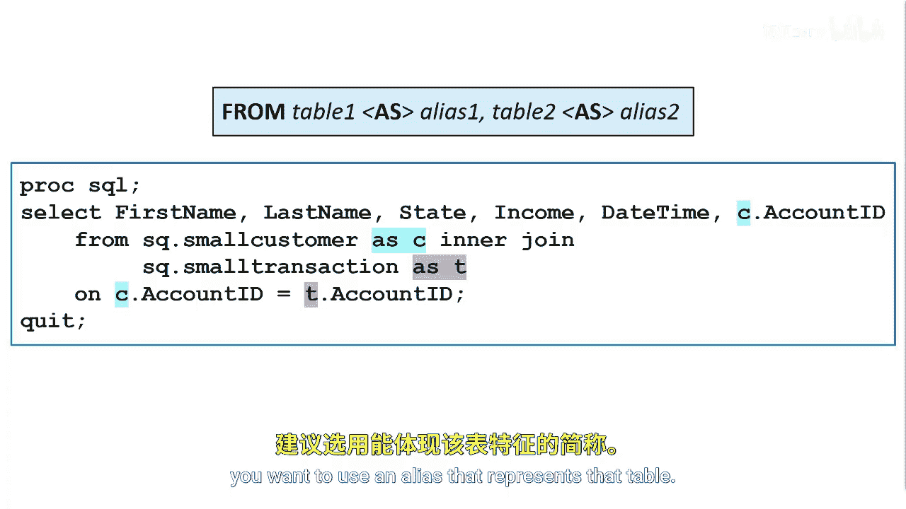

# SAS【中英⚡SAS高级程序员 专项课程｜SAS Advanced Programmer Professional Certificate】 p45 P45 04_使用表别名 -BV1Cfe3z3EoA_p45-

SQL enables you to assign an alias or nickname to a table in the from clauseuse by adding the optional keyword as and the alias of your choice。

The alias is a temporary alternate name for a table。

You then can use the alias in place of the full table name to qualify columns in the other clauses of a query。

In this example， the alias for the small customer table is C and the alias for the small transaction table is T。

Typically， when assigning table aliases， you want to use an alias that represents that table。

Again， using the as keyword is optional。