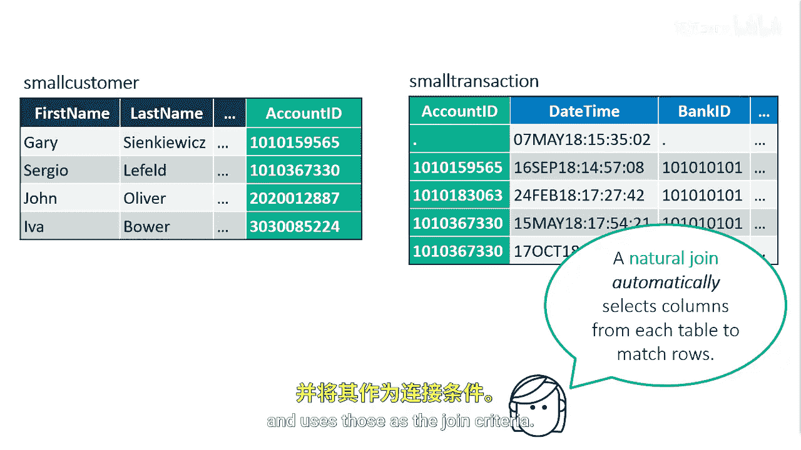

# SAS【中英⚡SAS高级程序员 专项课程｜SAS Advanced Programmer Professional Certificate】 p46 P46 05_使用自然连接匹配行 -BV1Cfe3z3EoA_p46-

In your programming， you might also encounter a natural join。

A natural join automatically selects columns from each table to use in determining matching rows。

With a natural join， ProC SQL identifies columns in each table that have the same name and type and uses those as the join criteria。

The advantage of using a natural join is that the coding is streamlined。

The on clauseuse is implied and you don't need to use table aliases to qualify column names that are common to both tables。

If you specify a natural join on tables that don't have at least one column with a common name and type。

 the result is a Cartesian product， you can use a wear clauses to limit the output。

Because the natural join makes certain assumptions about what you want to accomplish。

 you should know your data thoroughly before using it。

A natural join assumes that you want to base the join on equal values of all pairs of common columns。

To base the join on inequalities or other comparison operators， use standard syntax。

You can use ProC SQL options to assist you in creating and debugging queries。So far。

 we've seen the nOs equals and outOs equals options to reduce the query execution time by limiting the number of rows for development of our code。

Another excellent Pro SQL option is the feedback option。

The feedback option expands a select statement to the SAS log。

The column names are preceded by the table name if the table is not alias。

A great location to use the feedback option is when using a natural join because you see exactly how ProC SQL implements your query。

