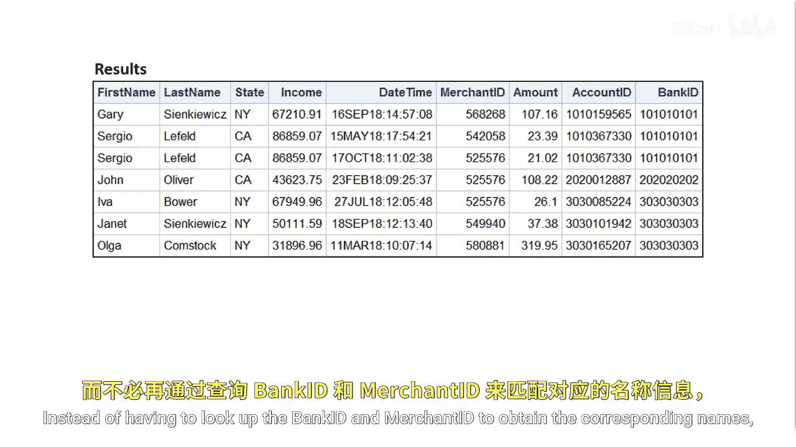
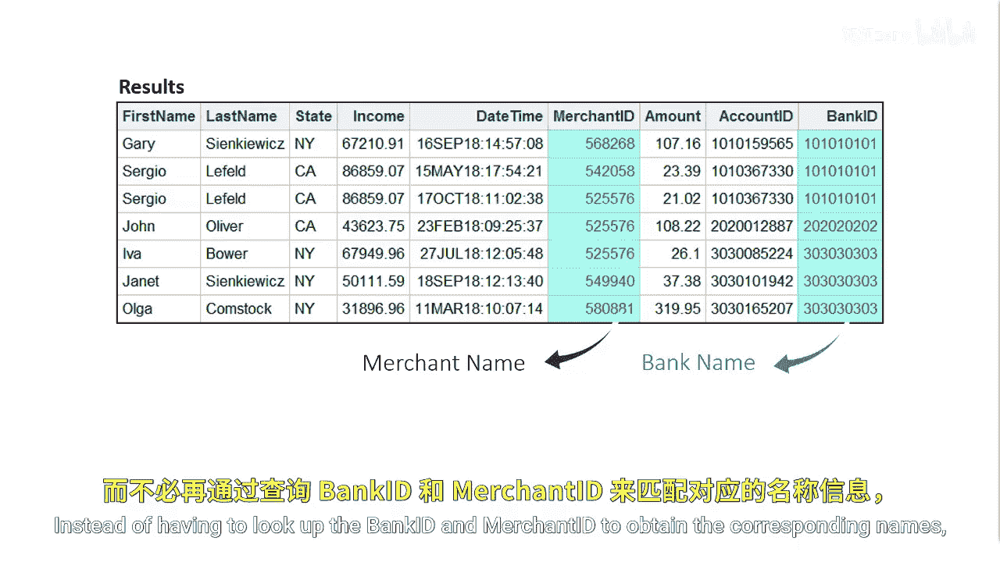
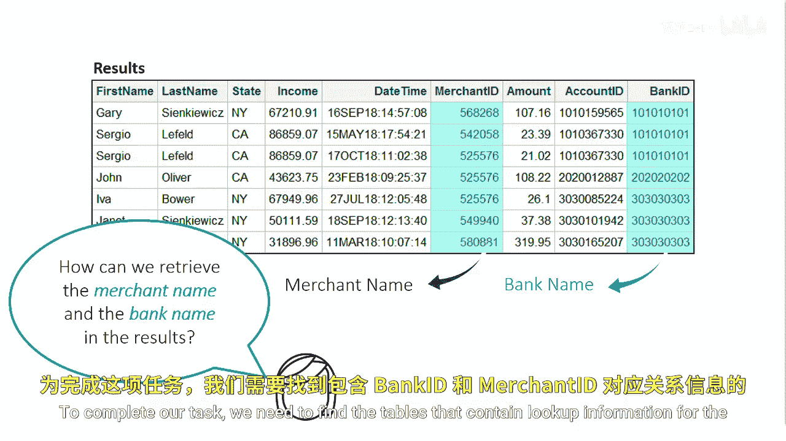
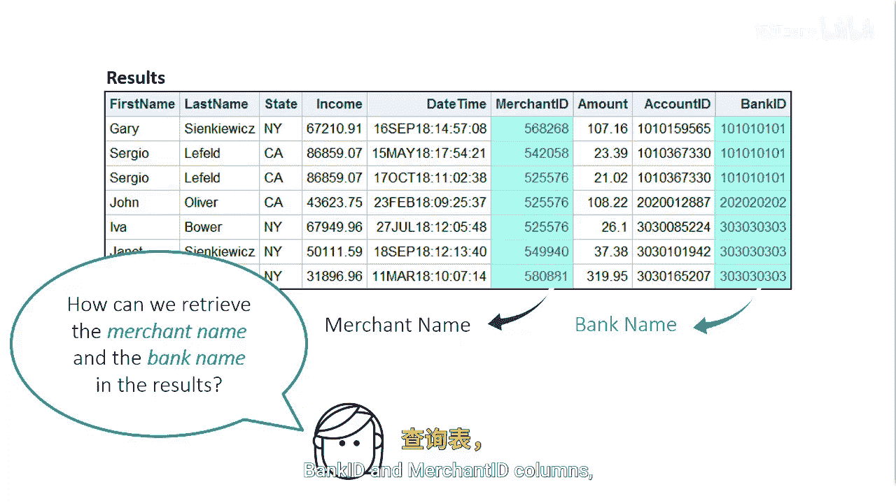

# SAS【中英⚡SAS高级程序员 专项课程｜SAS Advanced Programmer Professional Certificate】 p47 P47 06_从两个以上表中选择数据 -BV1Cfe3z3EoA_p47-

The results of the inner join on the small customer and small transaction tables include the columns first name。

 last name， state， income， date time， merchant ID， amount， account ID， and bank ID。

Although the results are informative， we want to dive deeper into the bank and merchant information。

Instead of having to look up the bank ID and merchantchan ID to obtain the corresponding names。

 we want to find a table that contains the necessary information。

To complete our task， we need to find the tables that contain lookup information for the bank ID and merchantchan ID columns。

 then join those tables all in one query。

