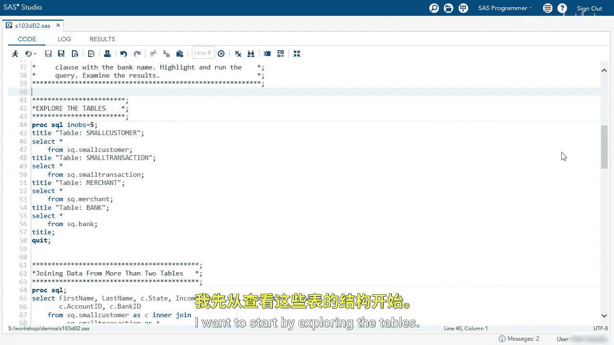
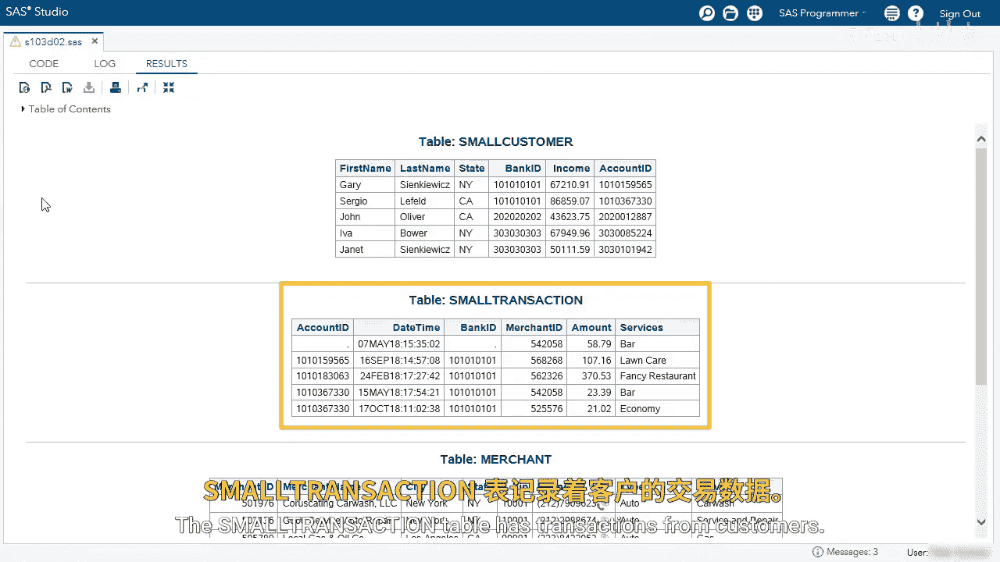
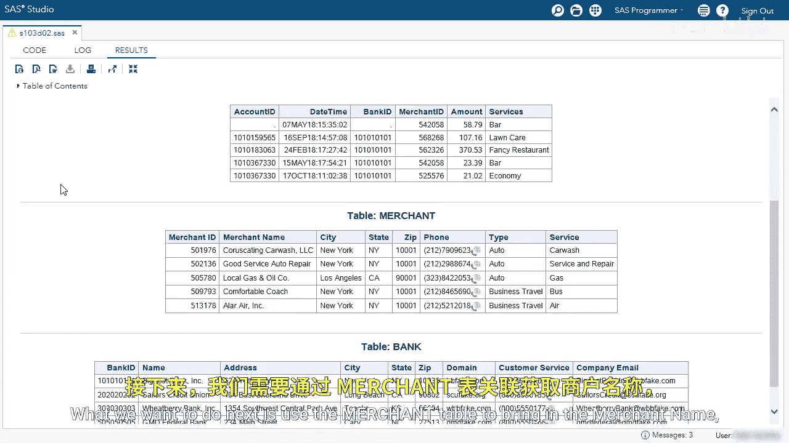
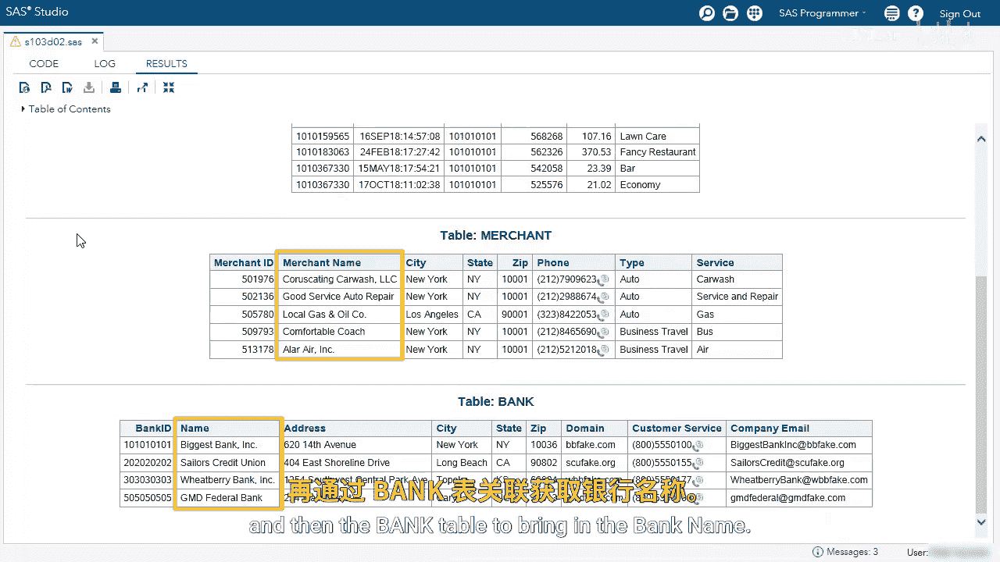
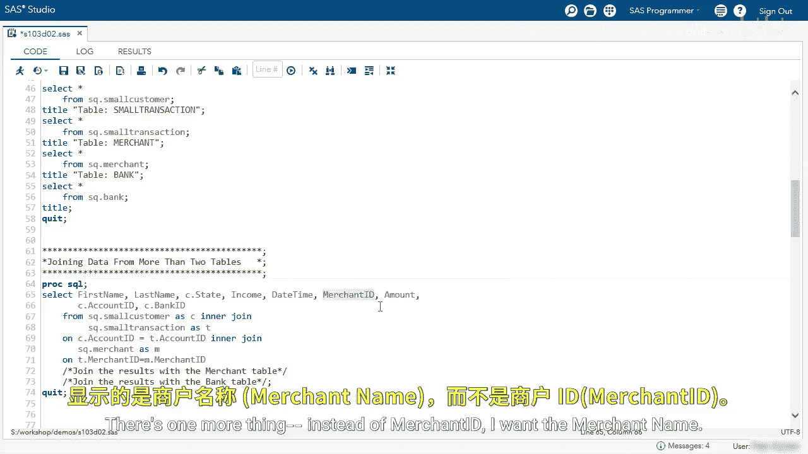
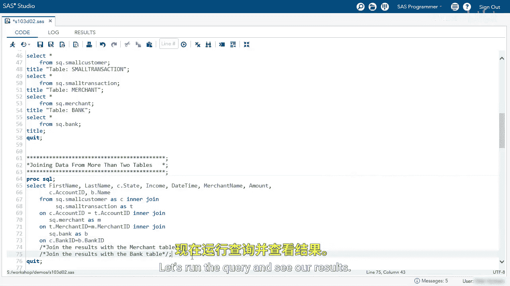

# SAS【中英⚡SAS高级程序员 专项课程｜SAS Advanced Programmer Professional Certificate】 p48 P48 07_演示：对四个表执行内连接 -BV1Cfe3z3EoA_p48-

We're going to use ProC SQL to perform an inner join with four tables。

I want to start by exploring the tables。

The small customer table we've seen before and has customer information。

The small transaction table has transactions from customers。 We've been joining this by account I D。

 What we want to do next is use the merchant table to bring in the merchant name and then the bank table to bring in the bank name。

I'm going to run the query to join the small customer and small transaction table。

In our results， we can see the merchant ID， but what merchant is that we don't memorize Is based on the merchant name。

 so we want to bring in the merchant name here。And in bank ID， we want to bring in the bank name。

So let's do that by performing a four table inner join。

The first thing I'm going to do is join the results with a merchant table。

We're going to use inter joinin。Then we're going to reference the table name， SQ。merchant。Next。

 we need an encl to specify the join。We're going to use on and actually let me go back and give this alias。

I'm going to use M let's use that alias to join the table first。

 I'm going to use a small transaction table merchant ID。

I'm using the alias T because I specified that above。That equals。The Merchan T merchant ID。

When I run this query， I will join by merchantchant ID。But there's one more thing。

Instead of merchantt ID， I want the merchant name。

Let's run the query。We can see here， instead of merchantchan ID。

 we brought in the merchant name from the merchant table。This gives us a little bit more information。

We want to do the same thing with Bank ID。 Well back to our editor。

I'm going to specify the join type for these results。And we're going to use an inner join。

 We're going to use the bank table。And we're going to give it an alias B。Next。

 let's specify the join type on this time， I'm going to use the small customer bank ID。

And that equals B dot bank ID for bank tableables bank ID。Before I run this query。

 I want to change C。bank ID to B dot name， so that is the bank table bank name。

Let's run the query and see our results。

Now in the last column， we can see we brought in the bank name from the bank table。

This report has a little bit more information for us and shows you that you can perform joins with multiple tables。

