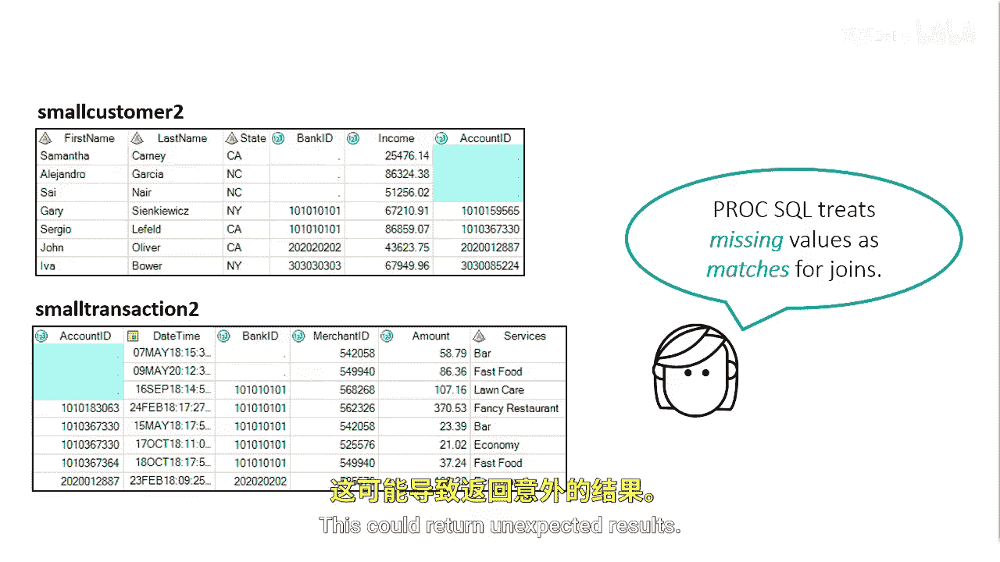
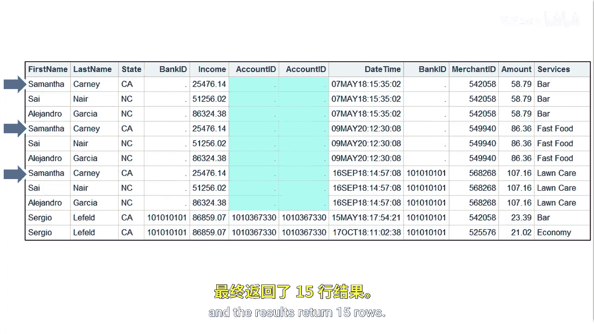
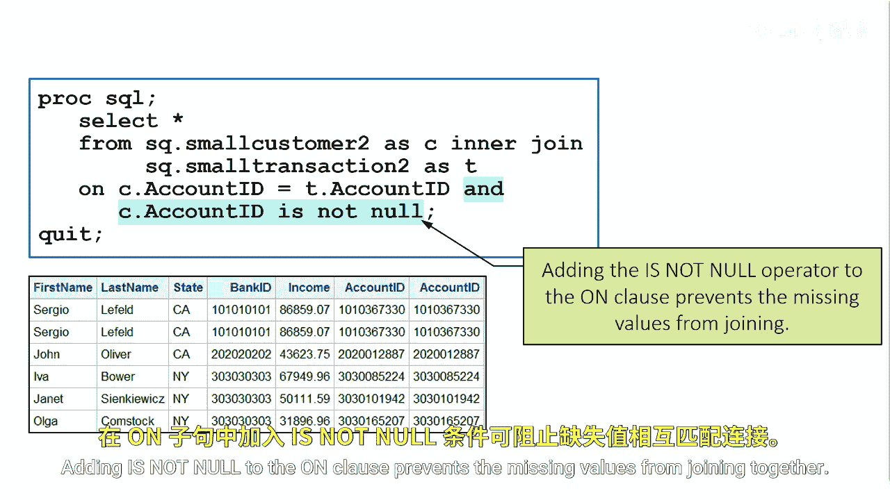

# SAS【中英⚡SAS高级程序员 专项课程｜SAS Advanced Programmer Professional Certificate】 p49 P49 08_处理缺失值 -BV1Cfe3z3EoA_p49-

Most database products treat missing values as the absence of a value or nulls。

 and because they don't contain any value， they're excluded from any conditional evaluation。

This example joins small customer2 and small transaction 2 on the column account ID。

There are missing values in the account ID column of both tables ProC SQL will join these columns。

ProC SQL treats missing values as missing values and matches for joins。

Any missing value matches with any other missing value of the same type。

 character or numeric in a join。This could return unexpected results。

The output shows that the missing values in the rows of small customer2 match all the missing values in small transaction 2。

 and the results return 15 rows。

This is probably not the intended result for the join。

You can specify to join only the non missing values by using theIs not null operator。

Adding is not null to the en clauseuse prevents the missing values from joining together。

