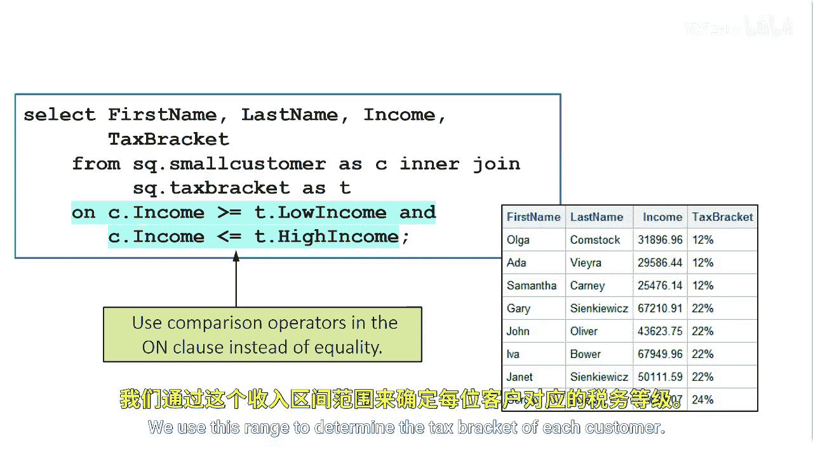

# SAS【中英⚡SAS高级程序员 专项课程｜SAS Advanced Programmer Professional Certificate】 p50 P50 09_创建非等值连接 -BV1Cfe3z3EoA_p50-

Although inner joins or equijoins are important， we can also create non equijoins。

Suppose we want to find the tax bracket of each customer。To do this。

 we need to check the income of each customer against the range of income values in the tax bracket table。

If the customer income is between the values， that is the tax bracket for that specific customer。

To solve our problem， we can adjust the on clauses to use comparison operators instead of equality。

In this example， we use the greater than operator to compare the income of a customer and see if it's greater than the low income value and less than or equal to the high income value in the tax bracket table we use this range to determine the tax bracket of each customer。

