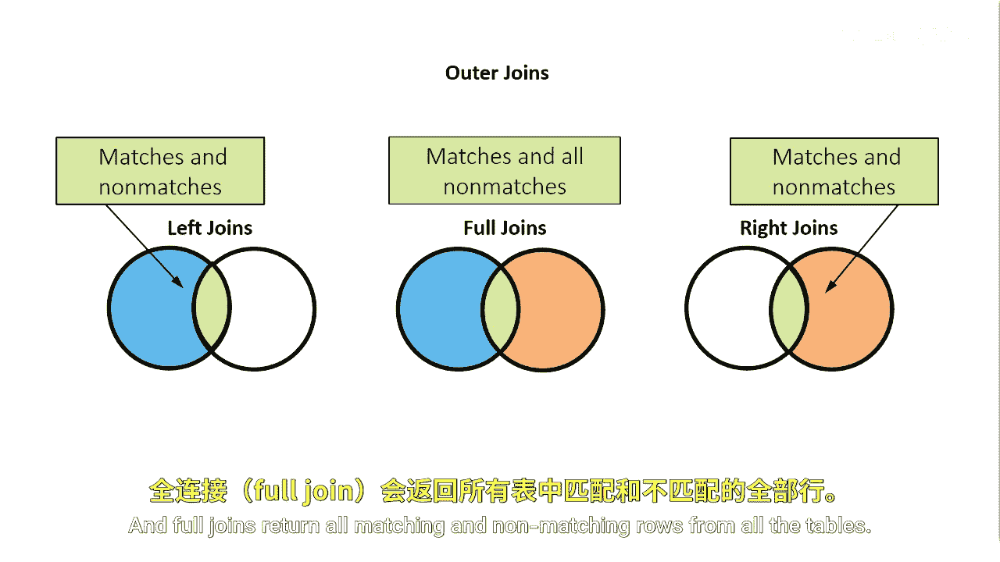
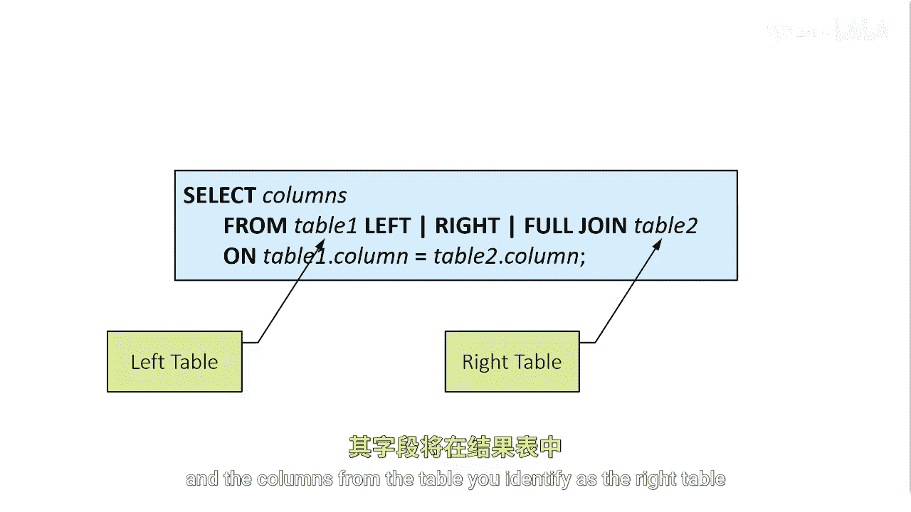

# SAS【中英⚡SAS高级程序员 专项课程｜SAS Advanced Programmer Professional Certificate】 p51 P51 01_SQL 外连接 -BV1Cfe3z3EoA_p51-

Now let's quickly review outer joins， which return non matching rows as well as matching rows。

A left join returns all rows from the left table and matching rows from the right table。

 a right join returns all rows from the right table and the matching rows from the left。

 and full joins return all matching and non matching rows from all the tables。

In an outer join， the from clauses lists two table names with keywords that indicate the type of join in between。

 left， right or full join， notice that the keywords do not include the word outer。

The on clause specifies the joint conditions。In determining left and right。

 consider the position of the tables in the front claws。In an outer join。

 the left table is the first table listed。The columns from the table you identify as a left table will appear first in the results table。

The right table is the second table listed， and the columns from the table you identify as the right table will appear second in the results table。

