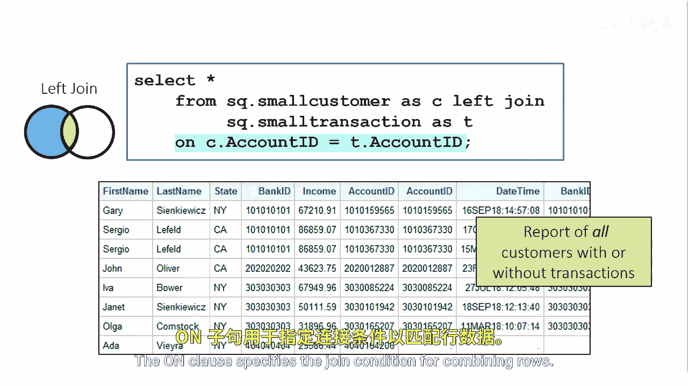
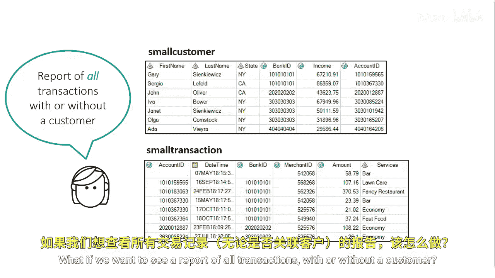
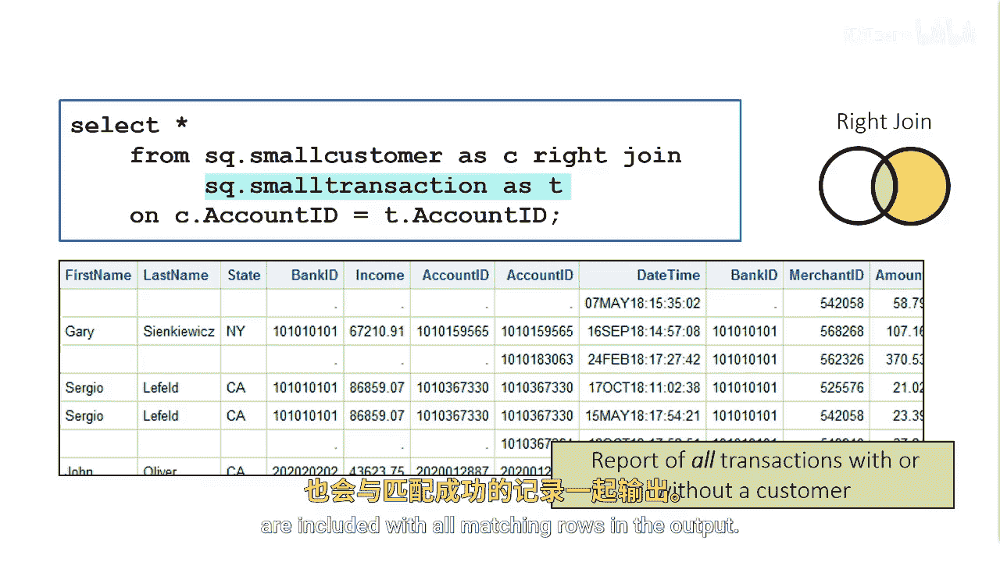

# SAS【中英⚡SAS高级程序员 专项课程｜SAS Advanced Programmer Professional Certificate】 p52 P52 02_执行左外连接和右外连接 -BV1Cfe3z3EoA_p52-

Suppose you want a report of all customers with or without a transaction。

Let's perform a left outer join to combine the table's small customer and small transaction we want the report to contain all the rows from small customer and only the rows from small transaction that have a matching value of the common column account ID。

Using an inner join would list only customers with matching transactions。In the F clause。

 we list the small customer table first， which makes it the left table。

 followed by the keywords left join and the small transaction table。

The en clause specifies a joint condition for combining rows。

What if we want to see a report of all transactions with or without a customer？

A right join specified with the keywords right join and on is the opposite of a left join。

 non matching rows from the right hand table， the second table listed in the from clauses are included with all matching rows in the output。

When selecting the join criteria columns in an inner join。

 we can select the column account ID from either the small customer table or the small transaction table。

 either way the results returned are the same。However， when selecting the columns for an outer join。

 selecting either column can return varying results。

