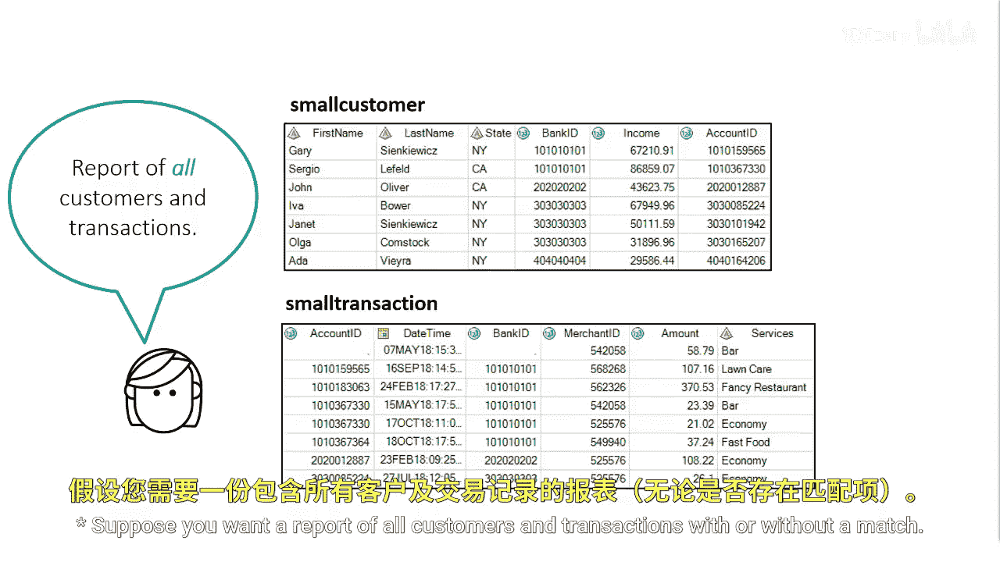
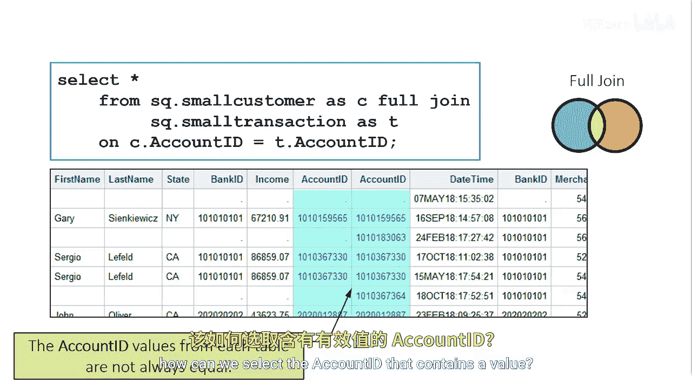
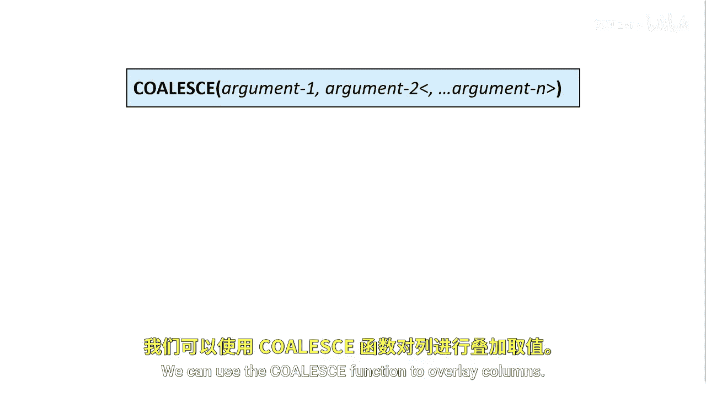

# SAS【中英⚡SAS高级程序员 专项课程｜SAS Advanced Programmer Professional Certificate】 p53 P53 03_使用全连接合并两个表 -BV1Cfe3z3EoA_p53-

Suppose you want a report of all customers and transactions with or without a match。

You can use a full join to include the matches and the No matches。

The account ID values from each table are not always equal if we need to include the account ID in our final report。

 how can we select the account ID that contains a value？

We can use a coalesque function to overlay columns。

The coalesque function returns the value of the first non missing argument。

This example adds a coalesque function to the previous example to overlay the account ID columns。

The coalesque function returns a single ID column in the results。

