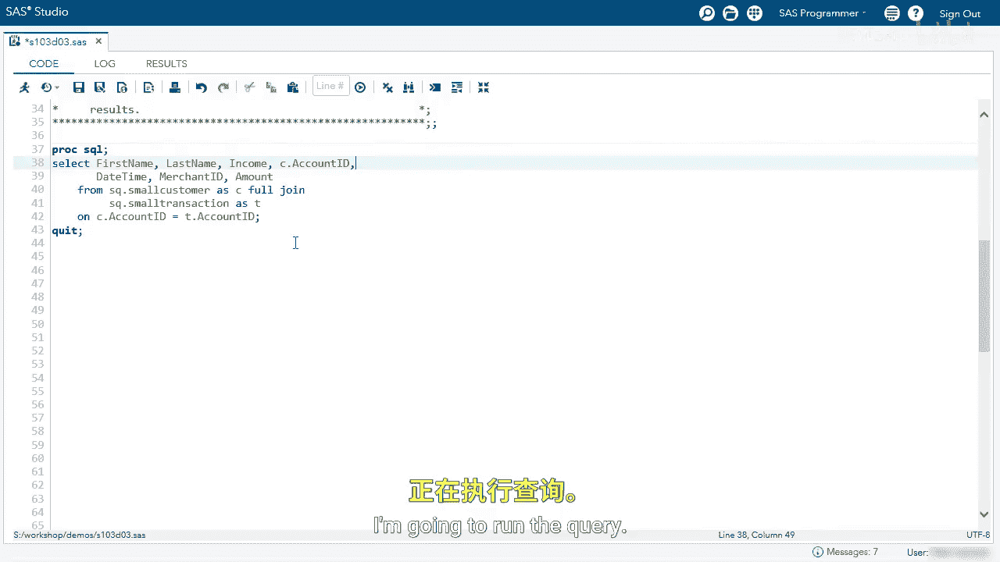
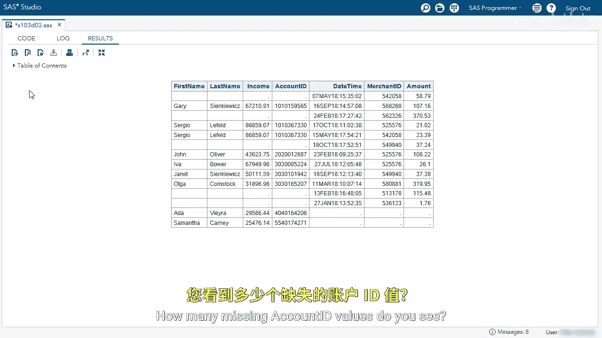
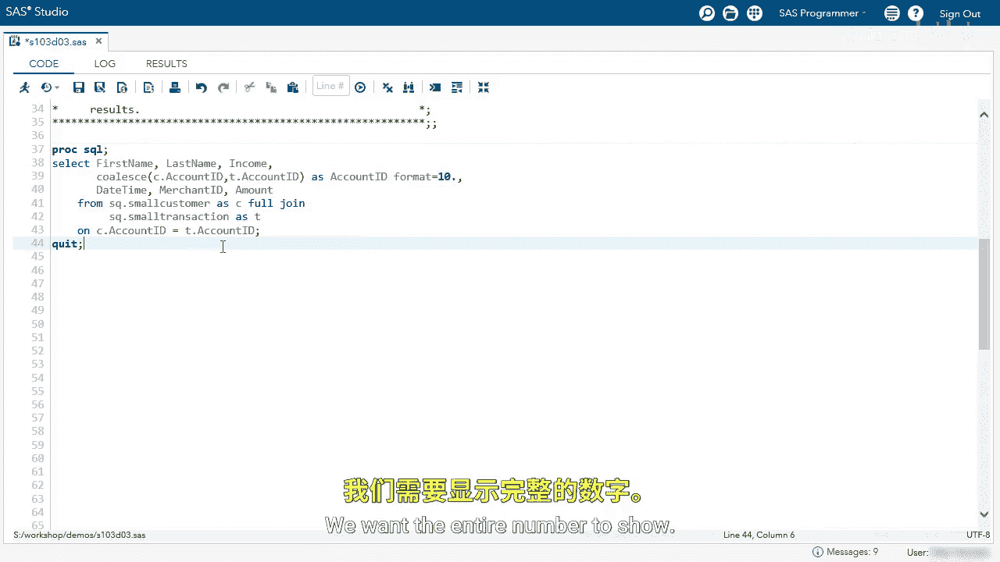

# SAS【中英⚡SAS高级程序员 专项课程｜SAS Advanced Programmer Professional Certificate】 p54 P54 04_演示：使用 PROC SQL 执行全连接 -BV1Cfe3z3EoA_p54-

We're going to use ProC SQL to perform a full join between two tables。Let's look at this query。

 we're selecting the first name， last name income， and we're selecting both account IDs。

 one from small customer and one from small transaction。

 we're selecting the datetime merchant ID amount， we're full joining small customer and small transaction on account ID。

We' going to run the query， look at the results。

I want you to pay attention to the account ID columns， Are they exactly the same？

You can see some differences， some have both missing， some have both values。

 sometimes one on the left is missing， sometimes one on the right is missing that's because we're selecting account ID from both tables our goal is to overlay these columns。

I'm going to remove the T account ID or the small transaction account ID。I'm going to run the query。

How many missing account ID values do you see？

I see  five。Well， let's go back to our code and select the T dot account ID or transaction table account ID。

We'll change the C to a T。

And run the query。Now I see three missing values for account ID。

 so depending on which account ID you select， you will have different values。

What we can do is overlay these using the coalesque function。

Go back to my editor。And use the co E function。We'll use both account IDs as arguments。

I'll delete the old account ID。And I'm going to clean up my code a little bit。

I'm going to name this column a CA ID。And I'm going to give it a format of 10 dot。

We want the entire number to show。

Now let's look at account ID， we can see we only have one missing value for account ID。

 so we overlaid those columns and we took the first non missing value。

With this report we've completed a full join I want to investigate it a little bit further。

 let's look at that first row， we don't have an account ID or first name， last name or income value。

We don't know which customer bought that， so maybe that person paid in cash。

We can see the remaining rows have an account ID， so ones with customer， we could easily match。

 but ones without a customer name and income， for some reason we don't have that value。

 that's something we could investigate further。The last thing I want to see is the last two rows。

 we have the customer Ada and Samantha。They don't have a datetime， merchant ID or amount。

Those customers have not purchased anything， so they're in our report。

 but they have not had any purchases。

