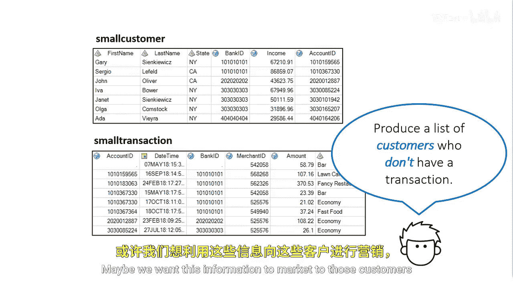
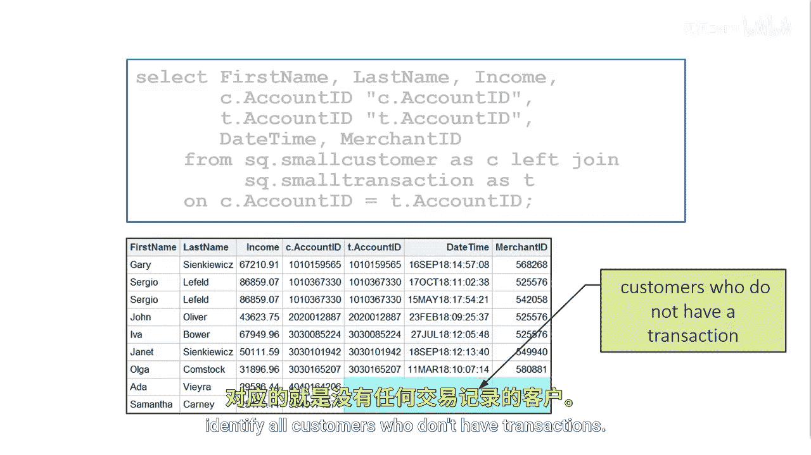
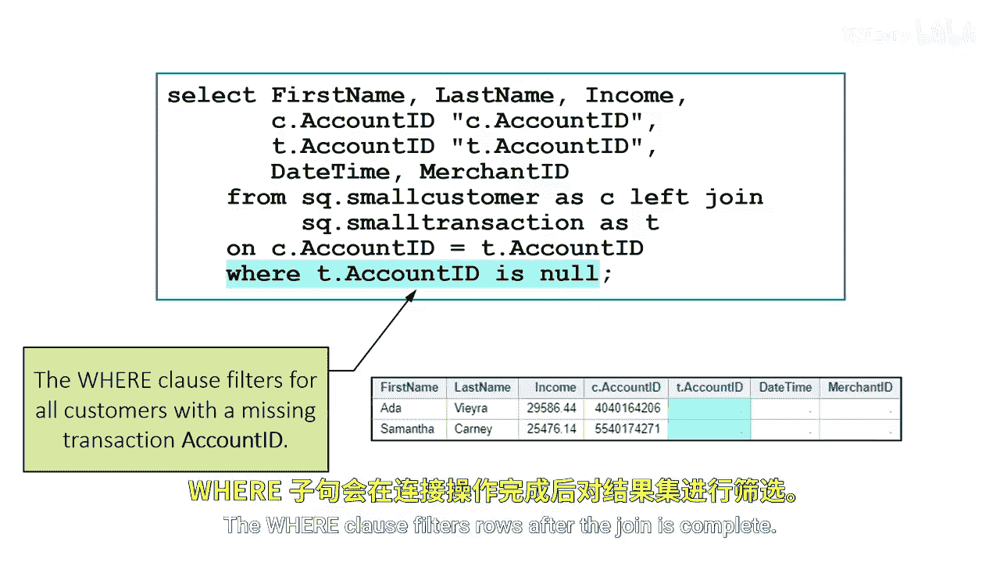

# SAS【中英⚡SAS高级程序员 专项课程｜SAS Advanced Programmer Professional Certificate】 p55 P55 05_识别不匹配的行 -BV1Cfe3z3EoA_p55-

Let's go back to the left join we created earlier using the small customer and small transaction tables。

Suppose our goal is to produce a list of all customers who don't have a transaction for the year。

Maybe we want this information to market to those customers to use our credit card more often。

To start， we can complete a left join on the small customer table and match with rows in the small transaction table。

This should be familiar。It gives us a report of all customers with or without a transaction。However。

 our task is to find customers without a transaction。

Let's take a deeper look at this report The last two rows are for Ada and Samantha What do you notice about the values in the Small transaction tables account ID column？

To produce a list of customers without a transaction， we need to filter for rows where the T。

 account ID or the small transaction table account ID's value is missing。

The rows with missing TDt account ID values identify all customers who don't have transactions。

We can add aware clause and filter for all rows where the small transaction table join value account ID is null。

This will create a left joint and only return the results where customer does not have a transaction。

The where clause filters row after the join is complete。

