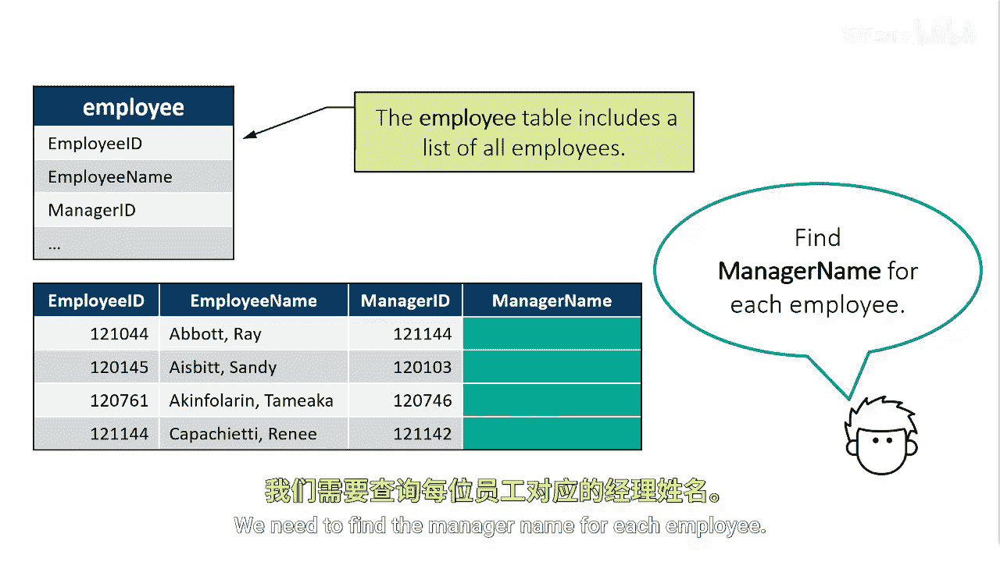
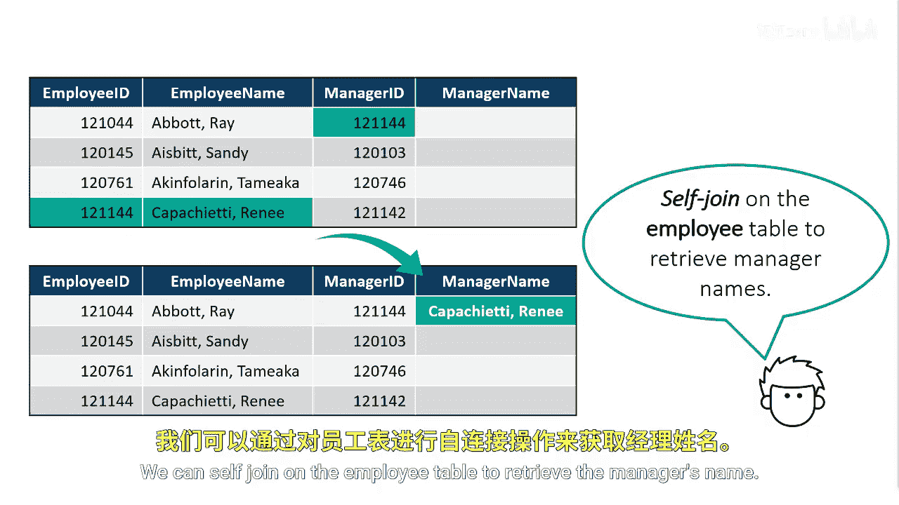

# SAS【中英⚡SAS高级程序员 专项课程｜SAS Advanced Programmer Professional Certificate】 p56 P56 01_使用自反连接 -BV1Cfe3z3EoA_p56-

Suppose we want to create a table that has a list of all employees。

 as well as the names of direct managers for each employee。

The employee table includes a list of all employees and contains a variety of columns。

 the employee ID in the employee table contains all employees， even the managers。This table， however。

 doesn't contain an employee's manager's name， only the manager ID for each employee。

We need to find the manager name for each employee。

We can use the employee table and a reflexive join on itself to fulfill this request。

We can look at the first row and see that employee Abbott Rays manager has a manager ID of 121144。

If we look down the employee ID column， we come across employee ID 121144， which is an employee。

 but she's also a manager。We can self join on the employee table to retrieve the manager's name。

To read from the same table twice， the table must be listed in the from clauses twice。

A different table alias is required to distinguish each table。

We will alias the table first as E for employees and second as M for managers。

