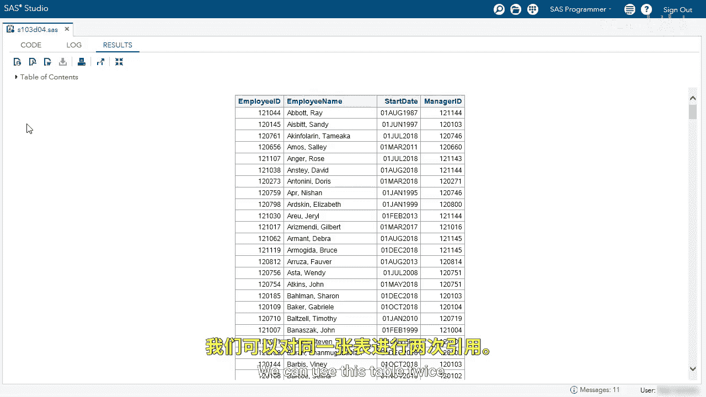
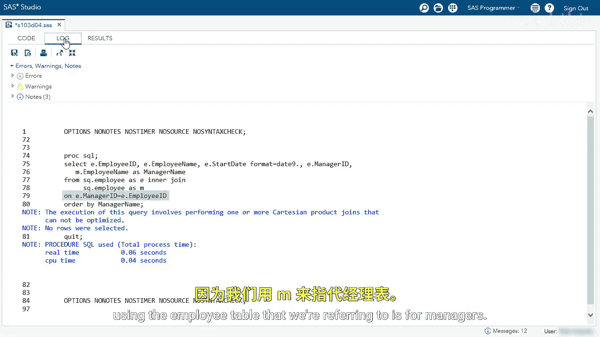
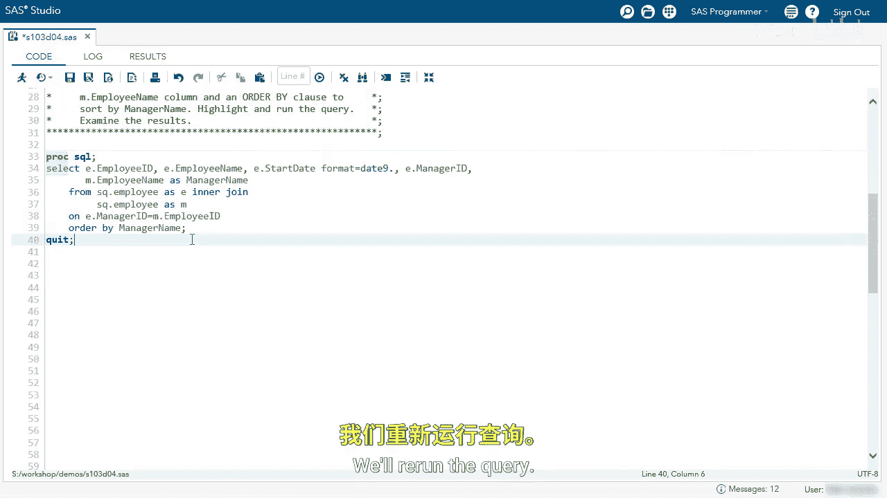
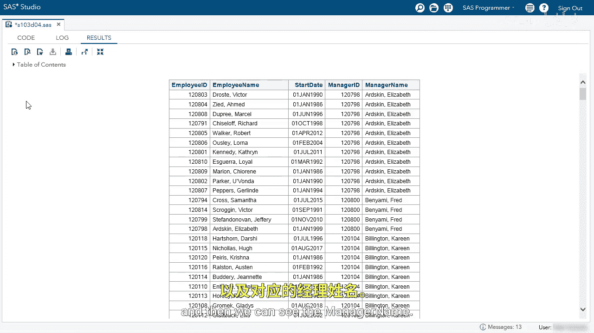

# SAS【中英⚡SAS高级程序员 专项课程｜SAS Advanced Programmer Professional Certificate】 p57 P57 02_演示：执行自反连接 -BV1Cfe3z3EoA_p57-

We're going to use ProCSQL to perform a reflexive join or self join。

I'm going to start by running this query， we're selecting the employee ID， employee name， start date。

 and manager ID from the employee table。

We can see the employee ID on the left， the employee name， the start date。

 and each employee has a manager ID。 We want to find out what each employee's manager's name is。

 We can use this table twice， so let's go back to our code。

I'm going to specify an inner join in the from clause。I'm going to use the same table SQ。emp。

I need to give it another alias， so I'm going to call this as am for manager。

And now I can specify the enclawuse。I'm going to specify E dot Manager ID。

So that is the employee tables manager ID equals。E。 employee ID。

The employee table we're referencing as manager， we want to match that table with the employee ID in the employee table。

Next， I'm going to reference MDOt employee name in the select clause to bring that column in。

I'm going to name this， I'm going to call this manager name。Lastly。

 I want to order this by the manager's name， so we'll add an order by clause。Let's run this query。

Let's go to our log。

So I'm getting to note my log， so I'm performing a Cartesian product， so what did I do？

Let's look at that on clauseuse， I'm specifying E dot manager ID equals e dot employee ID。

 and that can't work that's the same table， so we're trying to use the same table on clauseuse。

I need to change E dot employee ID to Mt employee ID。

 use the employee table that we're referring to as for managers。

We'll go back to our editor。😊，Change E to M。We'll rerun the query。

And there we go so we can see the employee ID employee name， the start date， the manager ID。

 and then we can see the manager name。

We performed a self joint on the same table to solve this problem。

