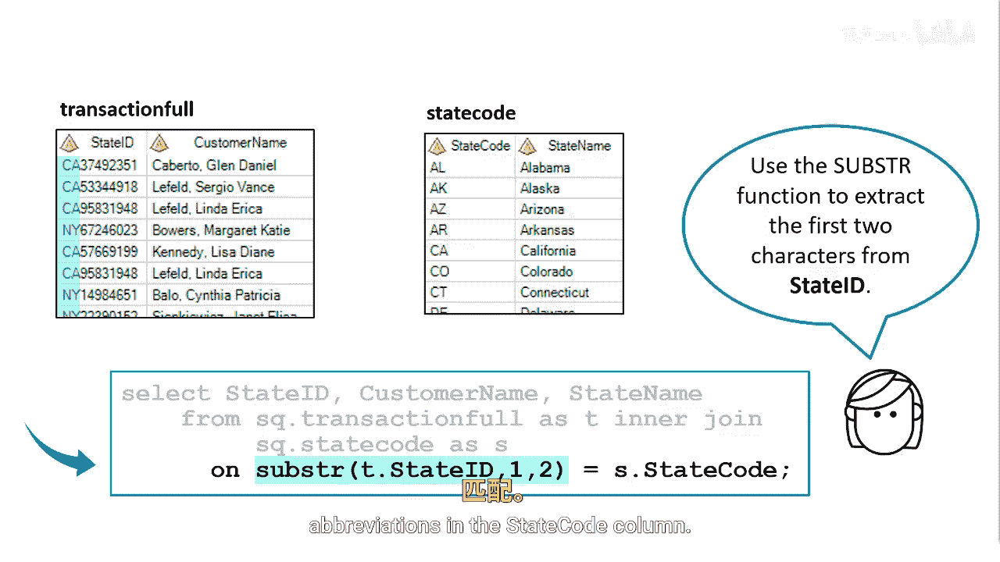

# SAS【中英⚡SAS高级程序员 专项课程｜SAS Advanced Programmer Professional Certificate】 p58 P58 03_使用函数连接表 -BV1Cfe3z3EoA_p58-

You can also use functions to join tables， Supp we want to join two tables without a common column。

We want to join the transaction F table with the stay code table to retrieve the state name for each customer。

However， the transaction full table doesn't have a column that just identifies the state abbreviation like the state code table does。

We can use the substring function to extract the first two characters from state ID that contain the state abbreviation。

Then use that information to join with the state code table that contains the state abbreviations in the state code column。

We can use the substr function in the on clauses as the join criteria。

