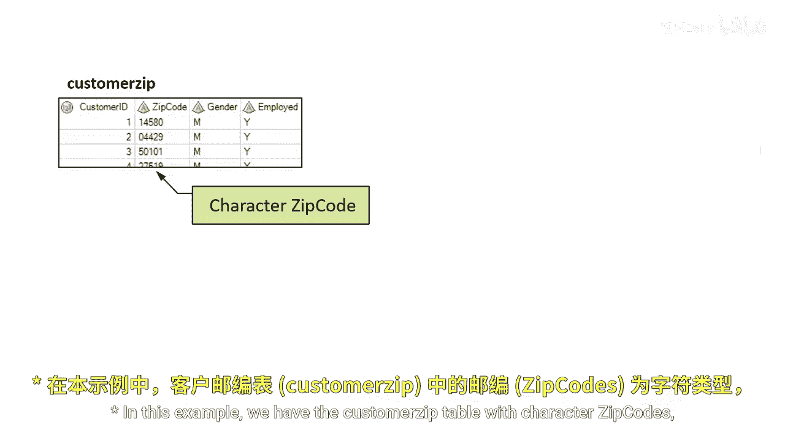
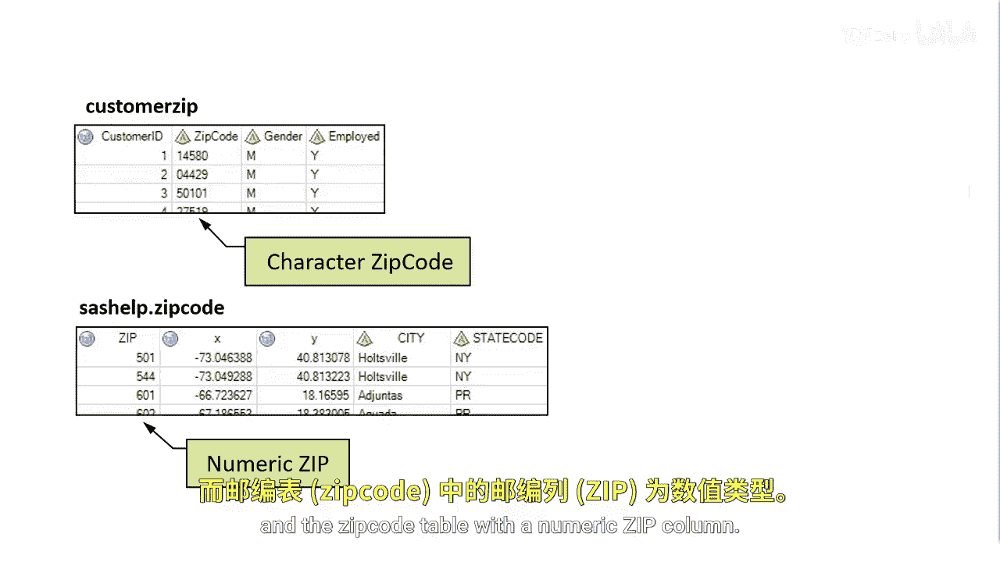

# SAS【中英⚡SAS高级程序员 专项课程｜SAS Advanced Programmer Professional Certificate】 p59 P59 04_当列类型不同时使用函数进行连接 -BV1Cfe3z3EoA_p59-

In this example， we have the customer zip table with character zip codes and the zip codes table with a numeric zip column。

Can you join tables if the join columns have different types？

Let's see what happens when we attempt to join a table and one column is character and the others numeric。

