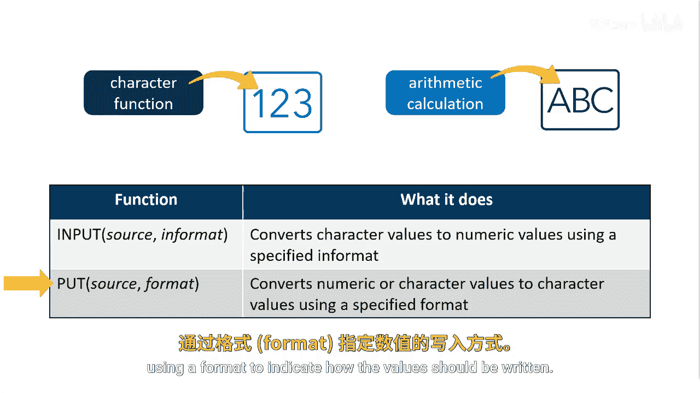
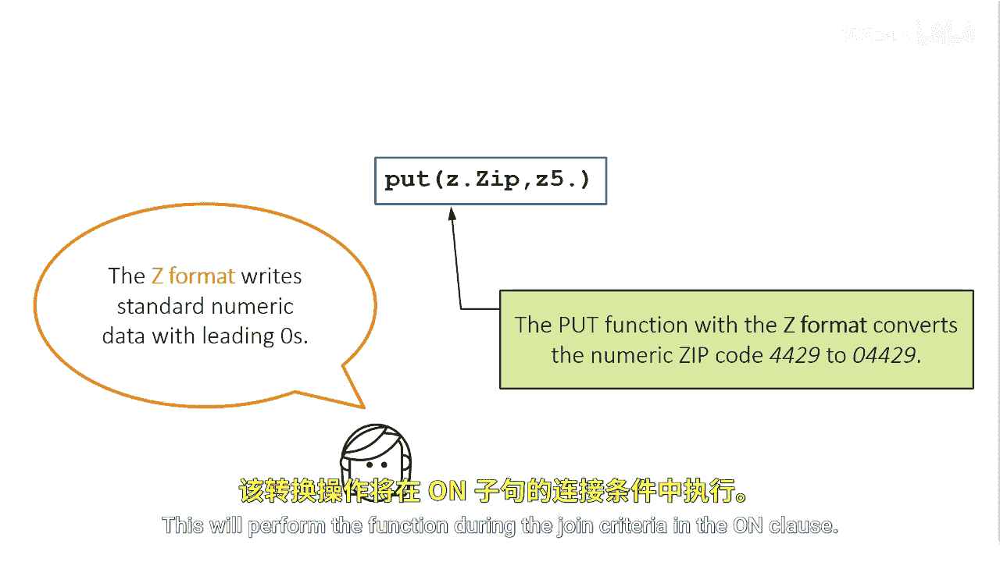

# SAS【中英⚡SAS高级程序员 专项课程｜SAS Advanced Programmer Professional Certificate】 p60 P60 05_使用函数转换列值 -BV1Cfe3z3EoA_p60-

SS doesn't allow columns with a different type to be used to join tables。

To explicitly and accurately convert data from one type to another， we can use special functions。

The input function can be used to convert a character value to a numeric value。

We use an in formatat to indicate how the character string should be read。

The Po function can be used for converting numeric values to character values。

 using a format to indicate how the value should be written。

For this example， we can convert the Z dot zip column from numeric to character using the put function。

We'll specify the source of Z。t zipip and use the format Z5。t。

The ZW format writes standard numeric data with leading zeros to the width specified。Here。

 we want to specify leading zeros up to a width of five because US zip codes are a length of five。

For example， if the zip code is a numeric value 4429。

 the put function with the Z format converts the value to character string 04429。

 this will perform the function during the join criteria in the encluse。

