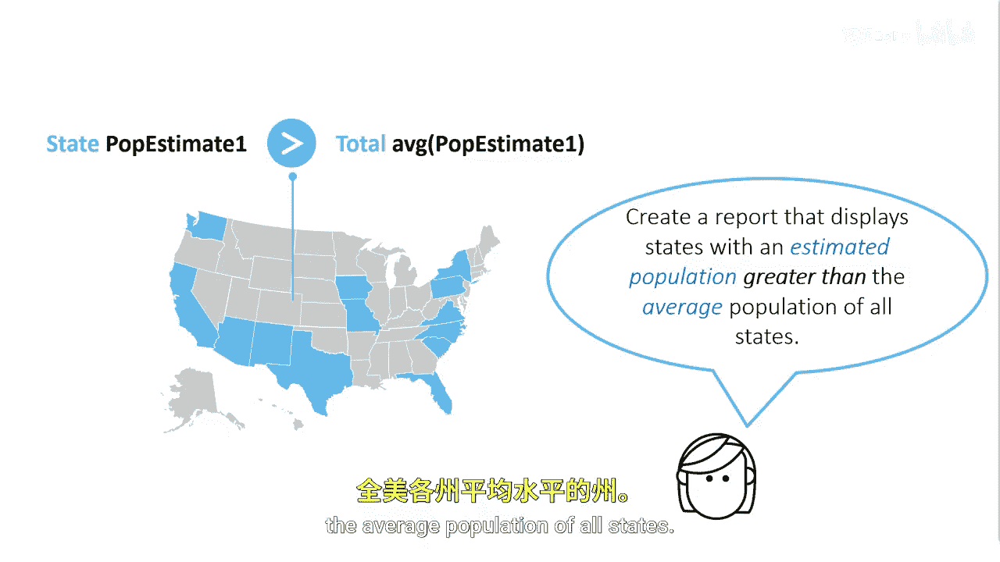
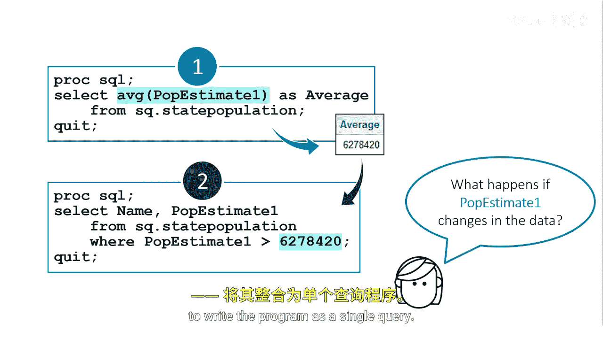
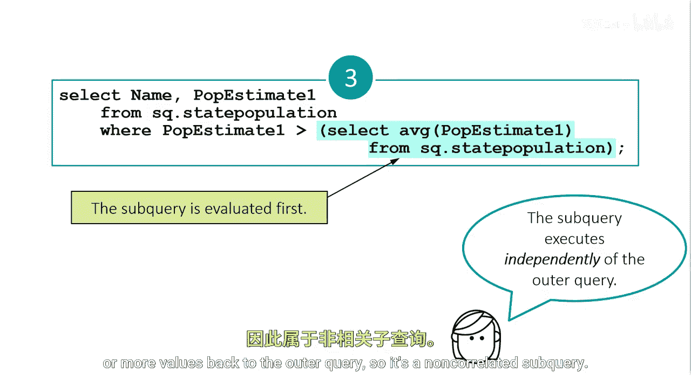

# SAS【中英⚡SAS高级程序员 专项课程｜SAS Advanced Programmer Professional Certificate】 p63 P63 02_在 WHERE 子句中使用子查询 -BV1Cfe3z3EoA_p63-

Suppose you need to look at next year's estimated populations to determine in which states to increase your market presence。

You've been asked to produce a report that shows the states with an estimated population greater than the average population of all states。

The query results will list the states。In the next few examples。

 we'll be using the state population table， which contains each state and its estimated population for the next three years。

When using subqueries， it helps to think of them in steps， typically。

 the first step is calculating the subquery or inner query value first。Next。

 you use the value you calculated from the subquery in the main query。

Then you combine the subquery with the outer query。

So let's think about our task the first step is determining the single value you need returned in the inner query and then calculating that value。

This query uses the average function on the P estimateimate1 column to return a result of 6278，420。

That is the average estimated population for all states our first query is successful。

The next query determines the states whose population estimate exceeds the average we calculated。

We can manually take the value from the first query and include that in the where clauses。

Although this method works， it's not as dynamic and efficient as it could be。

What happens if the state population table changes the population estimates？

You would have to rerun the first query to get the average estimate and then replace the static value in the second query with the new value。

You are also using two queries to accomplish this task when it can be done in one。

This is a perfect example of where we can use a subquery to solve this problem dynamically and efficiently。

Once you have the first two queries working， you can move on to step3 to write the program as a single query。

All you have to do in step three is insert the subquery into the outer query here we have taken the first query that returned the average of all state' estimated populations for next year and placed it where the static value was earlier。

When this query runs， SAS evaluates the inner query first and returns a value。Then。

 SAS executes the outer query and uses the value returned by the subquery。

This subquery executes independently of the outer query before it passes one or more values back to the outer query。

 so it's a non correlated subquery。

The subquery executes and returns the value of 6278，420 to the outer query。

The outer query executes using the average value in the wear clause。

Using a subquery is a great way to make your programs more dynamic and efficient and can solve unique problems。

As a quick note， when using a subquery， you won't see the value retrieve from the subquery。

 one way to see the value is to store it in a macro variable。This topic is covered elsewhere。

