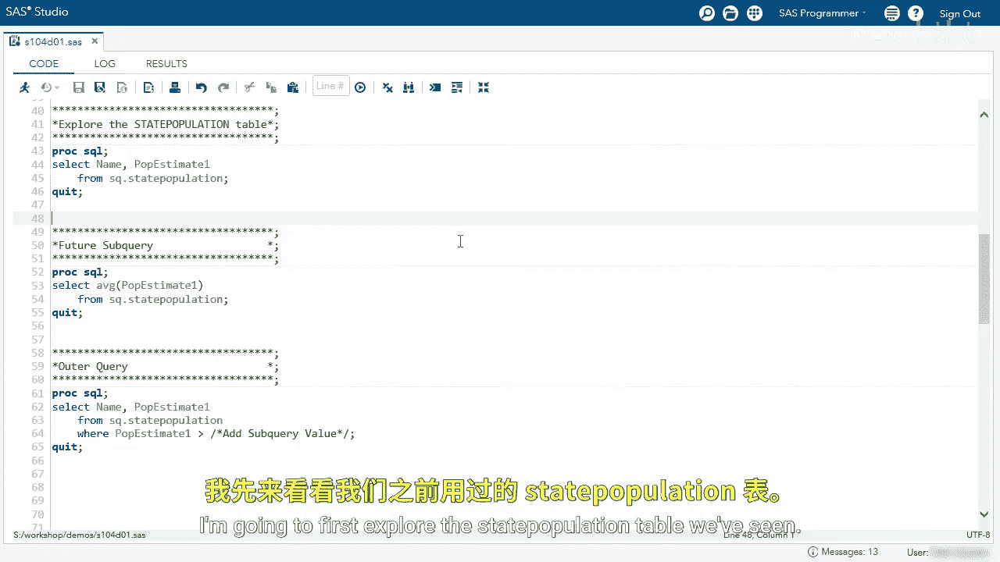
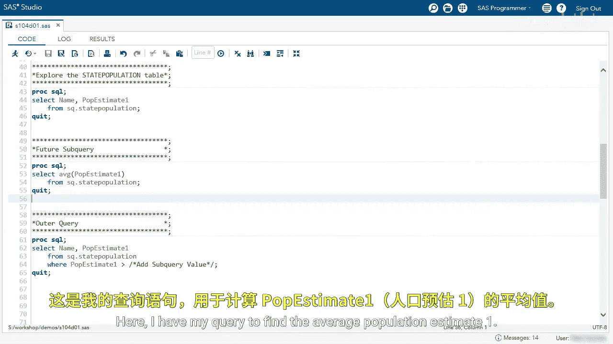
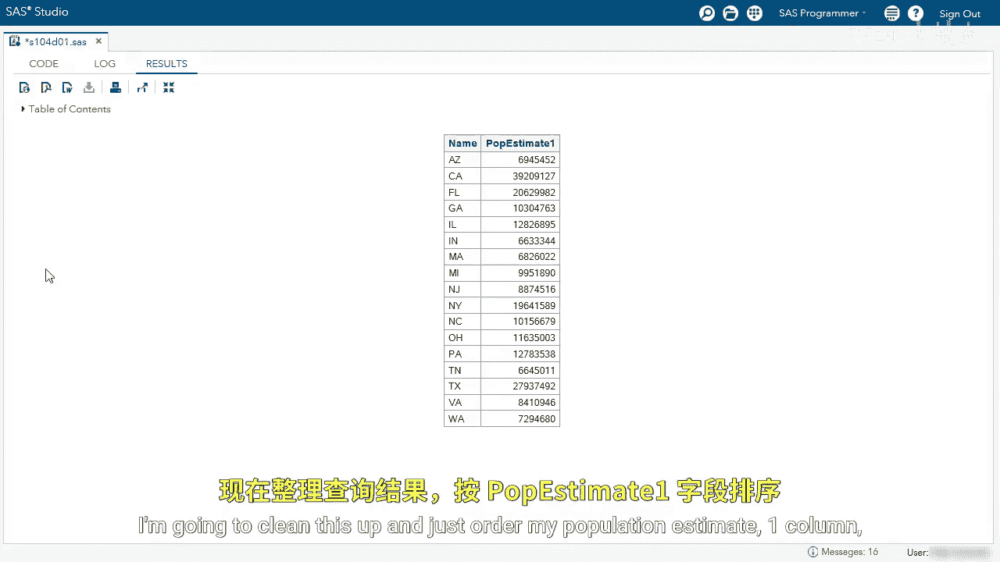
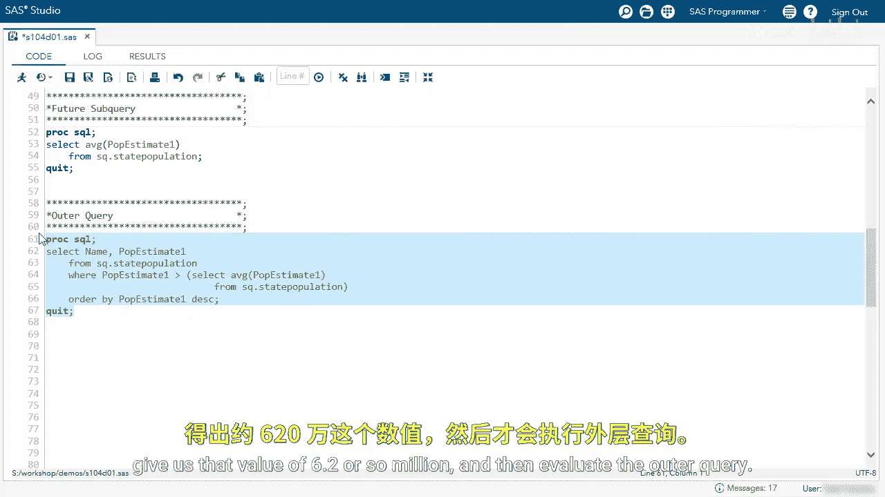
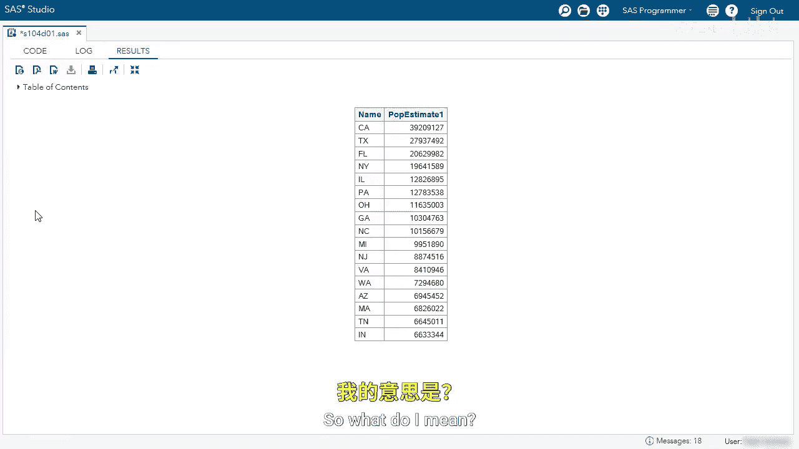
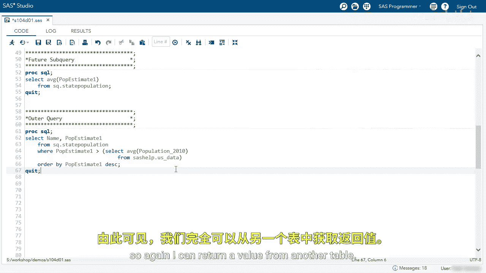
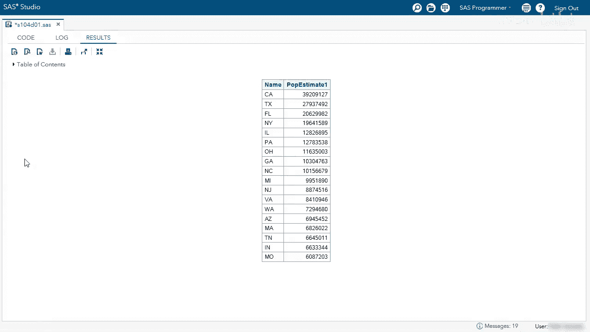

# SAS【中英⚡SAS高级程序员 专项课程｜SAS Advanced Programmer Professional Certificate】 p64 P64 03_演示：使用返回单个值的子查询 -BV1Cfe3z3EoA_p64-

We're going to use a subquery that returns a single value。

I'm going to first explore the state population table we've seen。

Again， we can see we're only focusing on the name columns of the state abbreviation and the population estimate one to next year's estimated population。

I want to find all states that have a population estimate 1 greater than the total average。

So let's go back and do that。😊。

Here I have my query to find the average population estimate 1。

 I'm going to run the query and take a look at my value。

Here we have that value we've been talking about earlier， 6。2 million。

 I'm going to go back and I'm going to use that in my main query。

So an easy way is to copy。Go back to my editor。

And then let's take a look at this outer query， we want the name and population estimate 1 from state population where P estimate 1 is greater than the value。

 and I'm just going to paste the value。

Im going to run the query。And now we can see every state that has a P estimate 1 greater than the average。

 I'm going to clean this up and just order my population estimateimate1 column。

So we'll use an order by clause。And I want to see this in descending order。

You can rerun the query and take a look at my report。

And see， I have those states。Now， what if the state population estimate 1 changes。

 those change all the time？

I would have to rerun that first query， retype the value， and then run the second query。

Here's where we can use a subquery。Go back to my editor。

And the easiest way is to copy the first query。I want to point out make sure you don't copy the semicolon that will cause an error。

I'm going to go， I'm going to delete the static value and add parentheses。

And then I'm going to paste the subquery。I like to clean this up to make my code more readable。

Now when I run this query， the subquery will evaluate first， give us that value of 6。

2 or so million and then evaluate the outer query。

Again， we get the same results。Now one thing I want to point out is the subquery doesn't have to return a value from the same table。

So what do I mean， I'm going to go back to my editor。

And in this subquery， I'm going to change some values。 I'm going to select Pulation underscore 2010。

And then I'm going to pick another table， SASHep。us_ data。

I am now returning an average of the population estimate of 2010 from the SAShelp。us data。

 which is not the SQ。 state population table， so again I can return a value from another table。

I can rerun this query and I'll get some results。😊。

And now I have my results using that 2010 estimate。

