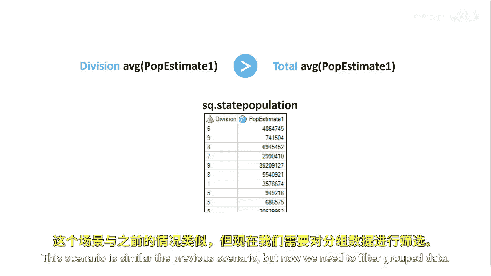
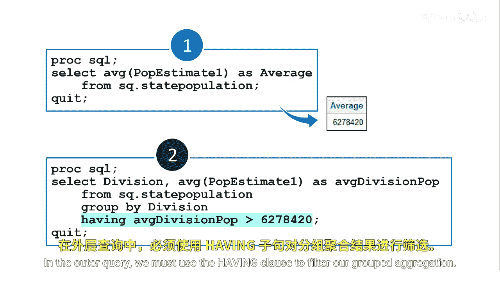

# SAS【中英⚡SAS高级程序员 专项课程｜SAS Advanced Programmer Professional Certificate】 p65 P65 04_在 HAVING 子句中使用子查询 -BV1Cfe3z3EoA_p65-

Now let's discuss the having clause， the United States is categorized into nine divisions and each division contains a division number。

You've been asked to produce a report that shows the divisions with an average estimated population greater than the total average population of all states。

This scenario is similar to the previous scenario， but now we need to filter grouped data。

To filter group data， we can use the having clause。

We'll use both the division and P estimateimate1 columns in the state population table to create a report。

First， generate the program using the manual method。

This example again calculates the average estimated P estimate1 value from the state population table。

Then we use the value return from the subquery to complete the having clause of the outer query。

The outer query groups each state into its corresponding division and then finds each division's estimated population。

In the outer query， we must use the having clauses to filter our grouped aggregation。

