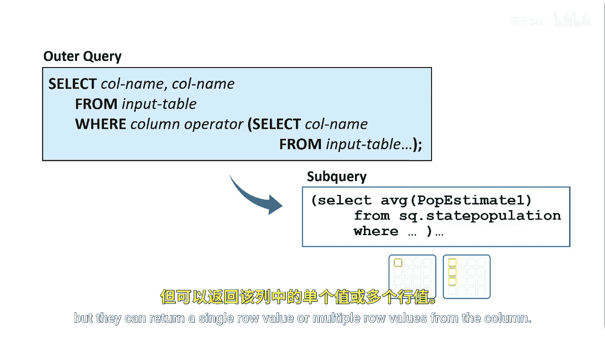
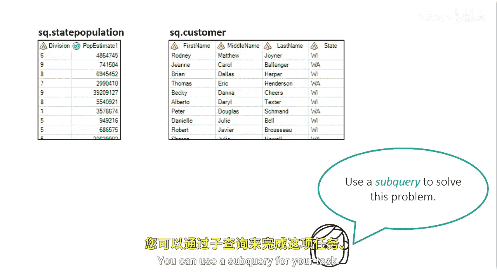
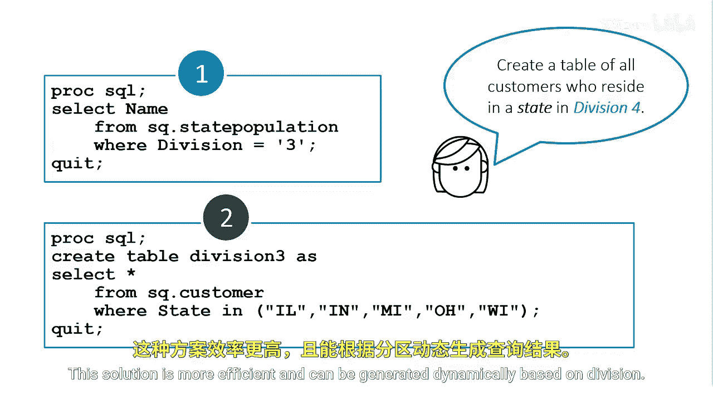

# SAS【中英⚡SAS高级程序员 专项课程｜SAS Advanced Programmer Professional Certificate】 p66 P66 05_返回多个值的子查询 -BV1Cfe3z3EoA_p66-

In the previous subqueries， we've been returning single values。

Subqueries in the where and having clauses must return one column。

 but they can return a single row value or multiple row values from the column。

Suppose you've been asked to create a table of all customers who reside in Division III for an analyst on your team。

 the analyst needs this table to run visualizations on customers in those states。

The information you need for the task is stored in the state population and customer tables in the state population table。

 you need to subset the table where the division is3 and then return the states that are in that division。

In the customer table， you need to use those states in Division III and subset the table by those states。

You can use a subquery for your task， let's see how to do this。

First， we use a standalone query to subset the state population table by all states that reside in Division III。

Our results show that five states reside in Division3， this query will serve as our subquery。

In the second query， we want to create a new table named Division3 that contains customers who reside in one of the states from our previous results。

To start， we manually type the state names in the where clause using the in operator。

When we execute the second query， we'll get a new table with a list of customers from ILINMIOHWI。

Although this works， our program is static， what if we want to change from Division 3 to Division 4 or clean up our code and write this in one query instead of two？

We can use the first query as a subquery in the where clause to build the list of states in Division III。

 and the second query becomes the outer query。This solution is more efficient and can be generated dynamically based on division。

