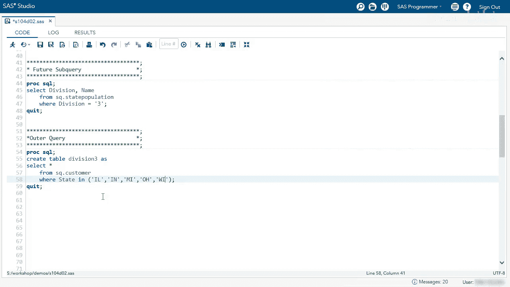
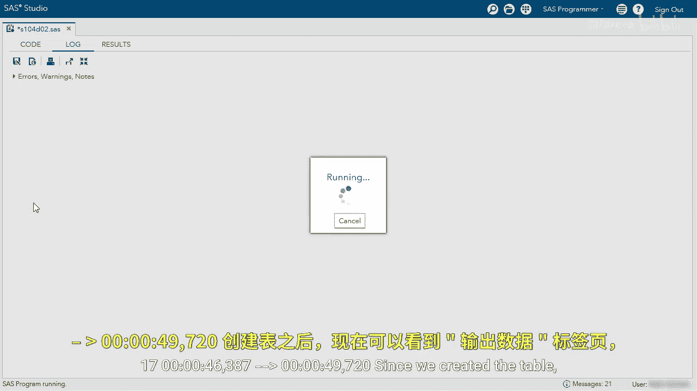
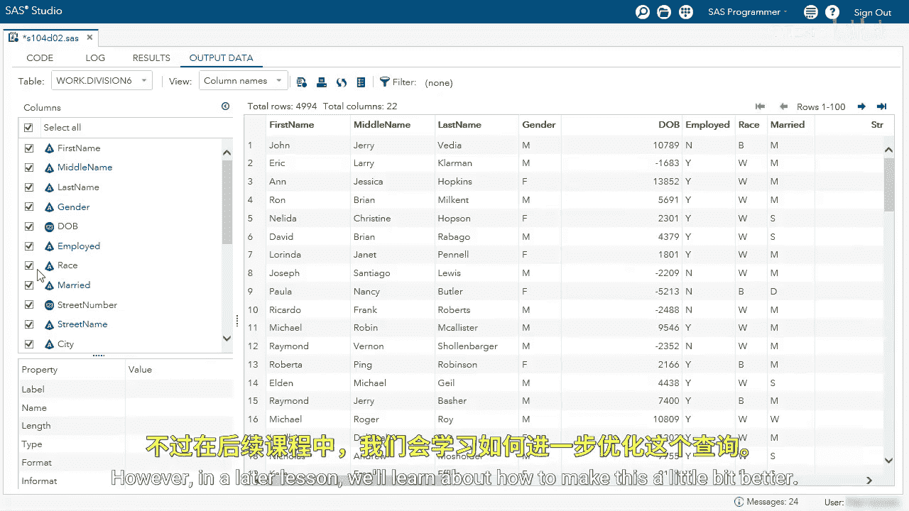

# SAS【中英⚡SAS高级程序员 专项课程｜SAS Advanced Programmer Professional Certificate】 p67 P67 06_演示：使用返回多个值的子查询 -BV1Cfe3z3EoA_p67-

We're going to use a subquery that returns multiple values in a single column。

Coming from the example we just talked about， I'm going to run the first query to find all states in Division3。

We can see we have all Division III states， IL， IN， MI， OHWI。

I can use these values in my outer query。Here we want to create the division 3 table。

 we want to select every column from the customer table where stay in in our division3 states。

 I'm just going to manually type those in。I'm going to run this query to create my division 3 table。

Since we created a table， we now have the output data tab， and we can see we have 16。

022 total rows and 22 columns。While this is great， let's use a subquery here。

Instead of typing the static values， I'm going to copy and paste my future subquery。Again。

 make sure not to copy the semicolon。I'm going to clean up my code。And before I run this。

 I want to see if you remember what we talked about a subquery and how many columns it can return。

I'm going to run the query and let's look at the error。Remember。

 a subquery can return more than one column， and I'm actually returning to division and name。

I don't need division because that's always three。So let's go back and remove division。

Now I can run this query and I will get every state in Division 3 that'll be returned in the where clause of the Outer query。

 which will give us a new table。Again， you can see this table returned 16，022 rows and 22 columns。

 this worked perfectly。But what if I want to change to Division 6， let's go back to our code。

When we used the static method， we were physically typing in the states to use Division 6。

 we would have to change the query in the future subquery section to division equals 6。

 copy those state values， and paste them in in the outer query。But instead。

 since we're using a subquery， we can just change a few values。

I'm going to change createre table Division 3 to Division 6。

And I'm going to change the subquery where division equals 3 to where division equals 6。

I'm going to run my query。And now I have every customer in Division6。

 which serves about 4900 customers there。Using a subquery is a great way to make this more efficient。

 however， in a later lesson we'll learn about how to make this a little bit better。

