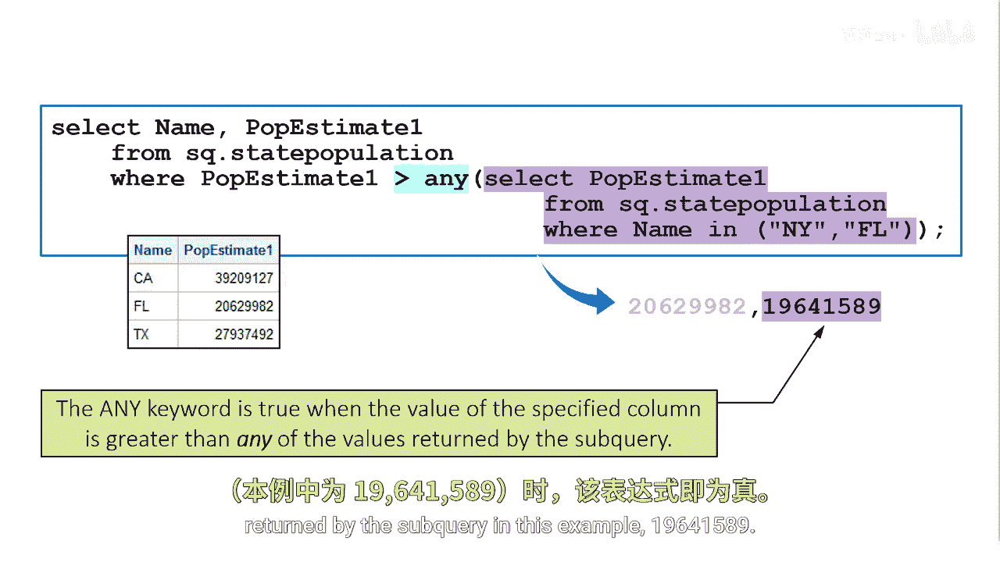
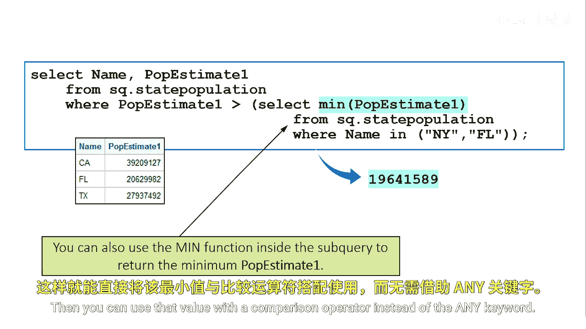

# SAS【中英⚡SAS高级程序员 专项课程｜SAS Advanced Programmer Professional Certificate】 p68 P68 07_使用 ANY 关键字 -BV1Cfe3z3EoA_p68-

Similar to the in operator， you can use the any keyword to specify that at least one of a set of values obtained from a subquery must satisfy a given condition for the expression to be true。

Suppose you're working with a subquery that returns two values。

 the population estimate for Florida and for New York。

You want to know which states have a population estimate value that is greater than either state。

In this example， the expression that precedes a subquery uses any with the greater than operator。

 so the expression is true when the value of the specified column is greater than any value returned by the subquery。

In other words， the expression is true when any value of the column is greater than the smallest value returned by the subquery。

 in this example， 19641，589。

You can also use the min function inside the subquery to return the minimum P estimate1 value。

Then you can use that value with a comparison operator instead of the any keyword。

