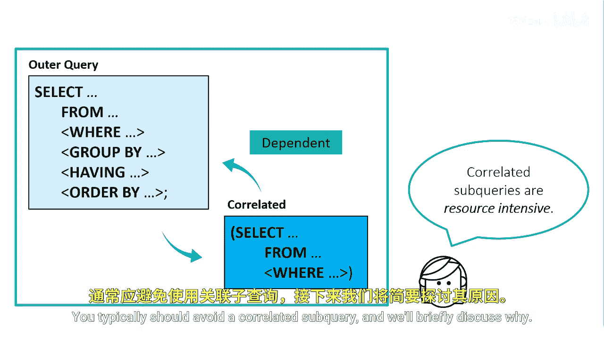

# SAS【中英⚡SAS高级程序员 专项课程｜SAS Advanced Programmer Professional Certificate】 p69 P69 08_使用关联子查询 -BV1Cfe3z3EoA_p69-

The previous subqueries have been non correlated subqueries that are self contained and execute independently of the outer query。

A correlated subquery is dependent on the outer query。

 it requires one or more values to be passed to it by the outer query before the subquery can be resolved。

This means that ProCSQL must process the correlated subquery multiple times。

 once for each table row that the outer query processes。

Correrelated subqueries tend to be resource intensive。

 you typically should avoid a correlated subquery and will briefly discuss why。

We want to find out how many customers are from a state and Division1。

 we previously saw a solution to this problem using non correlated subqueries。

 but we can also solve this using a correlated subquery。

We're using the static value1 and the where clause to represent division1。

The correlated subquery in the War clauseuse runs a query that produces a join between the state population and customer tables for each row。

The value of the joint will return customers who live in Division1。

Correrelatedated subqueries are not standalone because they need additional information from the main query。

The where expression in the inner query refers to values in a table in the outer query。

The correlated subquery is evaluated for each row in the outer query。The outer query obtains a row。

 then uses the results of the subquery to test the where condition to see if the state resides in Division 1。

 If it does， it sends a row back to the outer query。

A better method is to join the tables and use a wear clauses to obtain the necessary rows。

