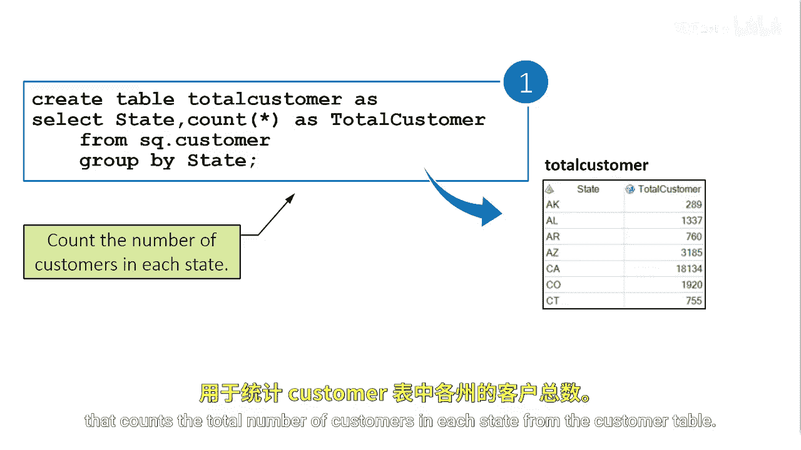
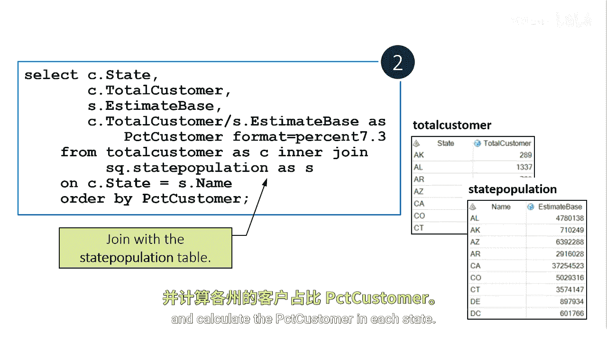

# SAS【中英⚡SAS高级程序员 专项课程｜SAS Advanced Programmer Professional Certificate】 p70 P70 01_使用临时表 -BV1Cfe3z3EoA_p70-

Suppose we want a report that shows the percentages of our customers in each state based on each state's estimated population。

 the data we need is in the customer and state population tables。

One method to create this report is to use a temporary table。

We can write a query to create a table named Tot customer that counts the total number of customers in each state from the customer table。

We then join the total customer table with the state population table and then calculate the percent customer in each state。

This solution works， but it requires a join and a temporary table。

We'd like to be able to create this report even as our customer list grows so that we always have an accurate percentage of customers in each state。

If the data in the customer table is updated daily， then every time we run this query。

 we'll have to repeat step one and create the total customer table。

 then join the total customer and state population tables。

Another solution to this problem is to use an inline view。

