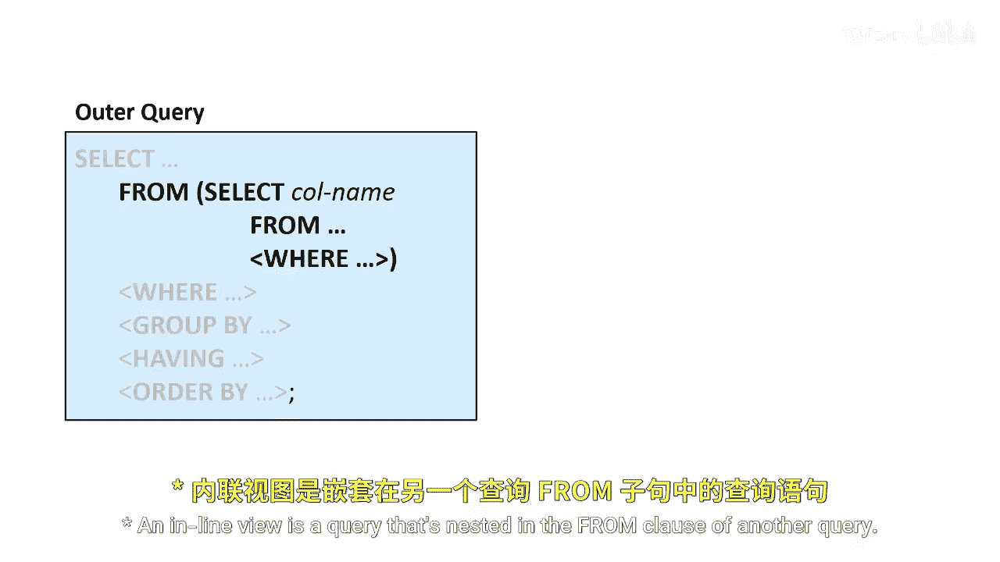
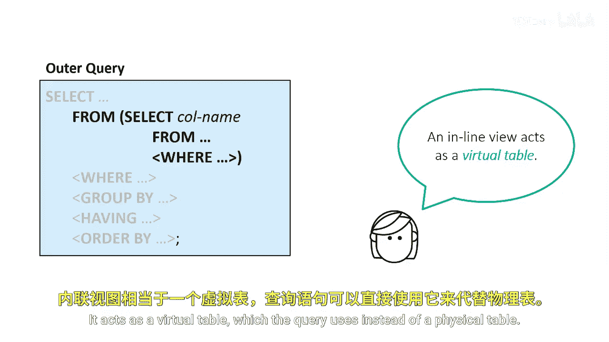
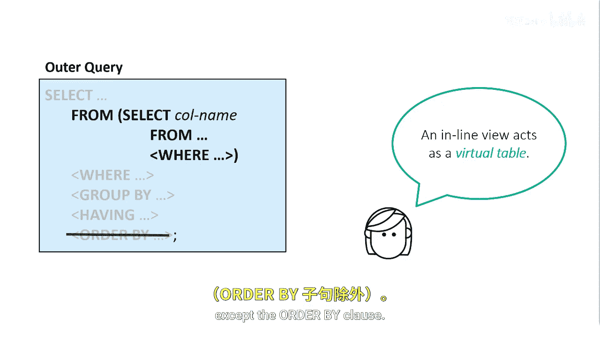
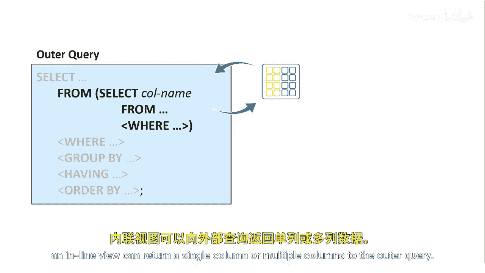
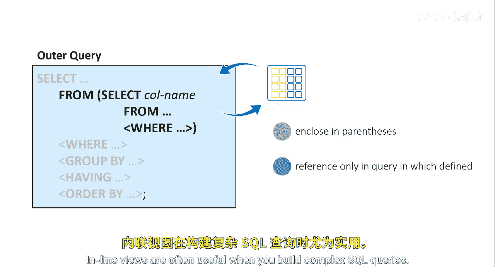

# SAS【中英⚡SAS高级程序员 专项课程｜SAS Advanced Programmer Professional Certificate】 p71 P71 02_什么是内联视图 -BV1Cfe3z3EoA_p71-

An inline view is a query that's nested in the from clause of another query。

It acts as a virtual table， which the query uses instead of a physical table。

An inline view can contain any of the clauses in a select statement except the order by clause。

Unlike a subquery， an inline view can return a single column or multiple columns to the outer query。

An inline view must be enclosed in parentheses and can be referenced only in the query in which it's defined。

Inline views are often useful when you build complex SQL queries。

