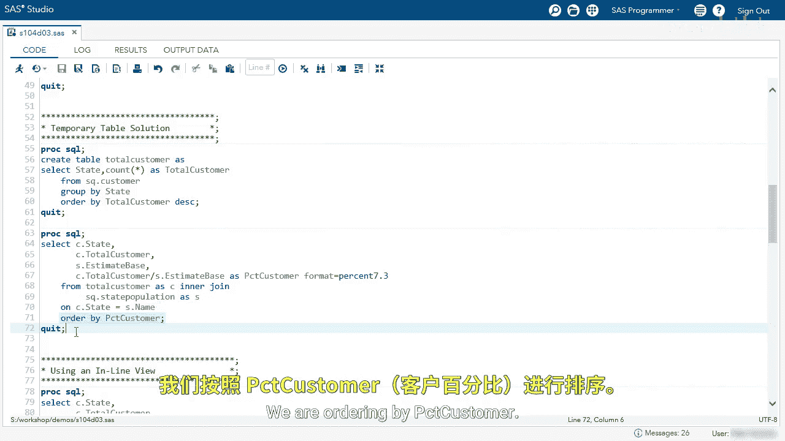
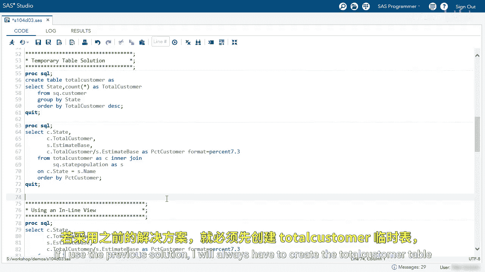

# SAS【中英⚡SAS高级程序员 专项课程｜SAS Advanced Programmer Professional Certificate】 p72 P72 03_演示：使用内联视图 -BV1Cfe3z3EoA_p72-

We're going to use an inline view to solve the problem we just talked about。

The first thing I'm going to do is explore the customer and state population table。Again。

 we have our customers and we want to count the total number of customers in each state。

And then we're going to join that with the state population table name。

 and then we're going to divide the number of customers by the estimated base。

That'll give us a percentage of customers in each state。We'll go back to our editor。

And let's look at our temporary solution。The first solution we discussed was create a temporary table called Toal customer that counts a number of customers in each state I'm going to run that query to create that table。

And we've seen this before， we have the state and the total number of customers in that state。

I'm going to go back to my editor。And now what we're going to do is we're going to join the total customer table with the state population table。

 we're selecting the state total customer from the total customer table。

And then we're going to select the estimated base from the state population table。

 We have our aliases here， C for total customer， S for state population。And then in our on clause。

 we're using C dot state equals s dot name。We are ordering by percent customer。

Let's run this query and look at the temporary table solution。

We've performed our join and these are an ascending order。

 so it looks like VT or Vermont has the least amount of customers by percentage。I scroll down。

 I can see the most customers。And we have DC the most customers by percentage at 0。066。

 This solution is great and it works， we can use a virtual table to make this a little bit better。

Go back to our editor。To use a virtual table， we have the same query here selecting the same columns in the from clauses on clauses or by clauses。

 the only difference is instead of the temporary table， we paste that query。Here。

So all I had to do is copy and paste。We'll copy my query。We don't need the C table statement。

We're going to paste， and then I'm going to clean it up。

I'm going to remove the semicolon because that will cause a syntax error。And now。

 instead of using the actual temporary table， we're going to use this query。

And it's just going to act like a virtual table。Before I run this。

 I am going to get an error and there's a reason there's one clause in my inline view that I cannot use and I want you to think which one it is。

And it's underlining it saying there's a syntax error and it's near the order by clause remember。

 inline views cannot contain an order by clause。So let's go back and remove the clauses。Again。

 I like to clean up my code。And now when I run this query， it should run successfully。Again。

 now I have the same results as previously， but now we use an inline view again。

 VT is at the top of 0。008。And then DC at the bottom with 0。066。

So I want to go back and talk about one more thing。When I use the inline view。

 the inline view will run at that exact moment。So as our SQ dot customer table grows。

 the inline view values will change if I use the previous solution。

I will always have to create the total customer table and then use that table in an inner join。

