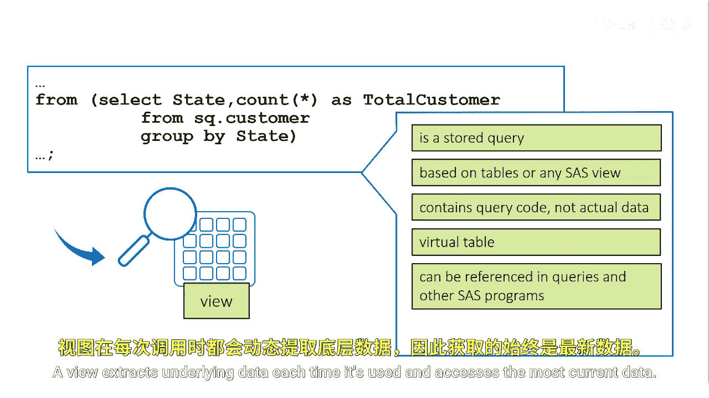
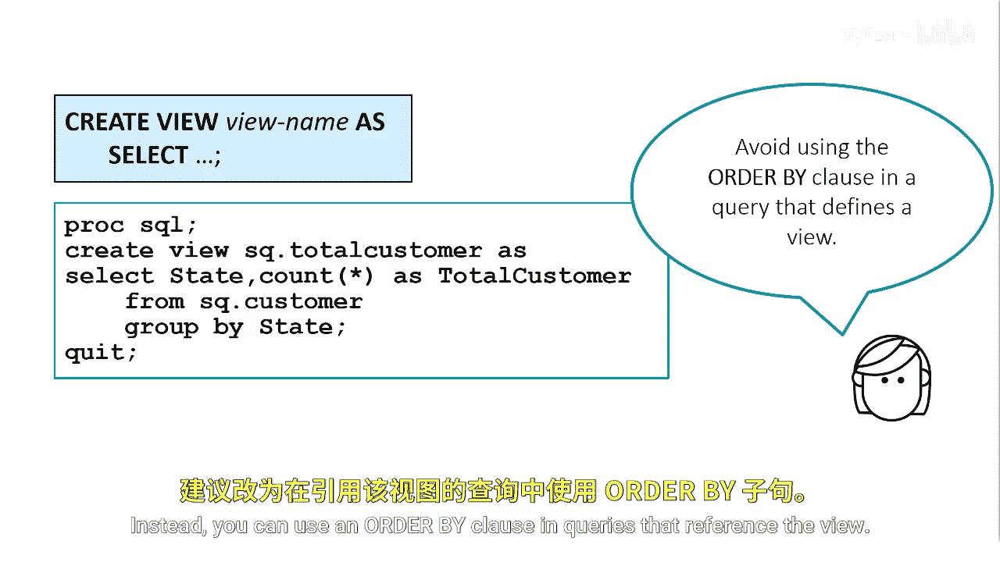
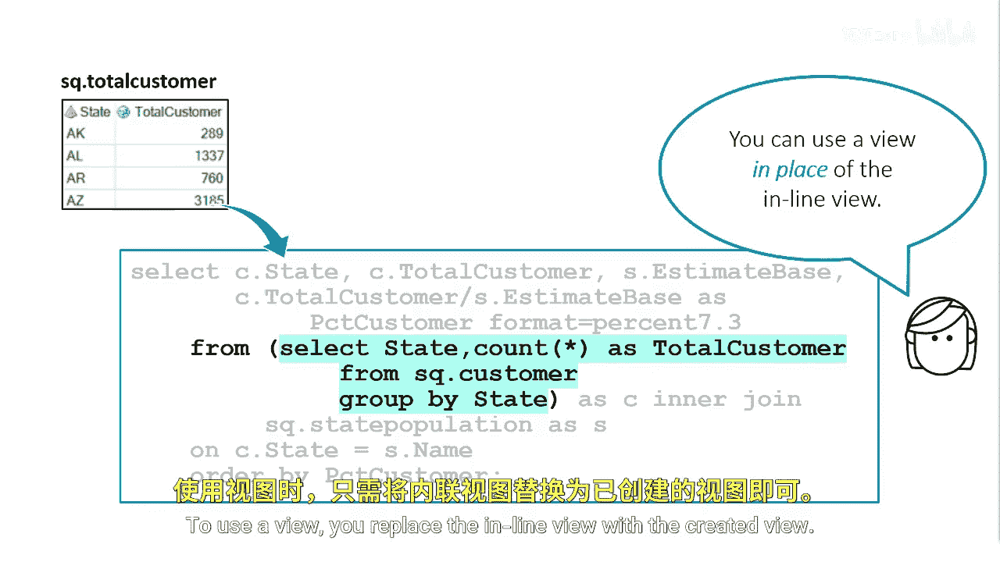

# SAS【中英⚡SAS高级程序员 专项课程｜SAS Advanced Programmer Professional Certificate】 p73 P73 04_创建视图 -BV1Cfe3z3EoA_p73-

What if you want to use the inline view in other queries？

Inline views are not assigned table names and can't be referenced in other queries or SAS procedures as if they were tables。

They can only be referenced in the query in which they are defined。To reuse this inline view。

 you need to retype it every time you need it， although this inline view is short。

 others can be more complicated and retyping them can be time consuming Also。

 what if you need to edit the code you would have to edit the code everywhere you use the inline view。

However， there's a more efficient solution。

You can create a ProC SQL view that can be referenced in other queries。

A Pro SQL view is a stored query that can be based on one or more tables or any kind of SAS view。

 Pro SQL Views， data step View， or SAS Access View。So a ProQL view contains query code。

 but no actual data。It's not a physical table Instead。

 a view is sometimes referred to as a virtual table because it can be referenced in queries and other SAS programs in the same manner as a physical table A view extracts underlying data each time it's used and accesses the most current data。

To create a Pro SQL view， you use the Create View statement。Unlike the Create table statement。

 the Create View statement has only one form which contains a query。

When you submit the Create View statement， the query's report output is suppressed。

Following the Create View keywords， you specify the name of the view。

View names must follow the rules for SAS Na， you can't specify the name of an existing table or view in the same SAS library。

Next， you specify the keyword as followed by the query clauses。In this example。

 the Cate View statement creates a ProC SQL view named SQ。total customer。Technically。

 you can use any of the optional query clauses in the Cre View statement。However。

 for the sake of efficiency， it's recommended that you avoid using the order by clause in the query that defines a view because it forces ProCSQL to sort the data every time the view is referenced。

Instead， you can use an order by clause and queries that reference the view。

To use a view， you replace the inline view with the created view。

In this basic ProC SQL query， the F clauseuse references the Proc SQL view named SQ。total customer。

When this program runs， the view executes and extracts the most current data from the underlying data source。

If you ever need to make a change to the view， the change will be reflected everywhere the view is used。

